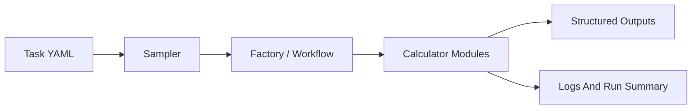

<div align="center">

# Jarvis-HEP

**Just a Really Viable Interface to Suite for High Energy Physics.**

**YAML-driven orchestration for likelihood-based HEP scans**

Run external calculators, explore difficult parameter spaces, persist structured outputs, and finish each run with explicit diagnostics.


[](https://arxiv.org/abs/2604.25557)

</div>

## Why Jarvis-HEP

Jarvis-HEP is built for scan workflows that are painful to manage by hand:

- expensive external calculators
- sparse or fine-tuned parameter regions
- profile-likelihood style workflows
- output bookkeeping that needs to stay reproducible

The project keeps those concerns in one runtime: task YAML, sampler choice, calculator orchestration, persisted outputs, and operator-facing diagnostics.

## At A Glance

| Problem | Jarvis-HEP answer |
| --- | --- |
| External program orchestration | Ordered calculator workflow with async-friendly execution |
| Hard-to-scan parameter spaces | Multiple sampler families, from random and Bridson to nested and MCMC-based methods |
| Output sprawl | Project-local outputs, logs, images, and packaged rerun workflows |
| Post-run analysis | HDF5 storage plus schema-driven CSV conversion |
| Run visibility | Logger-routed diagnostics and end-of-run summaries |

## Quick Start

### 1. Install

```bash
python3 -m pip install Jarvis-HEP
```

The default install also brings in `Jarvis-Operas`, because the built-in quickstarts use it.

### 2. Create a standalone project

```bash
Jarvis project create MyScan
cd MyScan
```

This creates a minimal project scaffold:

```text
MyScan/
├── bin/
├── data/
├── deps/
├── .jarvis-project.json
└── jarvis.project.yaml
```

The marker files (`.jarvis-project.json`, `jarvis.project.yaml`) identify the standalone project root.

Runtime artifact directories such as `outputs/`, `logs/`, and `images/` are created automatically on first use.

Project command reference:

```bash
Jarvis project --help
```

### 3. Run the built-in quickstart

```bash
Jarvis bin/quickstart_mcmc_operas.yaml
```

You can also replay tabulated points directly:

```bash
Jarvis bin/quickstart_csv_operas.yaml
```

### 4. Package a project

```bash
Jarvis project pack [path] [--share | --repro | --full]
Jarvis project pack [path] [--share | --repro | --full] --man
Jarvis project pack pack_YYYYMMDD_NNN.yaml
```

Modes:

- `--share`: lighter result-sharing package (default)
- `--repro`: unpack-and-rerun package
- `--full`: full archival package

If no mode flag is provided, `--share` is used. Use `.` to pack the current directory.
Add `--man` to write a manifest such as `pack_20260508_001.yaml` without creating an archive.
Passing a YAML manifest as the first argument packages from its `project_root`, `output`,
`include`, and `exclude` fields.

### 5. Browse the official Jarvis library

```bash
Jarvis project browse
Jarvis project info Example_Bridson
Jarvis project fetch Example_Bridson
```

### Resume and re-run

Jarvis-HEP writes a single checkpoint file per sampler at:

```text
<task_root>/checkpoints/<scan_name>/<sampler>/state.pkl
```

Use `--resume` to continue from the latest checkpoint without any prompt:

```bash
Jarvis bin/quickstart_mcmc_operas.yaml --resume
```

If you do not pass `--resume` and a checkpoint already exists, Jarvis-HEP prompts in English:

```text
Detected checkpoint file. Re-run from scratch? [y/N] (default: resume in 30s):
```

Behavior of that prompt:

- `y` / `yes` starts a fresh run and discards the existing checkpoint file
- pressing Enter resumes from the checkpoint
- typing anything else also resumes from the checkpoint
- no response for 30 seconds also resumes from the checkpoint

If no checkpoint exists, Jarvis-HEP starts a fresh run immediately.

## Core Workflow



Inside calculator modules, the maintained execution order is:

1. write input files
2. run external commands
3. read output files

## What Jarvis-HEP Produces

Typical project-local artifacts include:

- `outputs/<scan>/DATABASE/...`
  HDF5 samples, schema files, CSV exports, and run metadata
  (shared database path for normal runs and `--check-modules`)
- `outputs/<scan>/SAMPLE/...`
  per-sample artifacts and retained files
  (`--check-modules` writes under `outputs/<scan>/SAMPLE/tests/...`)
- `logs/<scan>/...`
  Jarvis, sampler, and runtime logs
- `images/<scan>/...`
  generated plot configs, semantic flowchart JSON, and figures
  (Jarvis-HEP writes `flowchart.json`; if JarvisPLOT is installed, it also asks
  JarvisPLOT to render `flowchart.png`)
- `run_summary.json`, `run_summary.csv`, `run_summary.txt`
  machine-readable and human-readable end-of-run summaries

Flowchart data export is semantic-only in Jarvis-HEP. The JSON is built by
`Workflow.build_flowchart_semantics()` and includes workflow layers, nodes, ports,
and edges. Calculator / Operas module selections are exported on module nodes as
`selection.expression` plus `selection.variables`; selection dependencies are also
represented with `selectionflow` edges. JarvisPLOT owns layout, rendering, and
styling; Jarvis-HEP only calls JarvisPLOT's public renderer when that optional
dependency is available. `--skip-draw-flowchart` skips this PNG rendering step
while still exporting `flowchart.json`.

## Sampling Support

Jarvis-HEP currently includes:

- random, grid, and CSV replay workflows
- Bridson sampling
- nested sampling: `Dynesty`, `MultiNest`
- differential-evolution sampling: `Diver`
- MCMC-family methods: `MCMC`, `PTMCMC`, `AMMCMC`, `RobustAM`, `DRAM`, `DEMCMC`, `DREAM`, `DREAMLite`, `EnsembleMCMC`, `PTEnsemble`, `SliceMCMC`, and `ESS`
- gradient-family methods: `MALA`, `HMC`, `NUTS`
- DNN-assisted iterative sampling
- experimental `RLTPMCMC`

> `RLTPMCMC` is experimental as of `v1.6.11`.

## Path Markers

| Marker | Meaning |
| --- | --- |
| `&J/...` | standalone project root |

Task YAML should use project-local `&J/...` paths. Package-owned resources are internal implementation details, not a public path marker.

## Runtime Tokens

| Token | Meaning |
| --- | --- |
| `@SampleID` | current sample UUID |
| `@Sdir` | current sample save directory under `outputs/.../SAMPLE/<uuid>` (or `outputs/.../SAMPLE/tests/<uuid>` in `--check-modules`) |
| `@PackID` | calculator module instance ID, enables per-instance working directories and file paths |

These runtime tokens are available on calculator workflow paths such as commands, working directories, and sample-scoped input/output file paths.

## Calculator Modules

Calculator modules wrap external programs. A typical calculator entry under `Calculators.Modules` uses these top-level keys:

| Key | Meaning |
| --- | --- |
| `name` | module name used in the workflow graph |
| `required_modules` | upstream modules that must finish before this calculator runs |
| `clone_shadow` | whether to use per-instance shadow paths |
| `path` | calculator installation/runtime root |
| `source` | optional source path for installation commands |
| `installation` | commands run during calculator installation |
| `initialization` | commands run before each execution |
| `execution` | per-sample input writing, external commands, and output reading |
| `timeout` | optional total time limit in seconds for one `execution` section |

`timeout` is a calculator-level fallback cut for one sample execution. It starts after `initialization` and covers the full `execution` section: input file writes, `execution.commands`, and output reads. If it is omitted, there is no calculator-level total execution limit. Positive numbers are interpreted as seconds.

Example:

```yaml
Calculators:
  make_paraller: 4
  Modules:
    - name: DemoCalc
      required_modules: []
      clone_shadow: false
      path: "&J/calculators/runtime/program/demo"
      source: "&J/calculators/source/demo"
      timeout: 120
      installation: []
      initialization: []
      execution:
        path: "&J/calculators/runtime/program/demo"
        commands:
          - "./run_demo.sh @SampleID"
        input: []
        output: []
```

`make_paraller` keeps its legacy spelling for compatibility.

## Subprocess Runtime

External calculator commands normally run through the shared subprocess scheduler. Runtime knobs can be set under `Runtime.Subprocess`:

```yaml
Runtime:
  Subprocess:
    max_concurrency: 8
    max_pending: 256
    per_task_timeout_sec: 300
    terminate_grace_sec: 5
    log_policy: logger
    progress_interval_sec: 5
    diagnostics_enabled: false
    diagnostics_interval_sec: 10
```

`Runtime.Subprocess.per_task_timeout_sec` is a per-command scheduler limit. Calculator `timeout` is a higher-level total limit for the whole calculator `execution` section. When both are configured, the effective command timeout is bounded by the remaining calculator execution budget.

## Design Principles

- no repo-root requirement for normal usage
- project-local outputs by default
- explicit logging instead of silent failure paths
- structured outputs that remain post-processable after the run
- runtime diagnostics that are additive, not bolted on later

## Documentation

- Online docs: <https://pengxuan-zhu-phys.github.io/Jarvis-Docs/>
- Project homepage: <https://github.com/Pengxuan-Zhu-Phys/Jarvis-HEP>
- CLI reference: `Jarvis --help`
- Project workflow reference: `Jarvis project --help`

## Citation

Jarvis-HEP is described in:

Erdong Guo, Paul Jackson, Jin Min Yang, and Pengxuan Zhu,
*Jarvis-HEP: A lightweight Python framework for workflow composition and parameter scans in high-energy physics*,
arXiv:2604.25557 [hep-ph], 2026.

```bibtex
@article{Guo:2026kfy,
    author = "Guo, Erdong and Jackson, Paul and Yang, Jin Min and Zhu, Pengxuan",
    title = "{Jarvis-HEP: A lightweight Python framework for workflow composition and parameter scans in high-energy physics}",
    eprint = "2604.25557",
    archivePrefix = "arXiv",
    primaryClass = "hep-ph",
    month = "4",
    year = "2026"
}
```

## License

Jarvis-HEP is released under the **MIT License**. See [LICENSE](LICENSE).
