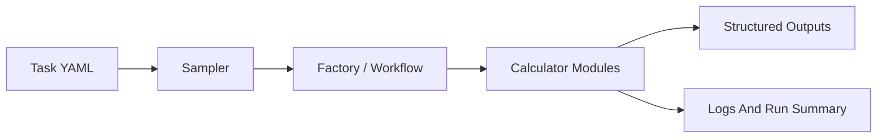

<div align="center">

# Jarvis-HEP

**YAML-driven orchestration for likelihood-based HEP scans**

Run external calculators, explore difficult parameter spaces, persist structured outputs, and finish each run with explicit diagnostics.


</div>

## Why Jarvis-HEP

Jarvis-HEP is built for scan workflows that are painful to manage by hand:

- expensive external calculators
- sparse or fine-tuned parameter regions
- profile-likelihood style workflows
- output bookkeeping that needs to stay reproducible

The project keeps those concerns in one runtime: task YAML, sampler choice, calculator orchestration, persisted outputs, and operator-facing diagnostics.

## At A Glance

| Problem | Jarvis-HEP answer |
| --- | --- |
| External program orchestration | Ordered calculator workflow with async-friendly execution |
| Hard-to-scan parameter spaces | Multiple sampler families, from random and Bridson to nested and MCMC-based methods |
| Output sprawl | Project-local outputs, logs, images, and packaged rerun workflows |
| Post-run analysis | HDF5 storage plus schema-driven CSV conversion |
| Run visibility | Logger-routed diagnostics and end-of-run summaries |

## Quick Start

### 1. Install

```bash
python3 -m pip install Jarvis-HEP
```

The default install also brings in `Jarvis-Operas`, because the built-in quickstarts use it.

### 2. Create a standalone project

```bash
Jarvis project create MyScan
cd MyScan
```

This creates a minimal project scaffold:

```text
MyScan/
├── bin/
├── data/
├── deps/
├── .jarvis-project.json
└── jarvis.project.yaml
```

The marker files (`.jarvis-project.json`, `jarvis.project.yaml`) identify the standalone project root.

Runtime artifact directories such as `outputs/`, `logs/`, and `images/` are created automatically on first use.

Project command reference:

```bash
Jarvis project --help
```

### 3. Run the built-in quickstart

```bash
Jarvis bin/quickstart_mcmc_operas.yaml
```

You can also replay tabulated points directly:

```bash
Jarvis bin/quickstart_csv_operas.yaml
```

### 4. Package a project

```bash
Jarvis project pack . --share
```

Modes:

- `share`: lighter result-sharing package
- `repro`: unpack-and-rerun package
- `full`: full archival package

If no mode is provided, `--share` is used.

### 5. Browse the official Jarvis library

```bash
Jarvis project browse
Jarvis project info Example_Bridson
Jarvis project fetch Example_Bridson
```

## Core Workflow



Inside calculator modules, the maintained execution order is:

1. write input files
2. run external commands
3. read output files

## What Jarvis-HEP Produces

Typical project-local artifacts include:

- `outputs/<scan>/DATABASE/...`
  HDF5 samples, schema files, CSV exports, and run metadata
- `outputs/<scan>/SAMPLE/...`
  per-sample artifacts and retained files
- `logs/<scan>/...`
  Jarvis, sampler, and runtime logs
- `images/<scan>/...`
  generated plot configs, semantic flowchart JSON, and figures
- `run_summary.json`, `run_summary.csv`, `run_summary.txt`
  machine-readable and human-readable end-of-run summaries

## Sampling Support

Jarvis-HEP currently includes:

- random, grid, and CSV replay workflows
- Bridson sampling
- Dynesty and MultiNest
- MCMC-family methods such as `MCMC`, `TPMCMC`, `AMMCMC`, `RobustAM`, `DRAM`, `DEMCMC`, `DREAM`, `DREAMLite`, `EnsembleMCMC`, `PTEnsemble`, `SliceMCMC`, and `ESS`
- reference-grade gradient-family entries: `MALA`, `HMC`, `NUTS`
- experimental `RLTPMCMC`

> `RLTPMCMC` is currently experimental in the active `v1.6.10` release-prep line.

## Path Markers

| Marker | Meaning |
| --- | --- |
| `&J/...` | standalone project root |

Task YAML should use project-local `&J/...` paths. Package-owned resources are internal implementation details, not a public path marker.

## Runtime Tokens

| Token | Meaning |
| --- | --- |
| `@SampleID` | current sample UUID |
| `@Sdir` | current sample save directory under `outputs/.../SAMPLE/<uuid>` |

These runtime tokens are available on calculator workflow paths such as commands, working directories, and sample-scoped input/output file paths.

## Design Principles

- no repo-root requirement for normal usage
- project-local outputs by default
- explicit logging instead of silent failure paths
- structured outputs that remain post-processable after the run
- runtime diagnostics that are additive, not bolted on later

## Documentation

- Online docs: <https://pengxuan-zhu-phys.github.io/Jarvis-Docs/>
- Project homepage: <https://github.com/Pengxuan-Zhu-Phys/Jarvis-HEP>
- CLI reference: `Jarvis --help`
- Project workflow reference: `Jarvis project --help`

## License

Jarvis-HEP is released under the **MIT License**. See [LICENSE](LICENSE).
