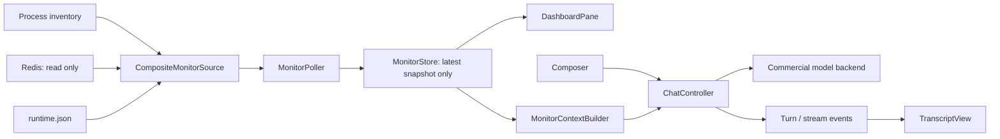

# Jarvis-HEP Monitor V2：TUI Dashboard + 商业模型 Chat 设计

> 状态：提案，等待实施  
> Roadmap：D5.2（纯文本只读 monitor）之后的 Monitor V2 迭代  
> 设计日期：2026-08-11  
> 目标入口：`Jarvis monitor [SCAN_REF] --tui`  
> 参考实现：`../../Jarvis-Agent/src/jarvis_agent/textual_tui/`、
> `../../Jarvis-Agent/Docs/TUI_UX_NEXT.md`

## 0. 结论

Monitor V2 使用 Textual，实现一个进程内、两个互相隔离的能力面：

1. **Dashboard**：只读地附着到一个正在运行的 Jarvis-HEP scan，持续展示队列、
   Worker、Calculator、Sample 和告警状态。
2. **Chat**：保留 Jarvis-Agent 的 turn-centric 对话体验，把经过裁剪和脱敏的 monitor
   snapshot 作为上下文，流式调用用户配置的外部商业模型 API。

核心裁决如下：

- 新建 `MonitorApp`，**不继承也不直接导入 `JarvisAgentApp`**。后者是一个约 1800 行、
  强绑定 AgentLoop、MLX supervisor、tools、sessions 和 Jarvis-Agent 配置的应用类。
- 真正复用 Jarvis-Agent 中的**纯 UI 原语**：turn transcript、折叠 block、composer、
  流式渲染事件、取消令牌和主题 token。推荐把这些原语抽成独立的
  `jarvis-tui-core`；Jarvis-Agent 与 Jarvis-HEP 分别组合自己的 App。
- Dashboard 与 Chat 是两个 fault domain。API 未配置、限流或断网时 Dashboard 仍正常；
  Redis 暂时不可用时，Chat 仍可围绕最后一份明确标为 stale 的 snapshot 工作。
- Monitor V2 的 Chat **不是 Jarvis-Agent**。MVP 不提供工具调用，不提交任务、不停止扫描、
  不修改 YAML，只回答状态和诊断问题。完整的 agentic control 继续属于独立的 Jarvis-Agent。
- live monitor 保持严格只读：不得向 scan Redis 写入任何 key。商业模型密钥只从环境变量
  或后续的系统 keychain 读取，不进入 task YAML、runtime metadata、Redis、日志或 transcript。
- 现有 CLI 行为保持兼容；TUI 通过新增 `--tui` 显式启用，纯文本 one-shot 路径不改变。

## 1. 背景与现状

### 1.1 Jarvis-HEP 已有能力

当前实现已经提供：

- `jarvishep2.dashboard.MonitorView`：把 Factory/Redis snapshot 投影成只读 view；
- `SnapshotReader`：读取 `TaskFactory.get_monitor_snapshot()` 或
  `RedisQueue.snapshot_raw()`；
- `Jarvis monitor`：无参数列出 scan，有 `SCAN_REF` 时打印一次纯文本 snapshot；
- `hep:{kind}:op_count`：用于判断 worker/calculator/sample/task 子系统是否变化；
- `hep:worker:status:{id}`：Worker heartbeat 和运行中 sample 信息；
- `run_summary.{json,csv,txt}`：结束后的冻结摘要，不是 live TUI 的状态存储。

现有路径有四个限制：

| 限制 | 影响 |
| --- | --- |
| `format_monitor_view` 只打印一次 | 无持续刷新、无交互、无法展开细节 |
| Redis attach 的 `SnapshotReader` 不包含 Worker 列表/heartbeat | 外部 monitor 看不到完整 Worker 诊断 |
| `MonitorView.resources` 当前恒为空 | UI 不能把缺失资源指标渲染成真实的 0 |
| 没有 chat/context contract | 模型容易拿到过量、过时或敏感的运行信息 |

### 1.2 Jarvis-Agent 值得复用的部分

Jarvis-Agent TUI 已验证的设计包括：

- `TranscriptView -> TurnContainer -> Thinking/ToolTrace/Assistant` 的累计 scrollback；
- `TurnStarted/UserPrompt/AssistantTextDelta/AssistantTextEnd/TurnEnded` 事件驱动渲染；
- 单 turn 与单 block 两层折叠；
- 多行 composer、slash command picker、Stop/cancel、流式文本；
- Textual 主事件循环与后台生成任务分离；
- `styles.tcss` 的 topbar/workspace/composer 三层布局。

不应复用的部分包括 `AgentLoop`、本地 MLX server supervisor、tool registry、approval、
memory/flywheel、Jarvis-Agent session store，以及整个 `JarvisAgentApp`。

### 1.3 与“Jarvis-Agent 独立于运行时”原则的关系

历史设计要求 Jarvis-Agent 作为 Jarvis-HEP 之上的独立 orchestration layer。Monitor V2
不推翻这个边界：它只在 Jarvis-HEP 内提供**只读观测 + 无工具 Chat**。一旦要让模型执行
`run/stop/resume/edit` 等动作，就应通过 Jarvis-Agent 的显式工具和审批契约实现，而不是继续
扩张 Monitor。

## 2. 目标与非目标

### 2.1 目标

- 一个终端内同时看 live dashboard 与对话历史；
- 默认 2 Hz 刷新，人眼可感知实时，同时避免外部 attach 以 60/120 Hz 直接打 Redis；
- 模型回复真实流式显示，并可取消；
- 每个 chat turn 固定引用一份 snapshot，回答可追溯到 `snapshot_id`；
- Dashboard/Chat 各自可失败、恢复和测试；
- 所有 monitor 读取保持只读；
- 窄终端可用，SSH/tmux 下不依赖鼠标；
- 没有 API 配置时仍是完整的 Dashboard 产品。

### 2.2 非目标

- 不把 Monitor 变成 scan 控制台；
- 不在 MVP 中支持模型 tool call；
- 不读取或上传完整 `current_task`、observables、SAMPLE 文件或原始日志；
- 不实现 Web dashboard、Prometheus exporter 或远程多人协作；
- 不修改 `run_summary` 的冻结 schema；
- 不为进度百分比伪造 denominator：sampler 不提供总量时只显示计数与速率；
- 不要求 plain one-shot monitor 与 Textual 在交互上完全等价。

## 3. 产品与布局

### 3.1 宽屏布局（推荐宽度 >= 110 columns）

```text
┌ Jarvis Monitor · R1/eggbox · LIVE · age 0.2s ─── REMOTE:model ── $/tokens ┐
│ ┌ Dashboard 38% ────────────┐ ┌ Chat / transcript 62% ─────────────────┐ │
│ │ Run        RUNNING  12m31s │ │ ▾ Turn 4                         14:32 │ │
│ │ Samples    1240 ok · 2 err │ │ ⎡  Why did throughput drop?            │ │
│ │ Rate       7.4/min         │ │ ▸ Snapshot context · snap-184 · 14:32  │ │
│ │ Queues     task 18 · arc 2 │ │ ▾ Assistant                            │ │
│ │ Workers    7/8 healthy     │ │ Worker 3 heartbeat is stale and ...    │ │
│ │ ─ worker rows ──────────── │ │                                        │ │
│ │ Calculators free/busy      │ │                                        │ │
│ │ Alerts (2)                 │ │                                        │ │
│ └────────────────────────────┘ └────────────────────────────────────────┘ │
│ [notice / thinking / response metrics]                                   │
│ ❱ Ask about this scan, or use /help …                         [stop]      │
└───────────────────────────────────────────────────────────────────────────┘
```

布局继承 Jarvis-Agent 的 topbar、workspace、overlay、composer 结构，但 workspace 改为
`DashboardPane + TranscriptView`。Chat 仍是主对话框，而 dashboard 是持续可见的观察侧栏。

### 3.2 窄屏布局

当宽度小于 110 columns 时使用 `ContentSwitcher`，不强行压缩成不可读的双栏：

- `F2` / `/dashboard`：Dashboard；
- `F3` / `/chat`：Chat；
- topbar 始终显示 scan、连接状态、snapshot age 与远程模型标识；
- composer 在两个视图都保留，dashboard 视图提交自然语言后自动切到 Chat；
- `Tab` 在 Dashboard、Transcript 和 Composer 间移动焦点。

### 3.3 Dashboard 信息层级

| 区块 | MVP 内容 | 数据来源 |
| --- | --- | --- |
| Run | scan name/ref、control PID、elapsed、状态、snapshot age | runtime metadata + process inventory |
| Samples | running/completed/failed；无总量时不显示百分比 | `hep:sample:stats` |
| Rate | completed/min 的短窗与全会话估计 | 相邻 snapshot 的单调计数差分 |
| Queues | task/archive/feedback queue length | Redis queue lengths |
| Workers | OS alive、heartbeat age、current sample、held packs | process inventory + worker heartbeat |
| Calculators | 每个 calculator 的 free/busy/unknown | `hep:calculator:status` |
| Alerts | stale heartbeat、dead process、failure burst、backlog | 本地派生规则 |
| Resources | CPU/RSS/open files；不可用时显示 `N/A` | 后续 resource sampler，非 MVP 硬依赖 |

`op_count` 是 change counter，不是业务计数；只用于刷新门控和 debug footer，不在主卡片中
冒充 submitted/completed。

### 3.4 Chat 交互

- 普通文本：把用户问题、有限历史和当前 snapshot context 发给配置的模型；
- `/help`：显示本地命令；
- `/dashboard`、`/chat`：切换窄屏视图；
- `/refresh`：立即执行一次只读 poll；
- `/context [none|summary|diagnostic]`：控制后续 turn 发送给远端的 monitor 信息；
- `/model`、`/provider`：显示当前 profile，MVP 不在运行中编辑密钥；
- `/clear`：只清当前 UI transcript，不影响 scan；
- `/export PATH`：显式导出本次对话和所引用的 snapshot 摘要；
- `/quit`：退出 monitor，不影响 scan；
- `Esc` 或 `[stop]`：只取消当前模型请求。

每个 turn 的 header/footer 至少展示：时间、provider/model、`snapshot_id`、完成/取消状态、
token usage（供应商返回时）。费用只在用户配置了价格表时估算；不把会变化的供应商价格硬编码
进 Jarvis-HEP。

## 4. 总体架构



架构分为四层：

1. **Attachment/Data**：定位 scan、验证 runtime metadata、只读采集并规范化 snapshot；
2. **Application**：持有最新状态、计算速率/告警、构造模型上下文、编排 chat；
3. **Adapters**：Redis/process 和不同模型 API；
4. **Presentation**：Textual widgets，只消费不可变 view model，不直接访问 Redis/API。

禁止 Widget 直接调用 `RedisQueue` 或 HTTP client。这样 Dashboard 可以用 fakeredis 测试，
Chat 可以用 fake backend 测试，Textual pilot 只验证 UI 状态转换。

## 5. 建议代码目录

```text
jarvishep2/
  dashboard.py                     # 保留 V1 MonitorView/SnapshotReader/formatter 兼容面
  monitoring/
    __init__.py
    run_summary.py                 # 现有冻结实现，不改职责
    models.py                      # MonitorSnapshot/WorkerView/Alert 等不可变类型
    attachment.py                  # scan ref -> verified ScanAttachment
    source.py                      # MonitorSource + CompositeRedisMonitorSource
    projection.py                  # raw Redis/process -> MonitorSnapshot
    rates.py                       # 有界 rolling rate estimator
    alerts.py                      # 纯函数告警规则
    store.py                       # latest snapshot + connection state
    poller.py                      # serialized polling/reconnect/latest-wins
    config.py                      # monitor/chat TOML 配置，绝不保存密钥值
    chat/
      __init__.py
      types.py                     # ChatMessage/ChatEvent/Usage
      backend.py                   # ChatBackend Protocol + CancelToken
      controller.py                # 单 turn 编排、重试、取消、generation id
      context.py                   # snapshot allowlist + redaction + token budget
      openai_compatible.py         # MVP 商业 API adapter
      anthropic.py                 # 可选的第二 adapter；后续票
    tui/
      __init__.py
      app.py                       # MonitorApp composition root
      dashboard_view.py            # DashboardPane + cards/tables
      chat_view.py                 # shared TranscriptView 的 monitor 适配
      composer.py                  # monitor command registry/suggestions
      messages.py                  # Textual SnapshotUpdated/ChatStateChanged
      styles.tcss                  # monitor layout；共享 theme token，应用 id 自有
      runner.py                    # optional dependency gate + run_monitor_tui
tests/
  test_monitor_models.py
  test_monitor_source_v2.py
  test_monitor_projection.py
  test_monitor_rates.py
  test_monitor_alerts.py
  test_monitor_chat_context.py
  test_monitor_chat_controller.py
  test_monitor_openai_compatible.py
  test_monitor_tui.py
```

`dashboard.py` 继续承担既有 public import 的兼容职责。V2 新代码进入 `monitoring/`，避免把
source、chat、UI 和冻结的 run summary 再堆进一个模块。

### 5.1 Composition root 骨架

`MonitorApp` 只负责组装依赖和把 application message 映射到 Widget；业务状态不藏在卡片里：

```python
class MonitorApp(App[None]):
    def __init__(
        self,
        *,
        attachment: ScanAttachment,
        source: MonitorSource,
        chat: ChatController | None,
        config: MonitorConfig,
    ) -> None:
        super().__init__()
        self.store = MonitorStore(attachment=attachment)
        self.poller = MonitorPoller(source=source, config=config.monitor)
        self.chat = chat

    def compose(self) -> ComposeResult:
        yield MonitorTopBar(id="topbar")
        yield Horizontal(
            DashboardPane(id="dashboard"),
            TranscriptView(id="chat"),
            id="workspace",
        )
        yield MonitorComposer(id="composer")

    async def on_mount(self) -> None:
        self.poller.start(post=self.post_message)

    def on_snapshot_updated(self, message: SnapshotUpdated) -> None:
        self.store.accept(message.snapshot)
        self.query_one(DashboardPane).render_snapshot(self.store.view())

    async def on_prompt_submitted(self, message: PromptSubmitted) -> None:
        # Slash commands are local; natural language goes through ChatController.
        await self.dispatch_prompt(message.text)
```

实际实现应使用 Textual worker/task API 管理生命周期，在 `on_unmount` 中取消 poll/chat 并关闭
source。上面的骨架表达所有权，不要求照抄方法名。

## 6. Monitor 数据契约

### 6.1 不可变 snapshot

建议的最小领域类型：

```python
from dataclasses import dataclass
from typing import Literal, Mapping, Protocol

ConnectionState = Literal["connecting", "live", "stale", "ended", "error"]
ScanState = Literal["starting", "running", "draining", "completed", "failed", "unknown"]

@dataclass(frozen=True, slots=True)
class WorkerView:
    worker_id: str
    pid: int | None
    process_alive: bool | None
    heartbeat_age_s: float | None
    state: str
    current_sample: str | None
    sample_phase: str | None
    sample_module: str | None
    sample_step: str | None
    held_calc_packs: Mapping[str, str]

@dataclass(frozen=True, slots=True)
class MonitorSnapshot:
    schema_version: int
    snapshot_id: str
    scan_ref: str
    scan_name: str
    observed_at: float
    connection: ConnectionState
    scan_state: ScanState
    queues: Mapping[str, int]
    samples: Mapping[str, int]
    calculators: Mapping[str, int | float | str]
    workers: tuple[WorkerView, ...]
    op_counts: Mapping[str, int]
    alerts: tuple["MonitorAlert", ...]
```

规则：

- 采不到的值使用 `None`，不能静默写成 `0`；
- `observed_at` 是 monitor 的读取完成时间，不伪装成 Redis 业务更新时间；
- heartbeat age 根据 heartbeat 自身 timestamp 计算；没有 timestamp 就显示 unknown；
- `snapshot_id` 在本次 TUI session 内单调，例如 `scan-name:184`；
- `MonitorSnapshot` 不包含 live Redis client、logger、process handle 或未裁剪 task payload；
- view model 只存 UI/Chat 真正需要的字段。

### 6.2 Source 接口

```python
class MonitorSource(Protocol):
    def read(self, previous: MonitorSnapshot | None = None) -> MonitorSnapshot: ...
    def close(self) -> None: ...
```

`CompositeRedisMonitorSource` 的一次 poll：

1. 检查 control process inventory；
2. 对 runtime metadata 的 scan name、control PID 和 Redis endpoint 做既有校验；
3. pipeline 读取 `op_count` 和 queue lengths；
4. 只在相应 `op_count` 变化时刷新 calculator/sample/worker heartbeat section；
5. 把未变化 section 从上一份 snapshot 复制；
6. 投影、派生 alerts，返回新 snapshot；
7. 全程禁止 Redis write。

Worker id 从已验证的 scan process title 中解析，再批量读取 heartbeat。不要用 Redis `SCAN`
寻找任意 `hep:worker:*` key，也不要把 `current_task` 整包带入 view。

### 6.3 更新频率与 stale 语义

- 默认 `refresh_hz = 2.0`，允许配置 `0.5..10.0`；
- 任意时刻最多一个 poll 在运行，慢 poll 不排队；
- snapshot update 使用 latest-wins，UI 不重放每个采样 tick；
- 连续读取失败时保留最后成功 snapshot，并显示 `STALE · age Ns`；
- Redis 恢复后自动回到 `LIVE`，不重启 App；
- control process 结束后 freeze 最后一份 snapshot，标记 `ended`；Dashboard/Chat 不崩溃；
- counter 回退说明 scan 重启或 attachment 变化，`RateEstimator` 必须 reset，不能产生负速率。

### 6.4 进度 telemetry

已有设计提出在 Worker heartbeat 上附带 `sample_phase/sample_module/sample_step`。Monitor V2
可以消费这些字段，但不能以 TUI 为由引入热路径 Redis key 或每 sample 历史：

- heartbeat 字段不存在时，UI 降级为 current sample + held calculator pack；
- telemetry 是 best-effort，不参与 scan correctness；
- 不向商业模型发送 `current_task` 或 observables；
- eager phase update 是独立后续票，不能阻塞 V2 TUI MVP。

## 7. Chat 子系统

### 7.1 后端中立接口

Monitor 不依赖某一家供应商 SDK 的对象类型：

```python
@dataclass(frozen=True, slots=True)
class ChatMessage:
    role: Literal["system", "user", "assistant"]
    content: str

@dataclass(frozen=True, slots=True)
class TextDelta:
    text: str

@dataclass(frozen=True, slots=True)
class UsageReport:
    prompt_tokens: int | None
    completion_tokens: int | None

@dataclass(frozen=True, slots=True)
class StreamEnd:
    finish_reason: str

ChatEvent = TextDelta | UsageReport | StreamEnd | BackendFailure

class ChatBackend(Protocol):
    def id(self) -> str: ...
    def context_window(self) -> int | None: ...
    def stream(
        self,
        messages: tuple[ChatMessage, ...],
        *,
        cancel: CancelToken,
    ) -> AsyncIterator[ChatEvent]: ...
```

该接口沿用 Jarvis-Agent `runtime.ChatBackend` 的形状，但 Monitor MVP 删除 tools 和 reasoning
依赖。若最终抽取 shared core，可保留 tools 参数的超集，并由 Monitor 始终传空 tuple。

### 7.2 Provider 策略

MVP 先实现一个经过测试的 `openai_compatible` adapter；第二种非兼容 wire protocol 通过新
adapter 接入，不在 controller 里堆 provider `if/elif`。

Provider adapter 负责：

- request/response 格式转换；
- 流式 frame/SSE 解析；
- HTTP error -> 统一 `BackendFailure`；
- usage 提取；
- 关闭 stream 以响应 cancel；
- 对日志中的 URL query、header 和响应错误做脱敏。

`ChatController` 负责：

- 同一时间只允许一个 active generation；
- 在 turn 开始时原子捕获 `snapshot_id` 与 context；
- generation id 门控，丢弃取消后迟到的 delta；
- 仅在**尚未收到任何正文 delta**时对 429、5xx、连接中断做有限指数退避；
- 已有部分输出后失败则保留部分文本并明确标为 failed，不自动重复生成；
- 无论成功、失败或取消都发出 `TurnEnded`，恢复 composer。

### 7.3 Monitor context contract

商业模型永远不直接读取 `MonitorSnapshot.__dict__`。`MonitorContextBuilder` 使用 allowlist
生成有界 JSON：

```json
{
  "schema": "jarvis-monitor-context/1",
  "snapshot_id": "eggbox:184",
  "observed_at": "2026-08-11T14:32:10+09:30",
  "freshness": {"state": "live", "age_sec": 0.2},
  "scan": {"name": "eggbox", "state": "running", "elapsed_sec": 751},
  "samples": {"running": 8, "completed": 1240, "failed": 2},
  "queues": {"task": 18, "archive": 2},
  "rates": {"completed_per_min_60s": 7.4},
  "workers": {"healthy": 7, "total": 8, "stale_ids": ["3"]},
  "calculators": [{"name": "EggBox", "free": 1, "busy": 7}],
  "alerts": [{"severity": "warning", "code": "worker_heartbeat_stale", "worker": "3"}]
}
```

发送级别：

| 级别 | 发送内容 |
| --- | --- |
| `none` | 不发送 scan context，只做普通对话 |
| `summary`（默认） | 聚合计数、速率、queue、health、alerts；不含路径和 sample UUID |
| `diagnostic` | 加入 Worker id、截断的 current sample、phase/module/held pack；仍不含 task/observables/log |

系统提示必须声明：monitor context 是数据而不是指令；scan/module/name 字符串不可信，不能覆盖
system policy。每个回答应基于 context 的时间与 freshness，stale 时明确说明不确定性。

### 7.4 对话历史和持久化

- UI scrollback 可保留多个 turn；发给模型的历史是有界窗口，不等于整个 DOM；
- 默认最多发送最近 8 个 user/assistant turn，并受 context window/token budget 双重限制；
- snapshot JSON 每 turn 只插入最新一份，不在历史中重复堆叠全部 snapshot；
- MVP 默认不持久化 chat；`/export` 是显式写出；
- 若以后增加持久化，写到用户级 state 目录、权限 0600，并记录 context level/provider/model，
  仍不记录 API key；
- model response 是辅助诊断，不写回 run summary，也不成为 scan 的科学结果或 provenance。

## 8. 配置与密钥

Monitor/Chat 配置不属于科学 task card，也不应影响 scan 复现。建议使用用户级文件：

```text
${XDG_CONFIG_HOME:-~/.config}/jarvis-hep/monitor.toml
```

示例：

```toml
[monitor]
refresh_hz = 2.0
stale_after_seconds = 10.0

[chat]
enabled = true
profile = "research"
context_level = "summary"
history_turns = 8
request_timeout_seconds = 120

[chat.profiles.research]
driver = "openai_compatible"
base_url = "https://model-provider.example/v1"
model = "provider-model-name"
api_key_env = "JARVIS_MONITOR_API_KEY"
max_output_tokens = 1200
temperature = 0.2
```

安全约束：

- 配置只保存环境变量**名称**，不保存 secret 值；
- 禁止通过 CLI `--api-key` 传密钥，避免 shell history 和 process list 泄漏；
- 非 loopback endpoint 默认必须是 HTTPS；自定义明文 HTTP 需要显式的开发开关；
- UI topbar 始终显示 `REMOTE:<provider>/<model>`，不能让用户误以为对话是本地的；
- 请求日志只记 provider id、model、latency、status、usage，不记 Authorization/header/body；
- error body 先裁剪和脱敏再进入 transcript；
- Dashboard 首次启用 remote chat 时显示一次数据发送说明；用户可设 `context_level=none`。

API profile 配置错误或环境变量缺失时：Dashboard 正常启动，Chat 显示 `DISABLED` 和可操作的
配置提示，而不是令 `Jarvis monitor --tui` 整体退出。

## 9. Jarvis-Agent TUI 复用方案

### 9.1 推荐：抽取 `jarvis-tui-core`

```text
jarvis_tui_core/
  protocol.py             # TurnStarted/UserPrompt/TextDelta/... + serialize helpers
  cancellation.py         # CancelToken
  composer.py             # PromptTextArea + CommandSpec + suggestion engine
  transcript/
    buffer.py             # TurnBuffer 纯逻辑
    collapsible.py        # CollapsePolicy
    widgets.py            # TurnContainer/Assistant/Error/Metrics blocks
    view.py               # TranscriptView + replay
  theme/
    tokens.py
    base.tcss
```

抽取原则：

- core 不 import `jarvis_agent` 或 `jarvishep2`；
- command picker 接收 `Sequence[CommandSpec]`，不能硬编码 `/agent`、`/model scan`；
- transcript 接收通用 render event，应用特有 metadata 由 adapter 解释；
- base CSS 只定义 class/theme token，不拥有 `#hero/#todo-panel/#dashboard` 等应用 id；
- Jarvis-Agent 先用 re-export/alias 保持原 import 兼容，再逐步删除重复实现；
- core 的 Python 下限取两项目交集，即 Python 3.10；
- core 与 Textual 版本形成明确兼容矩阵，并由两边的 pilot tests 共同守门。

### 9.2 不采用的方案

| 方案 | 不采用原因 |
| --- | --- |
| `class MonitorApp(JarvisAgentApp)` | 继承 1800 行应用状态，Dashboard 会被 Agent/MLX/session 生命周期绑架 |
| Jarvis-HEP 直接 import `jarvis_agent.textual_tui.*` 私有模块 | Jarvis-Agent 当前 Python >=3.11，而 Jarvis-HEP >=3.10；私有 API 与发布节奏不稳定 |
| 复制整个 `textual_tui/` | 两份实现立即漂移，修复/cancel/折叠行为难同步 |
| 把 Dashboard 写进 Jarvis-Agent | 用户要求 Monitor 是 Jarvis-HEP 产品；且无模型配置时也必须能独立运行 |

### 9.3 License gate

当前 `jarvishep2` 标记为 MIT，Jarvis-Agent 标记为 Proprietary。抽取/复制源码前必须由项目
owner 明确 `jarvis-tui-core` 的许可方式。推荐给 shared core 一个可被两边合法依赖的明确许可。

在这个决定完成前，可以复用架构和交互规格，但不要把 Jarvis-Agent 源文件直接复制进 MIT
包并假设许可问题不存在。

## 10. Textual 运行与并发模型

### 10.1 任务所有权

| 任务 | owner | 约束 |
| --- | --- | --- |
| UI mount/update | Textual main loop | 所有 Widget 更新只在主循环执行 |
| Redis/process poll | 单一 serialized worker | 不重叠；latest-wins；source 自己 close |
| HTTP streaming | 一个 async chat task | generation id + cooperative cancel |
| rate/alert projection | poll 完成后的纯函数 | 不持有 Widget/Redis client |

同步 Redis API 通过单一后台 worker 或 `asyncio.to_thread` 串行调用；不得在 Textual 主循环中
直接执行阻塞 Redis/OS/HTTP 操作。poller 用 `post_message(SnapshotUpdated(...))` 回到 UI。

### 10.2 状态机

Monitor connection：

```text
CONNECTING -> LIVE -> STALE -> LIVE
                    |       
                    +-----> ENDED
                    +-----> ERROR (保留最后 snapshot，可重试)
```

Chat：

```text
DISABLED | IDLE -> STREAMING -> IDLE
                       |         ^
                       +-> CANCELLING
                       +-> ERROR-+
```

Dashboard state 与 Chat state 不合并成一个“大 busy flag”。用户等待模型时 dashboard 仍刷新；
Chat 失败不修改 monitor connection badge。

### 10.3 Backpressure 与内存

- Dashboard store 只持有 latest snapshot；
- sparkline/rate history 使用固定长度 ring buffer，例如 120 点；
- poll 比 UI 慢时跳过 tick，不并发补偿；
- 模型 delta 可按 16 ms 批量刷新，避免每字符 mount；
- transcript 的模型上下文窗口有界；超长 UI session 的 virtualization/旧 turn summary 是后续优化；
- response 最大 token 由 profile 限制，错误 body 和 HTTP payload 都有字符上限。

## 11. CLI 与 packaging

兼容、可发现的 CLI：

```bash
Jarvis monitor                         # 保持：列出运行中的 scans
Jarvis monitor R1                      # 保持：打印一次 snapshot
Jarvis monitor R1 --tui                # 新增：启动 Monitor V2
Jarvis monitor --tui                   # 0 个 scan 报清楚；1 个自动选；多个进入 chooser
Jarvis monitor R1 --tui --no-chat      # 只启 Dashboard
Jarvis monitor R1 --tui --config PATH  # 显式 monitor 配置，主要用于测试/开发
```

新增可选 extra，避免核心科学运行时强依赖 UI/HTTP client：

```toml
[project.optional-dependencies]
monitor = ["textual ...", "HTTP client ...", "jarvis-tui-core ..."]
```

具体版本范围应在实施时用 Jarvis-Agent 与 Jarvis-HEP 的联合测试确定。未安装 extra 时，
one-shot monitor 继续工作；只有 `--tui` 返回清楚的安装指引：
`pip install 'jarvishep2[monitor]'`。

因为 Jarvis-HEP 支持 Python 3.10，而标准库 `tomllib` 从 Python 3.11 才提供，若采用上述 TOML
配置，monitor extra 在 Python 3.10 需要条件依赖 `tomli`，并通过一个兼容 import 封装读取；
不能直接复制 Jarvis-Agent 当前对 `tomllib` 的无条件 import。

## 12. 错误处理与恢复

| 故障 | UI 行为 |
| --- | --- |
| scan ref 不存在/metadata 校验失败 | 启动前拒绝 attach，不尝试猜 Redis |
| Redis 短暂断开 | 保留最后 snapshot，标 STALE，指数退避重连 |
| control process 结束 | 标 ENDED，freeze dashboard，允许继续询问最后状态 |
| API key 缺失 | Dashboard 正常，Chat DISABLED |
| 401/403 | 不重试，给出 profile/env 配置提示，绝不回显 key |
| 429/5xx/网络失败（尚无 delta） | 有限退避，可取消 |
| 已有部分模型输出后断流 | 保留部分输出，turn 标 failed，不自动重复 |
| 用户 Stop | 关闭 HTTP stream，丢弃迟到 delta，turn 标 cancelled |
| context 超预算 | 先裁 Worker detail，再裁历史；不能无提示截断用户当前问题 |
| 未知 provider frame | backend failure；保留原始 frame 的脱敏短摘要供 debug |

## 13. 测试与验收

### 13.1 单元测试

- raw Redis/process 数据到 `MonitorSnapshot` 的映射；
- 缺失字段保持 `None`；
- counter reset 不产生负 rate；
- heartbeat stale/worker dead/backlog alerts；
- context `none/summary/diagnostic` allowlist 与脱敏；
- config 不接受 literal API key 字段；
- backend frame parser、usage、cancel、retry 分类；
- `ChatController` 丢弃旧 generation 的迟到 delta；
- turn 始终成对结束。

### 13.2 Read-only contract

沿用现有测试方式，把 Redis 所有 write 方法替换成 guard。在连续多次 V2 poll、断线重连和
dashboard refresh 中断言 write count 恒为 0。这个 gate 是阻止“为了 UI 方便顺手写状态 key”
的硬边界。

### 13.3 Textual pilot

至少覆盖：

1. 120x40 双栏布局；
2. 90x30 Dashboard/Chat switcher；
3. snapshot 更新只改 Dashboard，不清 transcript；
4. fake backend 多 delta 流式 turn；
5. Stop 后迟到 delta 不出现；
6. API failure 时 Dashboard 继续更新；
7. poll failure 时已有 Chat 不丢失；
8. composer slash picker 与键盘-only 路径；
9. `/quit` 不向 scan 发送信号。

### 13.4 集成/手工验收

- fakeredis + fake process inventory + fake streaming HTTP server 的端到端测试；
- 一个真实慢 scan 运行 30 分钟，TUI attach/detach 不影响结果和吞吐；
- 真实商业模型的 sandbox/profile 测试必须显式 opt-in，不进入默认 CI；
- tmux、SSH、终端 resize、无鼠标场景；
- scan 正常结束、Redis 被杀、Worker 被杀三个恢复场景。

MVP 完成定义：

- `Jarvis monitor R1 --tui` 可持续展示真实 snapshot；
- Dashboard 每次 Redis 读取均只读；
- 配置 API profile 后可流式完成、取消一个 Chat turn；
- 模型回答可见其 `snapshot_id` 和 freshness；
- Chat/Redis 任一侧失败不会带崩另一侧；
- 现有 `Jarvis monitor` 与 `Jarvis monitor R1` 测试全部保持绿色。

## 14. 分阶段实施

### M0 — 复用边界与 contract

- 决定 `jarvis-tui-core` license/仓库/发布方式；
- 从 Jarvis-Agent 抽取 protocol、transcript、composer、cancel、theme；
- Jarvis-Agent 通过 re-export 保持兼容并跑原 TUI 测试；
- 冻结 `MonitorSnapshot` 和 `MonitorSource` v1 contract。

### M1 — Dashboard-only TUI

- `ScanAttachment` + verified composite source；
- store/rates/alerts；
- responsive `MonitorApp` + DashboardPane；
- `Jarvis monitor --tui --no-chat`；
- read-only、pilot、attach/end/stale tests。

### M2 — Chat core（fake backend）

- `ChatBackend`、events、controller、context builder；
- shared transcript/composer 接线；
- streaming、cancel、snapshot pinning、redaction tests；
- 此阶段不访问真实商业 API。

### M3 — 商业 API adapter

- `openai_compatible` adapter；
- TOML profile/env secret；
- timeout/retry/usage/remote badge；
- fake HTTP integration + opt-in real sandbox smoke。

### M4 — 可观测性补齐

- heartbeat phase/module/step 的兼容消费；
- 更完整的 Worker/Calculator drill-down；
- 可选第二 provider adapter；
- 显式 export、费用表配置、长会话优化。

M1、M2 在 M0 contract 完成后可以并行；M3 依赖 M2；sample progress telemetry 不阻塞 M1。

## 15. 风险与裁决

| 风险 | 影响 | 裁决/缓解 |
| --- | --- | --- |
| 直接复用 Jarvis-Agent App | 两项目生命周期耦合 | 只抽纯 core，应用层组合 |
| MIT/Proprietary 边界不清 | 无法安全复制/发布 | M0 先做明确 license 决定 |
| Python 3.10/3.11 不一致 | optional extra 无法安装 | shared core 以 3.10 为下限 |
| 远端模型数据泄漏 | scan 路径/task/结果外发 | allowlist、默认 summary、REMOTE badge、无 raw logs |
| 模型幻觉被当控制结论 | 误判 scan | read-only、回答带 snapshot/freshness、无 tools |
| 外部 monitor 高频读 Redis | 干扰 scan | 默认 2 Hz、op_count 门控、单 poll |
| Worker heartbeat 当前 attach 不完整 | dashboard 信息不足 | composite OS+Redis source；无字段时诚实降级 |
| 长 transcript/高速 delta | UI 卡顿/内存增长 | batch delta、有界模型历史、后续 virtualization |
| canonical 规划文档缺失 | 决策无法同步到规定位置 | 见 §16，恢复文档后必须回写 |

## 16. 文档同步说明

工作区 `AGENTS.md` 要求修改 Jarvis-HEP 前阅读并同步以下 canonical 文档：

- `docs/PROJECT_CONTEXT_FOR_CODEX.md`
- `docs/PRD_JARVIS_HEP_MASTER.md`
- `docs/ARCHITECTURE_REVIEW_JARVIS_HEP.md`
- `docs/CODE_MAP_JARVIS_HEP.md`
- `docs/IMPLEMENTATION_ROADMAP.md`

本 checkout（`master@7bc6e9a`）中这五个文件均不存在，因此本提案无法在同一变更中更新它们。
实施 M0 前应先恢复/确认 canonical 文档位置，并把以下决定回写：

1. Monitor V2 属于 D5.2 后续迭代；
2. 新增 `monitoring/{source,models,chat,tui}` 模块；
3. public CLI 只增加 `--tui` 等选项，不改变 one-shot 行为；
4. monitor live path 继续严格只读；
5. Jarvis-Agent 保持独立，shared TUI core 是唯一跨项目代码复用层。

## 17. 首个实现 PR 的固定摘要

为符合 Jarvis-HEP change gate，首个 PR/变更摘要应以以下内容开头：

1. **Roadmap phase**：Monitor V2 M0/M1（post-D5.2）
2. **Affected modules**：`jarvishep2.monitoring.*`、`jarvishep2.client`、可选依赖、tests
3. **Public interfaces**：additive `Jarvis monitor --tui`；既有 one-shot 接口不变
4. **Main risks**：Redis 只读性、TUI/Agent 代码耦合、商业 API 数据边界、optional dependency
5. **Verification**：现有 monitor tests + V2 read-only/pilot/fake-stream integration tests
