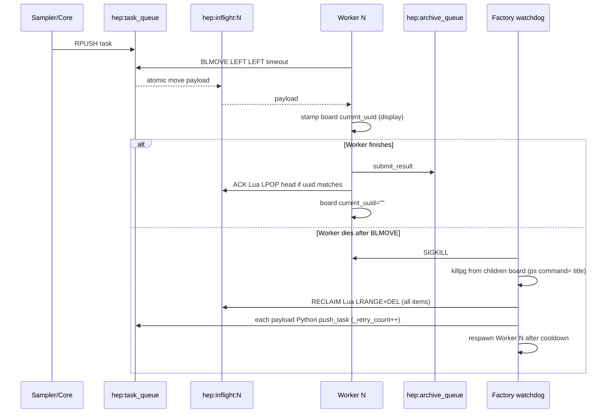
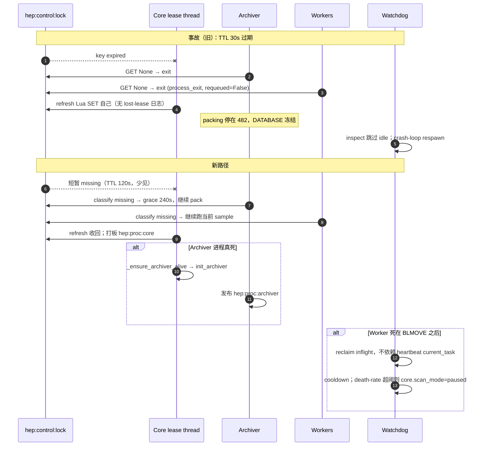

# Redis 进程广播板与运行时恢复加固

| 字段 | 值 |
| --- | --- |
| 文档 | Jarvis-HEP Process Board / Dual-Plane Redis |
| 作者 | Pengxuan Zhu（维护者） / 后续实现者 |
| 日期 | 2026-09-09 |
| 状态 | Draft |
| 代号 | D26.1（接 D25.4 mixin 拆分；不改 PackID / SAMPLE bucket / identity mapper） |
| 触发事故 | `iDM_Vector_V1`（EnsembleMCMC，500 chains × 10000 iter，190 workers）在 Ubuntu 上跑约 38 小时后卡在 80.6% |
| 相关代码 | `jarvishep2/queue/`、`jarvishep2/runtime/`、`jarvishep2/io/archiver.py`、`jarvishep2/file_operation_service.py`、`jarvishep2/async_subprocess.py` |

---

## Overview

`iDM_Vector_V1` 的挂死不是单点 bug，而是 **控制锁 TTL 过短 + “GET None = 被抢” + Archiver 无监督 + 任务所有权写在 heartbeat 里 + watchdog 忽略 idle + Redis 单连接 `socket_timeout=None`** 叠在一起的系统性故障。已经落地的补丁（锁 TTL 120s、missing/stolen 分类、Archiver 重启、pull 后立刻 stamp heartbeat）堵住了那一次事故的直接出口，但没有改变底层模型：进程存活事实、任务所有权、计数账本、阻塞队列被揉在同一套 Redis key 和同一个阻塞 client 上。

本设计把 Redis 拆成两个互不混用的平面，并新增 **D26.1** mixin `jarvishep2/queue/_redis_proc_board.py`（布局模仿 D25.4 的 `_redis_control.py` 等，但本变更的代号是 D26.1）：

- **Handoff 平面**（可消费、会消失）：`hep:task_queue`、`hep:feedback`、`hep:archive_queue`、`hep:inflight:{worker}`、SAMPLE bucket ready。任务所有权只活在 inflight 上，生产路径用 **一条** `BLMOVE hep:task_queue hep:inflight:{worker} LEFT LEFT timeout`（FIFO，与现码 `RPUSH`+`BLPOP` 同端），随后 Lua 把 `LLEN>1` 的多余条目弹回 `task_queue`。
- **Broadcast 平面**（单写者、带 TTL、他人只读）：`hep:proc:core` / `hep:proc:archiver` / `hep:proc:redis` / `hep:proc:worker:{id}` / `hep:proc:children:{id}`。每个 key 只有一个进程写；Monitor / Factory / 其它角色按 **客户端约定** 只调用读 API。本设计 **不上 Redis ACL**。板子不是命令，也不是账本。

Core 读 worker/archiver/redis 板，把 `scan_mode=running|degraded|paused|draining|stopping` 写在 **自己的** `hep:proc:core` 上，作为 worker 恢复熔断器。FileOperation 与 calculator 孤儿统一按 session-leader/pgid 回收（`factory.py` 的 PID 复用洞 **不会被完全关闭**）。控制面 Redis 调用使用短 `socket_timeout`；任务 `BLPOP`/`BLMOVE` 继续 `socket_timeout=None`。

---

## Background & Motivation

### 事故链（已核实，对应现码）

`iDM_Vector_V1`：EnsembleMCMC、500 chains × 10000 iter、190 workers，约 38 小时后进度停在 80.6%。磁盘和 inode 都没耗尽。根因链：

1. **控制锁 TTL 30s 过紧。** 一次 IO/调度停顿让 `hep:control:lock` 过期。现码已改为 `CONTROL_LOCK_TTL_SEC = 120`（`jarvishep2/queue/redis_queue.py`）。
2. **Archiver / Worker 把 `GET None` 当成 “owner lost” 直接退出**（日志 `control lease expired`）。现码已用 `classify_control_lock` / `next_control_lock_watch` 区分 `missing` vs `stolen`，grace = `max(60, 2*TTL)`（`jarvishep2/queue/_redis_control.py`）。
3. **Core 的 refresh Lua 在 key 缺失时会重新 SET 自己的锁**（故意如此，见 `tests/test_redis_queue.py::test_control_lock_refresh_can_reclaim_an_expired_own_lease`），并且 **不打** `lost Redis control lease`。扫描继续，Archiver 已经死了。
4. **Archiver 当时无监督。** packing 停在 bucket 482；DATABASE 冻在 964,734 行；其后约 3M sample 从未进 HDF5；SAMPLE 涨到 136G / 2017 个 bucket 目录。现码已在 `_RuntimeSupervisor._control_lease_loop` 里调用 `_ensure_archiver_alive`（`jarvishep2/runtime/_runtime_supervisor.py`）。
5. **Worker crash-loop**（`reason=process_exit, requeued=False`）：
   - heartbeat 线程同样把 `owner != expected`（含 `None`）当 stolen；
   - 任务已被 `BLPOP` 出 `hep:task_queue`，但 `_current_task` 还没写入 heartbeat（现码已在 `_main_loop` 里 pull 后立刻 stamp，见 `tests/test_worker_mvp.py::test_main_loop_heartbeats_in_flight_task_before_process`）；
   - EnsembleMCMC `wait_for_generation` 按 uuid barrier 等 feedback（`jarvishep2/sampling/feedback_sampler.py`），丢失的 inflight uuid 让整代卡住，默认 `generation_timeout=3600s`（`mcmc_sampler.py`）。
6. **Factory watchdog 只 stale-check `busy`/`starting`**（`factory.py::_Watchdog.inspect_workers`），**永久忽略 hung 在 `idle` 的 init**。`Worker.run()` 顺序是 `_init_redis()`（写一次 `status=idle`）→ `_init_runtime()`（FileOperation / calculator 可能卡住）→ 才 `_start_heartbeat_thread()`。hung init 期间没有周期心跳。无 restart backoff。
7. **FileOperation 是 `daemon=True` 的 `multiprocessing.Process`，spawn 时没有 `start_new_session`。** 子进程入口里才 `os.setsid()`（`file_operation_service.py::_file_operation_main`）。`kill_orphan_process_groups` 只杀 `getpgid(pid)==pid` 的 session leader，setsid 之前的孤儿会被跳过。Calculator `Popen(..., start_new_session=True)` 从出生就是 leader，但 **只在 heartbeat 已列出 PID 时才会被收割**（心跳间隔默认 5s）。
8. **`socket_timeout=None` 是为 BLPOP 故意的**（`RedisQueue._client_kwargs`，`tests/test_redis_queue.py`）。若 Redis 卡住，watchdog / lease refresh / sampler barrier **共用同一类阻塞 client，一起冻死**。

### 当前状态（工作树已落地，本设计不当作待办重做）

| 项 | 位置 | 行为 |
| --- | --- | --- |
| TTL 120s | `CONTROL_LOCK_TTL_SEC` | refresh 间隔 TTL/3 = 40s |
| missing ≠ stolen | `classify_control_lock` / `next_control_lock_watch` / `control_lock_missing_grace_sec` | grace = max(60, 2×TTL) = 240s |
| Archiver 租约循环 | `io/archiver.py` `ArchiverProcess.run` | 用 classifier；stolen 立刻退，missing 过 grace 才退 |
| Worker 租约循环 | `runtime/worker.py` `_heartbeat_loop` | 同上 |
| pull 后 stamp | `Worker._main_loop` | BLPOP 后立刻写 `_current_task` + `_heartbeat("busy")` |
| Worker 启动异常 | `Worker.run` | `_init_redis` 进入 try；`worker_log.exception` |
| Archiver 重启 | `_RuntimeSupervisor._ensure_archiver_alive` | 控制租约线程里 `is_alive()` 为假则 `init_archiver`；失败则 `_interrupt_requested` |

这些补丁让 **同一条事故链不再以同样方式重演**，但任务所有权仍在 heartbeat JSON 里、idle hung 仍被 watchdog 跳过、控制面仍可能被 BLPOP 连接拖死、FileOperation/calculator 孤儿语义仍不对称、190 worker 崩溃仍会无熔断地 respawn。

### 痛点（量化）

- 190 个 Worker × 默认 heartbeat 5s × watchdog `stale_sec=30` × `pull_timeout` 生产路径为 1s（`worker_config.py` 写死 `pull_timeout: 1`）。
- 一次丢 inflight：该 uuid 的 feedback 永远不来，EnsembleMCMC 这一代最多空等 3600s，然后 `TimeoutError`；若 Core 仍在跑、Archiver 已死，HDF5 与 SAMPLE 会再背离数小时。
- 当前 `hep:worker:status:{id}` 把整包 `current_task`（含 `u_coords` / `execution_plan`）塞进 heartbeat。这既是 Monitor 不该看的载荷（`docs/MONITOR_V2_TUI_DESIGN.md` §6.2），也是错误的所有权存储。

---

## Goals & Non-Goals

### Goals

1. 引入 Broadcast 平面：每个角色只写自己的 `hep:proc:*` HASH，TTL 表示存活；其它进程只读。
2. 引入原子 inflight：任务所有权从 heartbeat 挪到 `hep:inflight:{worker}`，与板子解耦。
3. Worker 恢复熔断：单 worker cooldown + 池级 death-rate fuse；状态写在 `hep:proc:core`，不改别人的 HASH。
4. FileOperation 与 calculator 孤儿统一按 pgid/session-leader 回收；children 板在 spawn 当时更新，不等下一个 5s 心跳。
5. Archiver 与 managed Redis 的监督与 Worker 同级：各自有板，Core 读板并采取重启/停机决策。
6. Watchdog 不再永久忽略 `idle`；heartbeat 线程在 `_init_runtime` **之前**启动。
7. 控制面 Redis 短超时；BLPOP 面保持 `socket_timeout=None`。
8. Monitor 继续做第三方只读附着（`docs/MONITOR_V2_TUI_DESIGN.md`），改读 `hep:proc:*`。只读是 **不调用写 API** 的客户端约定（`SnapshotReader` 测试禁止 `r.set/hset`），**不是** Redis ACL。

### Non-Goals

- 不改 `hep:control:lock` 的 reclaim Lua（key 缺失时 SET 自己的锁是故意的）。
- 不把全局 `socket_timeout` 改成 5s；不把 2s 控制面超时设到 `self.r`。
- 不改 identity mapper、PackID 池、SAMPLE bucket 编号/封存/打包协议。
- 不把板子当成命令通道（停机用 SIGTERM / 停止发任务，不用 `HSET` 别人的 key）。
- 不把板子当成账本（`completed`/`failed`/`running` 仍走 `hep:sample:stats` 的 `HINCRBY`）。
- 不把 Monitor 做成控制器；不 `SCAN hep:worker:*`；不把 `current_task` 整包送进 TUI/Chat。
- 不把 managed Redis 在进程死后静默拉起一个空实例（会丢掉队列/inflight/stats）；那种情况走 `--resume`。
- 不重做已落地的 lease grace / Archiver 重启 / pull-then-heartbeat。
- **本设计不上 Redis ACL、不创建 monitor 用户。** `write_redis_conf` 保持 `bind 127.0.0.1` + `protected-mode yes`。ACL 是后续独立票，不是 D26.1。
- **生产路径不用 `BRPOPLPUSH`。** 它是 `BLMOVE source RIGHT dest LEFT`，会从队列尾部偷任务，破坏 FIFO，并与仍走 `BLPOP` 的过渡 Worker 竞态。

---

## Key Decisions

| # | 决策 | 理由 |
| --- | --- | --- |
| KD-1 | Redis 分成 Handoff / Broadcast 两平面，禁止混用 | 事故的本质是“所有权、存活、账本、阻塞队列”写在同一类 key 上。单写者板 + 可消费队列是最小的竞态回避策略。 |
| KD-2 | 新 mixin `_redis_proc_board.py` 组合进 `RedisQueue`，与 D25.4 的 `_redis_control.py` / `_redis_task_broker.py` / `_redis_calc_pool.py` / `_redis_sample_buckets.py` 并列 | 调用方继续 `from jarvishep2.redis_queue import RedisQueue`；shim `jarvishep2/redis_queue.py` 不变。 |
| KD-3 | 板是 HASH + `EXPIRE`，字段 last-write-wins overlay，**不是**整包 JSON SET。Core 进程内用命名锁 `core._proc_board_lock`，每个发布者 **只 HSET 自己的字段分区** | 与现有 `heartbeat()` 的 `HSET mapping=` 一致。Lease 线程默认带上 `scan_mode=running` 会盖掉 fuse。 |
| KD-4 | 每个 `hep:proc:*` 只有一个写者进程：Worker 写自己的 worker/children 板；Archiver 写 archiver 板；Core 进程写 `hep:proc:core` **和** `hep:proc:redis`（redis-server 不是 Python） | managed Redis 无法自报；Core 已持有 `ManagedRedisServer.process`。 |
| KD-5 | `current_uuid` 在 worker 板上只是展示；任务所有权只在 `hep:inflight:{worker}` | 修复 “heartbeat 还没写完 current_task 任务已经 BLPOP 走了”。 |
| KD-6 | 生产路径 **只** 用 `BLMOVE source LEFT dest LEFT`。`connect()` / `ManagedRedisServer.ensure()` 用 `COMMAND INFO BLMOVE`（或 `INFO server redis_version`）**fail-fast**。无 `BRPOPLPUSH` 回退。Lua `LPOP`+`LPUSH` **仅** fakeredis/单测 | `BRPOPLPUSH` ≡ `BLMOVE RIGHT LEFT`，偷队尾，破坏 FIFO。Ubuntu 22.04 `apt install redis-server` 是 6.0.x（无 BLMOVE）；`INSTALL.md` 同时接受 valkey。必须在启动门禁，不能 silently 走错端。 |
| KD-7 | inflight **不设短 TTL**。ACK 是匹配 uuid 的单条 `LPOP`，**禁止** ACK 对 list 做 `DEL`。Reclaim **抽干** list（Lua `LRANGE 0 -1` 拷贝后 `DEL`；或循环 `LPOP` 直到空）。**每条** payload 由 Python `_retry_count++` 再 `push_task`。占用 bounce 用 `LPUSH` 回队头 | Worker 死在 BLMOVE 与占用 Lua 之间会留下 `LLEN=2`。单次 `LPOP` reclaim 会把第二条变成无主孤儿（原事故的缩小窗口）。ACK 的 `DEL` 仍会一次丢掉两条；reclaim 的 `DEL` 发生在拷贝全部元素之后，安全。 |
| KD-8 | 两个 `redis.Redis()`、**两份 ConnectionPool**。`_client_kwargs()` **无参** 仍是 `socket_timeout=None`（锁住 `test_client_kwargs_disable_socket_timeout_for_blocking_pops`）。`from_url` 调两次。`close()` 两个都关。`_ctrl()` 绝不被 `_blpop` / `_blpop_many` / `pull_task` / `pull_feedback` / `pull_result` / `pull_task_to_inflight` 使用 | 共享 pool 会把 2s timeout 漏到 BLPOP。redis-py 8 默认 5s 正是现有测试要锁的竞态。注入测试 client 时 `r_ctrl is r`。 |
| KD-9 | 不改 lock-reclaim Lua；lease 检查继续走 `classify_control_lock`。板不是锁 | 板丢失 = 进程安静，不等于锁被抢。Silence ≠ stolen 已经是用户同意的不变量。 |
| KD-10 | 过渡期 dual-write `hep:worker:status:{id}`；**去掉 `current_task` 整包冻结在 PR-8**（Monitor V1 snapshot 之后） | 不打断现有 `fetch_worker_status` / Monitor V1 / `decode_heartbeat_task`。PR-3 仍写该字段作 fallback。 |
| KD-11 | Watchdog 对 **所有** status 做 stale 检查；`idle` ∧ `LLEN(inflight)>0` 视为失败（`inflight_without_busy`）。占用 Lua **循环** `LPOP`+`LPUSH` 直到 `LLEN<=1`，然后返回剩余头（Worker 继续做 T1），**禁止** `None`+`busy` 空转。`pull` 仍 `None` 且 `LLEN>0` 时：`get_inflight_task()` + `process_task`，或 `_is_running=False` 让 Factory 抽干 reclaim——二者择一，禁止 busy-forever。`Worker._spawned_at` 由父进程在 `start()` 写入。板与 children 的 EXPIRE 都是 `board_ttl_sec = max(PROC_BOARD_TTL_SEC, 2 * stale_sec)` | 堵住 hung init。硬编码 children TTL=60 会在 `stale_sec=120` 时先蒸发回收名单。占用后空转 busy 会骗过 `test_long_calculator_survives_short_stale_threshold`。 |
| KD-12 | FileOperation 保持 `daemon=True` + 子进程尽早 `os.setsid()`；父进程 **轮询数秒**（默认 5s）直到 `getpgid==pid` 再写 children 板。每个 heartbeat **必须** `EXPIRE`/`touch` children 板。FileOperation `killpg` **必须**用与 `process_cleanup.list_jarvis_processes` 相同的源：`ps -ax -o pid=,command=`（setproctitle 后的 argv0），前缀 `Jarvis-FileOperation`（允许 `:<scan>`）。**禁止**读 `/proc/pid/comm`（Linux 截断 16 字节 → `Jarvis-FileOperat`，守卫会永远 no-op）。**禁止**把该 title 检查套到 calculator 二进制。watchdog **禁止**对非 leader `os.kill`。PID 复用洞视为残留风险 | `file_operation_title` 产出 `Jarvis-FileOperation:<scan>`（`jarvishep2/proc_title.py`）。`comm` 截断是实现陷阱，必须写进 `kill_orphan` 注释。calculator 没有 Jarvis- 前缀，只保留 `getpgid==pid`。 |
| KD-13 | 熔断器：per-worker cooldown + 池级 death-rate。`paused` **保留**现有 Worker，只停 respawn / `push_task`。恢复条件是 death-rate 低于 `degraded_frac` 持续 `pause_grace_sec`，然后重新填空 slot——**不**要求 `alive ≥ 0.8*total`（paused 期间空 slot 是故意的）。必须有 `degraded → running`。PR-6 **硬依赖** PR-3 | 38/190 触发 pause 后 alive=152 再死一个就永远回不来。无 inflight reclaim 的 pause 会再丢 BLPOP 任务。 |
| KD-14 | managed Redis **进程死亡 → 请求停机**，不静默拉空实例。interrupt 时 Core **`close()` 自己的两个 client** 以解开 Core/`wait_for_generation` 的 BLPOP。Worker 有独立 TCP 连接，走现有 `TaskFactory.request_worker_shutdown` / `stop_all_workers` 的 SIGTERM（然后 SIGKILL）。仅当 redis-server 进程已死时 Worker 才会因 RST 退出 | `close()` Core 的 client 不会掐断 190 条 Worker 连接。把 “Workers 随后因连接错误退出” 写成 interrupt 的后果是错的。 |
| KD-15 | Sampler `wait_for_generation` 将 feedback BLPOP **封顶 1s**，每轮读 `scan_mode`。**从未成功读到** `scan_mode` 时当作 `running`，**不**启动 unknown-fail 计时。计时只在 seen→missing 转换后开始，时钟 = **已发布的 core 板 TTL**（`board_ttl_sec = max(PROC_BOARD_TTL_SEC, 2 * stale_sec)`，与 TTL 表同一公式）。`pause_grace_sec` 只做熔断恢复 / `alive==0` interrupt。`paused`/`stopping`/`_interrupt_requested` 尽快失败 | 启动竞态不能在 60s 后杀掉健康 generation。YAML `stale_sec=120` 时 core 板活 240s，sampler grace 必须同长。 |
| KD-16 | **无 Redis ACL。** Monitor / watchdog「只读」是调用约定。`hep:control:lock` 仍是唯一 stacked-run fence | `write_redis_conf` 没有 `ACL FILE`。上 ACL 会误伤 `INCR hep:{kind}:op_count` 与 dual-write。本机伪造板是已承认的威胁模型。 |
| KD-17 | 每个 heartbeat **tick 只 `INCR` 一次** `hep:worker:op_count`（板 HSET 与旧 status 走同一 pipeline）。Worker `_shutdown_runtime`：`drop_proc_board`；inflight 仅在 sample 已 `submit_result` 后 ack，否则留给 Factory reclaim | dual-write 两次 INCR 会让 Monitor 门控/速率翻倍。TTL 残留板会污染下一轮 `worker_ids` 范围不够长的 fresh reset。 |

---

## Proposed Design

### 平面划分

```
Handoff（可消费，会消失）              Broadcast（单写者，TTL，他人只读）
─────────────────────────────────      ─────────────────────────────────
hep:task_queue                         hep:proc:core
hep:feedback / :chain:{id}             hep:proc:archiver
hep:archive_queue                      hep:proc:redis
hep:sample:bucket:ready                hep:proc:worker:{id}
hep:inflight:{worker}                  hep:proc:children:{id}
hep:sample:stats          ← 账本，INCR 友好，既不是 handoff 也不是板
hep:control:lock          ← 继续只做 stacked-run fence，不是板
hep:worker:status:{id}    ← 过渡期 dual-write，不是新设计的所有权源
```

不变量（已与用户对齐）：

1. **板不是命令。** 停机 = SIGTERM / 停止 `push_task` / `scan_mode=stopping`。禁止 `HSET hep:proc:worker:{id} status=stop`。
2. **板不是账本。** `completed`/`failed`/`running` 只通过 `submit_result` / inflight pull 的 `HINCRBY`。
3. **Silence ≠ stolen。** 板或锁缺失走 grace；stolen 仅当 owner 字符串是另一个活着的 owner。
4. **Monitor 永远是第三方只读附着（客户端约定，无 ACL）。** 实现约束：Monitor 代码路径不得调用任何 Redis 写命令；用测试锁住，而不是 `user monitor on -@all`。Factory watchdog 在 Core 进程内，**会**经 Core API 写 `scan_mode`、**会抽干** inflight（`LRANGE`+`DEL`，不是单次 `LPOP`）——它不是只读角色。

### 进程树与写/读矩阵

```mermaid
flowchart TB
    subgraph coreProc["Jarvis:&lt;scan&gt;  (Core process)"]
        Main["Jarvis2Core main / sampler"]
        Lease["Jarvis-ControlLease thread"]
        WD["_Watchdog thread 1s"]
        Mon["_MonitorLoop thread"]
        Fac["TaskFactory in-process"]
    end
    Arch["Jarvis-Archiver:&lt;scan&gt;"]
    RedisSvr["Jarvis-Redis:&lt;scan&gt;@port"]
    subgraph w0["Jarvis-Worker-N:&lt;scan&gt;"]
        WMain["Worker main_loop"]
        WHb["heartbeat thread 5s"]
        FO["Jarvis-FileOperation setsid"]
        Calc["calculator Popen setsid"]
    end
    MonA["Jarvis monitor (3rd party, read-only)"]

    Main -->|write| CoreB["hep:proc:core"]
    Lease -->|write lock| Lock["hep:control:lock"]
    Lease -->|write| CoreB
    Lease -->|write| RedisB["hep:proc:redis"]
    WD -->|read| WB["hep:proc:worker:*"]
    WD -->|read| ChB["hep:proc:children:*"]
    WD -->|read/write inflight reclaim| IF["hep:inflight:{N}"]
    WD -->|write scan_mode fields| CoreB
    WMain -->|BLMOVE| TQ["hep:task_queue"]
    WMain -->|write| IF
    WHb -->|write + EXPIRE children| WB
    WHb -->|touch| ChB
    WMain -->|write spawn-time| ChB
    Arch -->|write| AB["hep:proc:archiver"]
    Arch -->|BLPOP| AQ["hep:archive_queue"]
    MonA -->|read only| CoreB
    MonA -->|read only| WB
    MonA -->|read only| AB
    MonA -->|read only| RedisB
```



**写/读矩阵**（W = 唯一写者，R = 只读，— = 不碰）：

| Key | Core | Factory watchdog | Worker N | Archiver | Monitor | Sampler |
| --- | --- | --- | --- | --- | --- | --- |
| `hep:proc:core` | **W**（分区 + `_proc_board_lock`） | 同进程，经 `_set_scan_mode` 只写 fuse 分区 | R | R | R（约定） | R（`scan_mode`） |
| `hep:proc:archiver` | R | R | — | **W** | R（约定） | — |
| `hep:proc:redis` | **W** | R | — | — | R（约定） | — |
| `hep:proc:worker:{N}` | R | R | **W（仅自己的 id）** | — | R（约定） | — |
| `hep:proc:children:{N}` | R | R（killpg 源） | **W（仅自己的 id；heartbeat touch）** | — | R（约定） | — |
| `hep:inflight:{N}` | resume drain | reclaim：**抽干** list → 每条 Python `push_task` | **W** pull/ack | — | — | — |
| `hep:task_queue` | push | requeue `push_task` | `BLMOVE LEFT LEFT` | — | R llen（约定） | push |
| `hep:control:lock` | W refresh | — | R classify | R classify | R（约定） | — |
| `hep:sample:stats` | reset | 失败耗尽时 submit_result | pull +1 running / submit | — | R（约定） | R |
| `hep:worker:status:{N}` | R（过渡） | R（过渡） | **W dual-write** | — | R 过渡（约定） | — |

表中 Monitor 列的「R」= 调用约定，Redis 不会拒绝 `HSET`。Factory watchdog 跑在 Core 进程内；`hep:proc:core` 用命名锁 `Jarvis2Core._proc_board_lock`（`threading.Lock`）串行化分区 `HSET`。

### 板字段 schema

所有板都是 HASH。每次 publish：`HSET` 变更字段 + `EXPIRE key ttl`。值为 Redis 原生 string/int；嵌套结构 JSON 编码（复用 `_encode_heartbeat_value`）。

公共字段（每个板都有）：

```
role            core | archiver | redis | worker | children
pid             int
pgid            int or ""
ts              unix float（写者的 time.time()）
owner           与 control lock 相同的 owner 字符串（Core）；Worker 用 "worker:{id}:{pid}"
scan_name       str
host            os.uname().nodename
```

`hep:proc:core`（Core 进程单写。**每个 in-process 发布者只传自己分区的字段**，并持有 `core._proc_board_lock`。禁止把整份 snapshot 当 kwargs 回写。）

```
# 分区 MAIN（bootstrap / shutdown；锁：_proc_board_lock）
run_id, started_at, workers_total
scan_mode               仅 draining | stopping（shutdown 路径）
# 分区 WATCHDOG（熔断；锁：同一把 _proc_board_lock）
scan_mode               仅 running | degraded | paused
pause_reason            str, 仅 degraded/paused
workers_alive, workers_respawned, death_window_respawns, death_rate_1m
last_respawn_ts
# 分区 LEASE（1s 监督 tick；锁：同一把。此分区禁止出现 scan_mode）
lease_owner, lease_ts, archiver_pid, archiver_alive, redis_pid, redis_alive
```

`scan_mode` 合法值：`running | degraded | paused | draining | stopping`。Lease 线程的 redis/archiver 板 tick **不得** 带 `scan_mode=`，否则会把 watchdog 的 `paused` 打回 `running`。单测：watchdog 写入 `paused` 后调用 lease 的 `publish_proc_board("core", redis_alive=1)`，读回仍是 `paused`。

`hep:proc:worker:{id}`（展示，不是所有权）：

```
status          starting | idle | busy | stopping | stopped
current_uuid    str, 展示用；无任务时 ""
file_operation_pid
held_calc_n     int（张数，不把 pack map 当所有权）
heartbeat_interval_sec
```

`hep:proc:children:{id}`（回收源）：

```
file_operation_pid
file_operation_pgid     仅当 getpgid==pid 才写入；否则 ""
calc_pgids              JSON int list（session leaders）
updated_reason          spawn | reap | heartbeat
```

`hep:proc:archiver`：

```
status          starting | running | draining | stopped
records_written int（与 Value 对齐，监控用，不是账本权威）
last_bucket_packed
db_path         basename only（避免把绝对路径泄漏给 Chat；Monitor V2 可再裁剪）
```

`hep:proc:redis`（Core 写）：

```
status          running | unreachable | stopped
pid, port, title
started_by_us   0|1
last_pong_ts
```

**TTL：** 常量 `PROC_BOARD_TTL_SEC = 60` 是下限，与默认 `stale_sec=30` 独立。每次 publish/touch 的实际 EXPIRE 为：

```
ttl = max(PROC_BOARD_TTL_SEC, 2 * watchdog.stale_sec)
```

YAML 把 `stale_sec` 调到 120 时 TTL=240，板不会先于 watchdog 蒸发。`r_ctrl` 一次 2s timeout 漏掉 EXPIRE 时，板仍活过 `stale_sec`。Watchdog 仍以板上 `ts` 年龄为主；key 完全消失视为 stale（进程安静），**不是** stolen。Archiver 特例：`max(ttl, ARCHIVER_BOARD_TTL_SEC)`，`ARCHIVER_BOARD_TTL_SEC = 120`。Worker **每次** `_heartbeat` 必须用 **同一个** `board_ttl_sec` `touch`/`EXPIRE` `hep:proc:children:{id}`（禁止 children 写死 60）。

两个时钟不得混用：

| 时钟 | 公式 | 用途 |
| --- | --- | --- |
| `board_ttl_sec`（板存活 / sampler seen→missing） | `max(PROC_BOARD_TTL_SEC, 2 * stale_sec)` | worker/children/core EXPIRE；sampler unknown-fail **只用这个**，不用裸 `PROC_BOARD_TTL_SEC` |
| `pause_grace_sec`（熔断） | YAML/默认 60 | death-rate 低于阈持续此时长才 `degraded/paused→running`；`alive==0` 同宽限才 interrupt |

**载荷与内存（190 workers）：**

| 对象 | 估大小 | 190 份 |
| --- | --- | --- |
| worker 板 ~12 字段，无 task blob | ~400 B | ~76 KB |
| children 板（1 FileOp + 数个 calc pgid） | ~250 B | ~48 KB |
| inflight，忙时整包 task ~2–8 KB | ~5 KB | 全忙 ≈ 0.95 MB |
| core + archiver + redis | < 2 KB | 2 KB |
| 过渡期 dual-write `hep:worker:status:{id}` 仍含 current_task | ~5 KB | ~0.95 MB |
| **合计上限** | | **~2 MB** |

刷新：190 × (HSET+EXPIRE) / 5s ≈ 38 pipeline/s，localhost Redis 可忽略。Watchdog 每 1s pipeline `HGETALL` × 190 + `LLEN` inflight，单 RTT，<10 ms 量级。板 TTL 60s，约 190×650 B ≈ 120 KB 常驻（不含 inflight 载荷）。

### Mixin 接口（`jarvishep2/queue/_redis_proc_board.py`）

与现 mixin 一样：文件顶部从 `jarvishep2.queue.redis_queue` import 常量；`RedisQueue` 多重继承。控制面命令一律走 `self._ctrl()`（见 KD-8），禁止在 BLPOP client 上做板读写。

```python
# jarvishep2/queue/redis_queue.py  — 新增常量
PROC_CORE = "hep:proc:core"
PROC_ARCHIVER = "hep:proc:archiver"
PROC_REDIS = "hep:proc:redis"
PROC_WORKER = "hep:proc:worker:{id}"
PROC_CHILDREN = "hep:proc:children:{id}"
INFLIGHT = "hep:inflight:{worker}"
PROC_BOARD_TTL_SEC = 60  # lower bound; publish uses max(this, 2 * stale_sec)
ARCHIVER_BOARD_TTL_SEC = 120
CONTROL_SOCKET_TIMEOUT_SEC = 2.0
PROC_ROLES = frozenset({"core", "archiver", "redis", "worker", "children"})
```

```python
class _ProcBoard:
    """Private RedisQueue mixin: broadcast boards + inflight ownership (D26.1)."""

    def _proc_board_key(self, role: str, *, owner_id: str | None = None) -> str:
        ...

    def publish_proc_board(
        self,
        role: str,
        *,
        owner_id: str | None = None,
        ttl_sec: int | None = None,
        **fields: Any,
    ) -> None:
        """HSET overlay + EXPIRE. Raises ValueError on unknown role.
        Worker/children require owner_id. Never called by Monitor."""

    def read_proc_board(
        self,
        role: str,
        *,
        owner_id: str | None = None,
    ) -> dict[str, Any]:
        """HGETALL; missing key → {} . Never raises on empty."""

    def read_proc_boards(
        self,
        role: str,
        *,
        owner_ids: list[str],
    ) -> dict[str, dict[str, Any]]:
        """Pipeline HGETALL for worker/children. Monitor/Factory 热路径。"""

    def touch_proc_board(
        self,
        role: str,
        *,
        owner_id: str | None = None,
        ttl_sec: int | None = None,
    ) -> bool:
        """EXPIRE only; False if key missing（写者发现自己的板被驱逐）。"""

    def drop_proc_board(self, role: str, *, owner_id: str | None = None) -> None:
        """Writer shutdown path. Others must not call."""

    def publish_children_board(
        self,
        worker_id: str,
        *,
        file_operation_pid: int | None,
        file_operation_pgid: int | None,
        calc_pgids: list[int],
        reason: str = "heartbeat",
        ttl_sec: int | None = None,
    ) -> None: ...

    def read_children_board(self, worker_id: str) -> dict[str, Any]: ...

    def pull_task_to_inflight(
        self,
        worker_id: str,
        timeout: int = 5,
    ) -> dict[str, Any] | None:
        """Blocking BLMOVE LEFT LEFT then occupancy Lua.
        Occupancy loops LPOP+LPUSH until LLEN<=1, then returns the remaining
        head (ok). None only if the queue was empty (LLEN==0 after BLMOVE miss).
        If Python still sees None with LLEN>0, caller must get_inflight_task()
        + process_task or exit — never busy-loop."""

    def get_inflight_task(self, worker_id: str) -> dict[str, Any] | None:
        """LINDEX 0; 不消费。热路径调试/Monitor 不用。"""

    def ack_inflight_task(self, worker_id: str, uuid: str) -> bool:
        """Single Lua: LINDEX 0, cjson uuid match, LPOP head only.
        Never DEL the list. False on empty/mismatch (including LLEN>1
        when head uuid differs)."""

    def reclaim_inflight_task(self, worker_id: str) -> list[dict[str, Any]]:
        """Factory: drain the whole list. Lua LRANGE 0 -1 then DEL
        (or LPOP-until-empty). Returns every payload (possibly >1).
        Caller _retry_count++ and push_task **each**. Empty → []."""

    def list_inflight_worker_ids(self) -> list[str]:
        """SCAN match hep:inflight:* （仅 resume/reset；热路径不用 SCAN）。"""

    def require_blmove(self) -> None:
        """COMMAND INFO BLMOVE (or INFO redis_version ≥ 6.2). Fail fast."""
```

`RedisQueue` 组合：

```python
class RedisQueue(
    _TaskBroker, _CalcPool, _SampleBuckets, _ControlAndHeartbeat, _ProcBoard
):
    ...
```

`heartbeat()` **暂时保留**，内部改为 **一条** pipeline：`HSET hep:worker:status:{id}` + `HSET hep:proc:worker:{id}` + `EXPIRE` worker 板 **`board_ttl_sec`** + `EXPIRE hep:proc:children:{id}` **同一 ttl** + **一次** `INCR hep:worker:op_count`。`publish_proc_board` 本身 **不再** INCR。`current_task` 整包只留在旧 status key，直到 **PR-8** 删除。

Worker `_shutdown_runtime`：若本 sample 已 `submit_result` 则 `ack_inflight_task`；否则 **留下** inflight 给 Factory reclaim。然后 `drop_proc_board("worker")`、`drop_proc_board("children")`，再 `close()` 两个 client。

### 双 client（控制面短超时）

现码 `RedisQueue._client_kwargs(self)` **无参**，固定 `socket_timeout=None`。`tests/test_redis_queue.py::test_client_kwargs_disable_socket_timeout_for_blocking_pops` 以无参调用锁住这一点。PR-2 **不得**把无参签名改成必填 `blocking=` 以致该测试失败；新增控制面 kwargs 用另一个方法。

```python
def _client_kwargs(self) -> dict[str, Any]:
    """Blocking BLPOP/BLMOVE client. No-arg form MUST stay socket_timeout=None."""
    return {
        "decode_responses": self._codec == "json",
        "socket_timeout": None,
        "socket_connect_timeout": float(
            self.config.get("socket_connect_timeout", self._SOCKET_CONNECT_TIMEOUT_SEC)
        ),
    }

def _control_client_kwargs(self) -> dict[str, Any]:
    kwargs = self._client_kwargs()
    kwargs["socket_timeout"] = float(
        self.config.get("control_socket_timeout", CONTROL_SOCKET_TIMEOUT_SEC)
    )
    return kwargs

def connect(self) -> None:
    if self.r is not None:
        if self.r_ctrl is None:
            self.r_ctrl = self.r  # injected test client: one object, two names
        return
    import redis
    blocking = self._client_kwargs()
    control = self._control_client_kwargs()
    url = self.config.get("url")
    if url:
        self.r = redis.Redis.from_url(str(url), **blocking)
        self.r_ctrl = redis.Redis.from_url(str(url), **control)  # second client, second pool
    else:
        host = str(self.config.get("host", "localhost"))
        port = int(self.config.get("port", 6379))
        db = int(self.config.get("db", 0))
        self.r = redis.Redis(host=host, port=port, db=db, **blocking)
        self.r_ctrl = redis.Redis(host=host, port=port, db=db, **control)
    # require_blmove() is PR-3 only — do not call it from this PR-2 connect().
```

硬约束：

- **两个** `redis.Redis()` 实例、**两份** `ConnectionPool`。禁止 `Redis(connection_pool=self.r.connection_pool)`。pool 级 timeout 会漏到 BLPOP。
- `self.r`：仅 `_blpop`、`_blpop_many`、`pull_task`、`pull_feedback`、`pull_result`、Archiver drain、`pull_task_to_inflight` 的 `BLMOVE`。
- `self.r_ctrl`：锁、板、heartbeat pipeline、stats 读、watchdog、monitor。
- `_ctrl()` **禁止**被上述 blocking 方法使用。
- 测试注入 `client=`：`self.r_ctrl = self.r = client`（fakeredis 无双 pool 问题）。
- `close()`：若 `r_ctrl is not r`，先关 `r_ctrl` 再关 `r`（现码 `close()` 只关 `self.r`，漏 FD）。
- `_require_client`：`self.r is None` 或（非注入路径）`self.r_ctrl is None` 都 raise。
- 新测试：`connect()` 之后 `queue.r.connection_pool is not queue.r_ctrl.connection_pool`；`queue._client_kwargs()["socket_timeout"] is None`；BLMOVE/BLPOP 仍走 `self.r`。

若 `r_ctrl` 抛 `TimeoutError`：写路径 warning + 本次 skip，但仍应尽量 `touch_proc_board`（纯 EXPIRE，失败则记）。读路径返回 `{}`。Sampler：从未读到 `scan_mode` 当 `running`；seen→missing 才用 `board_ttl_sec`（KD-15）。连续失败由 redis 板 `unreachable` + 15s grace 处理。

双 client **不能**单独拯救卡在 `socket_timeout=None` BLPOP 上的 **Core** sampler。Redis 卡住时：lease 1s tick 的 `r_ctrl.ping` timeout → interrupt → Core **`close()` 自己的两个 client** 解开 `wait_for_generation`。Worker 连接不受 Core `close()` 影响，由 `TaskFactory.request_worker_shutdown`（SIGTERM，现码 `factory.py`）收割；redis-server 已死时才 RST。最坏情况（漏关 Core client）：15s grace + 一轮 1s BLPOP。

### 原子 inflight

现码 FIFO：`RPUSH` + `BLPOP`（左弹）于 `_TaskBroker.push_task` / `pull_task`。

`BLPOP` 不能进 Lua。生产路径 **只** 用：

```
BLMOVE hep:task_queue  hep:inflight:{worker}  LEFT LEFT  <timeout>
```

**禁止** `BRPOPLPUSH`（= `BLMOVE RIGHT LEFT`，偷队尾）。**禁止** 生产走 Lua `LPOP` 冒充阻塞。

启动门禁（`RedisQueue.connect` 与 `ManagedRedisServer.ensure` 在 ping 成功后）：

```python
def require_blmove(self) -> None:
    # Prefer COMMAND INFO BLMOVE (exists on Redis ≥ 6.2 and Valkey).
    # Fallback: parse INFO server redis_version; reject < 6.2.
    # Ubuntu 22.04 apt redis-server is 6.0.x — fail with:
    # "Jarvis-HEP D26.1 requires BLMOVE (Redis/Valkey ≥ 6.2); "
    # "Ubuntu 22.04 redis-server is 6.0. Install Redis ≥ 6.2 or valkey-server."
```

fakeredis / 无 `BLMOVE` 的单元测试：走下面 `_ATOMIC_STEAL_TO_INFLIGHT_LUA`（非阻塞 `LPOP`+`LPUSH`），**不得**作为生产回退。

`BLMOVE` 本身不检查占用。双 pull 或 **BLMOVE 成功后、占用 Lua 跑之前 Worker 被杀**，会留下 `LLEN≥2`。因此：

1. **每次** BLMOVE 成功后立刻跑占用 Lua：**循环** `LPOP` 头 + `LPUSH` 回 `hep:task_queue` 队头，直到 `LLEN<=1`。然后返回剩余头为 `ok`。`n_start>1`（bounce 过）**不** `HINCRBY running`；`n_start==1` 才 +1。Python 拿到剩余 T1 并 `process_task`，**禁止**返回 `None` 后 heartbeat `busy` 空转。
2. **防御路径：** 若 `pull_task_to_inflight` 仍返回 `None` 且 `LLEN>0`：`get_inflight_task()` + `process_task` 该 payload，**或** `self._is_running = False` 让 Factory 抽干 reclaim。禁止 `continue` + `busy`。
3. **Reclaim 必须抽干**（`LRANGE`+`DEL`）。单次 `LPOP` 会把间隙留下的第二条变成无主孤儿。

ACK 必须在 **一条** Lua 里完成 uuid 匹配 + 只 `LPOP` 头：禁止 Python `get_inflight` 后再 `EVAL`（与 Factory **抽干** reclaim 竞态）；禁止 ACK 对整个 key `DEL`。生产 codec 为 json；Lua 用 `cjson.decode`。

`running`：占用 Lua 在 **首次** 成功占用时 `HINCRBY running 1`。BLMOVE 与 Lua 之间 crash：任务已在 inflight、running 少 1；Monitor 已 clamp ≥ 0。可接受。

#### Lua / Python 契约

| 名字 | 何时 | KEYS / ARGV | Redis 返回 | Python 映射 | 副作用 |
| --- | --- | --- | --- | --- | --- |
| `BLMOVE LEFT LEFT` | 生产 pull，blocking，`self.r` | source=`hep:task_queue` dest=`hep:inflight:{w}` | payload or nil | nil → `None`（空队列）；payload → 立刻 `EVAL` 占用 Lua | 不碰 `running` |
| `_ATOMIC_OCCUPANCY_LUA` | BLMOVE 之后，或测试 | K1=task_queue K2=inflight K3=sample_stats | `{ok, payload}` 或 `{empty}` | `ok` → `dict`（剩余头，Worker 继续做）；`empty` → `None`（真空闲） | **while LLEN>1：LPOP + LPUSH 回队头**；`n_start==1` 才 `HINCRBY running 1` |
| `_ATOMIC_STEAL_TO_INFLIGHT_LUA` | **仅** fakeredis/单测，非阻塞 | 同上 | false / payload / occupied 标记 | 同 `pull_task_to_inflight`；false→`None` | `LLEN(K2)>0` 则 **不** LPOP K1；否则 LPOP+LPUSH+INCR |
| `_ATOMIC_ACK_INFLIGHT_LUA` | Worker 在 `submit_result` 之后 | K1=inflight ARGV1=uuid | 1 或 0 | `bool`；0 = empty/mismatch | `cjson.decode` 头；uuid 匹配才 `LPOP`；**永不 `DEL`** |
| `_ATOMIC_RECLAIM_INFLIGHT_LUA` | Factory 在 kill/sweep 之后 | K1=inflight | array of payloads（可空） | `list[dict]`；`[]` = 空 | **`LRANGE 0 -1` 拷贝后 `DEL`**（或循环 LPOP 至空）。对 **每一条** Python `_retry_count++` + `push_task`。Lua 不 `RPUSH`/`LPUSH` 回 queue |
| `get_inflight_task` | 调试 | `LINDEX 0` | payload | `dict \| None` | 无 |

占用 Lua：

```lua
-- _ATOMIC_OCCUPANCY_LUA
-- KEYS[1]=hep:task_queue  KEYS[2]=hep:inflight:{w}  KEYS[3]=hep:sample:stats
-- BLMOVE dest LEFT: newest at index 0. Bounce extras until one owner sample.
local n_start = redis.call('LLEN', KEYS[2])
if n_start == 0 then
    return {'empty'}
end
while redis.call('LLEN', KEYS[2]) > 1 do
    local extra = redis.call('LPOP', KEYS[2])
    redis.call('LPUSH', KEYS[1], extra)  -- FIFO head, not tail
end
if n_start == 1 then
    redis.call('HINCRBY', KEYS[3], 'running', 1)
end
return {'ok', redis.call('LINDEX', KEYS[2], 0)}
```

测试专用非阻塞 steal（生产不调用）：

```lua
-- _ATOMIC_STEAL_TO_INFLIGHT_LUA
if redis.call('LLEN', KEYS[2]) > 0 then
    return {'occupied'}
end
local payload = redis.call('LPOP', KEYS[1])
if not payload then
    return {'empty'}
end
redis.call('LPUSH', KEYS[2], payload)
redis.call('HINCRBY', KEYS[3], 'running', 1)
return {'ok', payload}
```

ACK（匹配才弹头，双条目不 `DEL`）：

```lua
-- _ATOMIC_ACK_INFLIGHT_LUA
-- KEYS[1]=hep:inflight:{w}  ARGV[1]=uuid
local payload = redis.call('LINDEX', KEYS[1], 0)
if not payload then
    return 0
end
local obj = cjson.decode(payload)
if tostring(obj['uuid']) ~= ARGV[1] then
    return 0
end
redis.call('LPOP', KEYS[1])
return 1
```

Reclaim（**抽干**，不是单次 LPOP）：

```lua
-- _ATOMIC_RECLAIM_INFLIGHT_LUA
-- KEYS[1]=hep:inflight:{w}
-- Copy then DEL: a crash after DEL is ok (payloads already in the Lua return
-- which redis-py delivers, or the eval is atomic). Never DEL before LRANGE.
local items = redis.call('LRANGE', KEYS[1], 0, -1)
redis.call('DEL', KEYS[1])
return items
```

Factory 回收顺序保持 `tests/test_worker_failure.py::test_kill_precedes_slot_sweep`：

`SIGKILL Worker → killpg(children 板 pgid，ps title 守卫) → sweep PackID → reclaim **全部** inflight → 对每条 Python `_retry_count++` + `push_task` → cooldown 后 respawn`。

```python
def requeue_in_flight_task(self, heartbeat: dict[str, Any], *, worker_id: str) -> bool:
    redis = self._factory.redis
    payloads = redis.reclaim_inflight_task(worker_id)  # list, may be 0..N
    if not payloads:
        task = redis.decode_heartbeat_task(heartbeat)  # PR-8 前 fallback
        payloads = [task] if task else []
    any_requeued = False
    for task in payloads:
        retry_count = int(task.get("_retry_count", 0) or 0)
        if retry_count >= self.max_sample_retries:
            ...  # submit_result Failed as today
            continue
        task["_retry_count"] = retry_count + 1
        redis.push_task(task)
        any_requeued = True
    return any_requeued
```

必须覆盖的测试：占用 Lua `LLEN==3` 循环 bounce 后 `LLEN==1` 且返回原头、`running` 不二次 +1；ack mismatch → 0 且 list 不变；**plant 两条 inflight，一次 reclaim 两条都回 `task_queue` 且 `_retry_count` 各 +1**；reclaim 与 ack 并发：payload 不会双发也不会丢失；**submit 失败（mock `_stage_and_submit` 抛）后 inflight 仍在、未 ACK**；**occupied 路径不 busy-loop**（要么 process leftover，要么 `_is_running=False`）。

Resume：`reconcile_resume_ephemeral` `SCAN hep:inflight:*`、`hep:proc:*` 一并 DELETE。Fresh `reset_run_ephemeral_keys` **在 PR-1** 就按已知 `worker_ids` 删除 `hep:proc:worker|children:{id}` 与 `hep:inflight:{id}` 以及三块全局板（不必等 PR-8）。SCAN 清残留留给 PR-8 resume 冷路径。

#### Inflight 时序



### Hang / recovery 时序（事故 vs 新路径）



### Heartbeat / init 顺序

现状 `Worker.run()`：

```python
self._init_redis()          # heartbeat status="idle" 一次
self._init_runtime()        # 可能卡住：FileOperation、calculator bind
self._heartbeat("starting")
self._start_heartbeat_thread()
self._main_loop()
```

改为：

```python
self._init_redis()                 # connect + r_ctrl; 不发 idle
self._heartbeat("starting")        # 板 + 旧 status key
self._start_heartbeat_thread()     # 从此 5s 刷新，init 卡住也能被看见
self._init_runtime()               # FileOperation start → 立刻 publish children 板
self._heartbeat("idle")            # init 完成，可以 BLMOVE
self._main_loop()                  # pull_task_to_inflight
```

`_init_redis` 里现有的 `heartbeat(status="idle", pid=...)` 删掉，避免 watchdog 在 init 前把 worker 当成健康空闲。

`_main_loop`：

```python
wid = str(self.worker_id)
task = self._redis.pull_task_to_inflight(wid, timeout=pull_timeout)
if task is None:
    leftover = self._redis.get_inflight_task(wid)
    if leftover is None:
        self._heartbeat("idle")
        continue
    # Occupancy/BLMOVE gap left T1 owned. Process it — do NOT busy-loop.
    task = leftover
uuid = str(task.get("uuid") or "")  # bind BEFORE process_task
self._inflight_submitted = False  # only True after submit_result succeeds
with self._hb_lock():
    self._current_task = dict(task)
    self._current_sample_uuid = uuid or None
self._heartbeat("busy")
self.process_task(task)  # finally may skip _stage_and_submit (cleanup except)
if uuid and self._inflight_submitted:
    self._redis.ack_inflight_task(wid, uuid)
else:
    # submit failed or never reached: leave inflight for Factory drain-reclaim.
    # Do not ACK. Stop this process so inspect_workers sees process_exit
    # (or idle+inflight → inflight_without_busy). Never heartbeat busy forever.
    self._is_running = False
    self._heartbeat("idle")
    break
self._heartbeat("idle")
```

`process_task` / `_stage_and_submit` 在 **`submit_result` 成功返回之后** 置 `_inflight_submitted = True`（与 `_shutdown_runtime` 同一条件）。现码 `finally` 的 cleanup `except` 可以跳过 `_stage_and_submit`（`worker.py` 560–582）；照抄无条件 ACK 会让 inflight 消失、Factory reclaim 得到 `[]`。uuid **必须**在 `process_task` 前绑定（`finally` 会清 `_current_task`）。submit 失败不 ACK，退出 loop，Factory 抽干 reclaim（`_retry_count++`）。占用 Lua 已把 `LLEN` 收到 ≤1 并返回头；`get_inflight_task` 只是防御。

### Watchdog：不再忽略 idle

`TaskFactory.start_workers` 在 `worker.start()` **之后立刻** 设置 `worker._spawned_at = time.time()`（父进程，必填；禁止用 `last_seen or 0` 做减法）。

```python
def inspect_workers(self) -> None:
    redis = self._factory.redis
    for worker in list(self._factory.workers):
        if not worker.is_alive():
            self.handle_worker_failure(worker, reason="process_exit")
            continue
        wid = str(worker.worker_id)
        board = redis.read_proc_board("worker", owner_id=wid)
        last_seen = self.heartbeat_timestamp(board) or self.heartbeat_timestamp(
            self.worker_heartbeat(worker.worker_id)
        )
        ctrl = redis._ctrl() if hasattr(redis, "_ctrl") else redis.r  # PR-2; LLEN must not use a wedged BLPOP conn
        inflight_n = int(ctrl.llen(INFLIGHT.format(worker=wid)) or 0)
        status = str(board.get("status") or "").strip().lower()
        if inflight_n > 0 and status in {"idle", "", "starting"}:
            self.handle_worker_failure(worker, reason="inflight_without_busy")
            continue
        if last_seen <= 0:
            age = time.time() - worker._spawned_at  # required; AttributeError = bug
            if age > self.stale_sec:
                self.handle_worker_failure(worker, reason="stale_heartbeat")
            continue
        if (time.time() - last_seen) <= self.stale_sec:
            continue
        self.handle_worker_failure(worker, reason="stale_heartbeat")
```

健康 idle：`status=idle` ∧ `ts` 新鲜 ∧ **inflight 空** → 不重启。  
`idle`/`starting`/空 status ∧ **inflight 非空**：BLMOVE 已拿走任务但心跳还没切到 `busy`（或卡在该窗口）→ `inflight_without_busy`，走与 stale 相同的 kill/reclaim。这是原事故在新 key 上的对应物。  
Hung idle：init 卡住、心跳写失败 → `ts` 过期 → 重启。

**Backoff：** `_handle_worker_failure` 在 respawn 前查 `_cooldown_until[worker_id]`。指数：5s, 10s, 20s, 40s，封顶 60s；成功跑过 `stale_sec` 无失败则 reset。Cooldown 期间该 slot 空着，**不**把别人的 worker_id 拿来填。熔断见下一节。

`max_sample_retries=3` 不变。

### 熔断器（Core 板）

阈值（写入 `WATCHDOG_DEFAULTS` / `EnvReqs.V2.factory.watchdog`，有默认即可，不强制 YAML）：

```
respawn_cooldown_sec_base: 5.0
respawn_cooldown_sec_cap: 60.0
death_window_sec: 60.0
death_rate_abs_min: 10
death_rate_frac: 0.20          # 190 workers → max(10, 38) = 38 次 / 60s
degraded_frac: 0.10            # 19 次 / 60s → degraded
pause_grace_sec: 60.0          # FUSE clock only: death-rate recovery + alive==0 interrupt
                               # NOT the sampler last-seen clock (that is PROC_BOARD_TTL_SEC)
```

状态机只写在 `hep:proc:core.scan_mode`（WATCHDOG 分区；`core._set_scan_mode` 持 `_proc_board_lock`，只传 fuse 字段）：

```
running  --(death_rate ≥ degraded_frac)--> degraded
degraded --(death_rate ≥ pause 阈)------> paused
degraded --(death_rate < degraded_frac 持续 pause_grace_sec)--> running
paused   --(death_rate < degraded_frac 持续 pause_grace_sec)--> running
         恢复后重新 respawn 空 slot；不要求 alive ≥ 0.8*total
paused   --(workers_alive==0 持续 pause_grace_sec)--> stopping + interrupt
any      --(shutdown)------------------> draining → stopping   # MAIN 分区
```

- `degraded`：继续 respawn，cooldown 至少 20s；warning 日志；Monitor alert。
- `paused`：**保留**还活着的 Worker，只停 **新** respawn 和 Sampler `push_task`。已 inflight 的继续做完。不 HSET 别人的 worker 板。空 slot 是故意的，因此恢复 **不得** 要求 0.8×total（38 次死亡后 alive=152，再死一个就会死锁）。
- `degraded → running` 必须存在：death-rate 掉下去就退出 degraded，不要卡在中间态。
- `workers_alive==0` 且 paused 超过 **`pause_grace_sec`（熔断时钟）**：`_interrupt_requested = True`，`scan_mode=stopping`，然后 Core **`close()` 自己的两个 Redis client**（解开 `wait_for_generation`）。Worker 由现有 `TaskFactory.request_worker_shutdown` SIGTERM（`factory.py`），不是 Core `close()` 的副作用。
- Sampler：`wait_for_generation` 把 `pull_feedback` timeout **封顶为 1s**。每轮读 core 板。
  - `last_scan_mode is None`（**从未成功读到**）：当作 `running`，**不**启动 unknown-fail 计时（bootstrap / PR-1 dual-write 竞态）。
  - seen→missing（`{}` / `r_ctrl` timeout）：用 **`board_ttl_sec = max(PROC_BOARD_TTL_SEC, 2 * stale_sec)`**（与 TTL 表、core 板 EXPIRE 同一公式；不是裸 60，也不是 `pause_grace_sec`）；该时钟耗尽才 `unknown` 失败。
  - `paused`/`stopping`/`_interrupt_requested` → 明确异常，日志带 `pause_reason`。

PR-6 **硬依赖** PR-3：没有 inflight reclaim 就 pause/kill，等于再演一遍 `requeued=False`。

### FileOperation + calculator 孤儿

现状对比：

| | Calculator `Popen` | FileOperation `Process` |
| --- | --- | --- |
| session | `start_new_session=True` 从出生 | spawn 后子进程里 `os.setsid()` |
| daemon | 否 | `daemon=True` |
| 回收 | heartbeat `active_subprocess_pids` 且 `getpgid==pid` | 同左；setsid 前会被 skip |
| 发布时机 | 5s 心跳 | 5s 心跳 |

改造（**不声称 `factory.py` 注释里的 PID 复用洞已关闭**）：

1. `_file_operation_main`：在 `getppid() != owner_pid` 早退之后、进 job loop **之前** `os.setsid()`（现有逻辑保留）。
2. `FileOperationService._start`：`Process.start()` 之后，父进程 **轮询最多 5s**（间隔 ~50ms）直到 `os.getpgid(pid)==pid`，然后 `publish_children_board`（写入 pid **和** pgid）。5s 仍不是 leader：发布 `file_operation_pid`、`file_operation_pgid=""`。watchdog 对空 pgid **killpg 是 no-op**（单测锁住），**绝不**回退 `os.kill(pid)`。该窗口的孤儿依赖 `_watch_owner_process`（ppid 变成 1 则 `killpg`/ `_exit`）。这是 **接受的 spawn-bootstrap 残留风险**。
3. 备选 A6（`Popen(start_new_session=True)`）仅当现场 setsid 在 spawn 上下文稳定失败时再开票；默认不重做 Queue 协议。
4. `AsyncSubprocessScheduler._register_active_pid`：注册后回调更新 children 板（debounce ≤ 0.2s）。`calc_pgids` 只含 `getpgid==pid` 的。
5. **每次** Worker `_heartbeat` 必须 `EXPIRE`/`touch` `hep:proc:children:{id}`（与 worker 板 **同一 pipeline、同一 `ttl = board_ttl_sec`**）。禁止 children 写死 `PROC_BOARD_TTL_SEC`（`stale_sec=120` 时 worker 板活 240s、children 60s 会让 kill 名单先蒸发）。
6. `_Watchdog.kill_orphan_process_groups` 保持旧签名给现有测试。新路径 `kill_orphan_from_children_board(board)`：
   - 只对 `file_operation_pgid` 与 `calc_pgids` 里 **非空** 且 `getpgid(pid)==pid` 的条目 `killpg`；
   - **FileOperation title 源必须与 `process_cleanup.list_jarvis_processes` 相同**：`subprocess.run(["ps", "-ax", "-o", "pid=,command="])`，匹配 argv0/command 前缀 `Jarvis-FileOperation`（`file_operation_title` → `Jarvis-FileOperation:<scan>`）。**禁止** `/proc/{pid}/comm`：Linux 截断 16 字节得到 `Jarvis-FileOperat`，`startswith("Jarvis-FileOperation")` 永远失败，5s-pgid 路径会变成 no-op。把这条截断陷阱写进 `kill_orphan` 注释。
   - **Calculator 不要做 Jarvis- title 检查**（二进制不叫 Jarvis-）。calculator killpg = session-leader only，PID 复用是残留风险。
   - **禁止**调用 `_signal_process_tree` 的非 leader `os.kill` 回退。该 helper 只给 FileOperation **父进程**自己的 `shutdown()` 用。
   - 测试：真实 `setproctitle.setproctitle("Jarvis-FileOperation:scan")` 子进程（`start_new_session=True`），killpg 必须命中；**不要**用伪造的 `/proc/comm`。
7. heartbeat 过渡期仍把 FileOperation pid 写入旧 `active_subprocess_pids`。权威回收源是 children 板；板上 pgid 为空则不杀。

残留洞（写入 `kill_orphan_process_groups` 注释，PB-19 用测试锁 no-op）：复用后 **恰好是 session leader** 且 title 也碰巧匹配的 pid 仍可能被杀。本设计缩小窗口，不关闭 `factory.py:302-309` 描述的理论洞。

`process_cleanup.py`（`Jarvis ps` / `Jarvis kill`）仍是 **人类最后手段**。

### Archiver / managed Redis 监督

**Archiver**（已有进程重启）：

- `ArchiverProcess.run` 在 `SimpleArchiver.start()` 之后立刻 `publish_proc_board("archiver", status="running", pid=..., records_written=...)`，循环里每 1s touch/更新 `records_written`（已有 `records_written` Value 同步）。
- `_ensure_archiver_alive` 保留；额外：若进程 `is_alive()` 但 archiver 板 `ts` 超过 `max(PROC_BOARD_TTL_SEC, 2*poll)`，记 warning（HDF5 卡死但仍活着）。**不**因板 stale 杀 Archiver（packing tar 可能超过 30s）。板 TTL 用 `ARCHIVER_BOARD_TTL_SEC = 120`。
- 重启 backoff：与 worker 类似，连续失败 N=3 则 `_interrupt_requested`（现码第一次 `init_archiver` 失败就会 interrupt；保留，避免 HDF5 锁死循环）。

**managed Redis：**

- Core 写 `hep:proc:redis`。`ManagedRedisServer` 已 `Popen(..., start_new_session=True)`（`queue/redis_server.py`）。
- `_control_lease_loop` 现间隔 40s 太慢。拆成：
  - 锁 refresh：仍每 `TTL/3`；
  - 监督 tick：每 1s（可与 watchdog 合并，或 lease 线程 `wait(1.0)` 内用 monotonic 判断锁是否到期）。
- 1s tick：`managed.process.poll()`；`r_ctrl.ping()` 带 2s timeout。
- 进程死或 ping 连续失败 `redis_unreach_grace_sec=15`：`scan_mode=stopping`，`_interrupt_requested=True`，**不** `ensure()` 拉空实例，然后 **`core.redis.close()` 只关 Core 的两个 client**（解开 sampler BLPOP）。Worker 走 `factory.request_worker_shutdown` SIGTERM；redis-server 已死时它们才会 RST。日志：`managed redis-server died; refusing empty restart; use --resume`。漏关 Core client 时最坏窗口 = 15s grace + 一轮 1s BLPOP。
- 现码 `_control_lease_loop` 在 refresh **异常**时只 warning、不 interrupt（仅 `refresh_control_lock → False` 才 interrupt）。本设计的 1s tick 补上 ping/poll 失败路径。
- 未 `started_by_us` 的外部 Redis：只 ping；板里 `pid=""`，`started_by_us=0`。

### Monitor

`docs/MONITOR_V2_TUI_DESIGN.md` 已要求：Worker id 从 process title 解析，禁止 `SCAN hep:worker:*`，禁止 `current_task` 进 view。

本设计落地后 `CompositeRedisMonitorSource` / 现有 `SnapshotReader`：

- `RedisQueue.snapshot_raw()` 增加 `proc_core` / `proc_archiver` / `proc_redis`（各一次 HGETALL）以及可选的 worker 板（调用方传入 id 列表，来自 OS inventory，不是 SCAN）。
- `TaskFactory._MonitorLoop._fetch_workers_redis` 改为 `read_proc_boards("worker", owner_ids=...)`，过渡期仍 merge 旧 heartbeat。
- `hep:worker:op_count`：**每个 heartbeat tick 只 INCR 一次**（旧 status HSET + 板 HSET + children EXPIRE 同一 pipeline）。`publish_proc_board` 单独调用时不 INCR。
- Chat/TUI 只取 `current_uuid`、`status`、`pid`、heartbeat age。Monitor 写 Redis：靠测试禁止，无 ACL。

### `reset_run_ephemeral_keys` / resume

在现有删除列表上增加：

```
hep:proc:core, hep:proc:archiver, hep:proc:redis
hep:proc:worker:{0..N}, hep:proc:children:{0..N}
hep:inflight:{0..N}
```

`worker_ids` 参数已存在。**PR-1 的 `reset_run_ephemeral_keys` 就必须按该范围 DELETE 这些 key**（`_reset_redis_for_fresh_run` 已传 `max(workers, 32)`）。不要等到 PR-8。`reconcile_resume_ephemeral` 的 `SCAN hep:proc:*` + `hep:inflight:*` 仍在 PR-8，清超出 0..N 的残留。

---

## API / Interface Changes

### `RedisQueue` 对外（新增，旧方法保留）

见 mixin 签名。公开再 export 常量：`PROC_CORE`、`PROC_WORKER`、`INFLIGHT`、`PROC_BOARD_TTL_SEC`、`CONTROL_SOCKET_TIMEOUT_SEC`。`__all__` 更新。

`pull_task()` **保留**：内部可继续 BLPOP（测试、drain）。生产 Worker 改走 `pull_task_to_inflight`。`drain_task_queue` 仍绕过 inflight。

### Worker

- `_main_loop` 改 `pull_task_to_inflight`；**仅** `_inflight_submitted` 后 `ack_inflight_task`；leftover 走 `get_inflight_task` 或退出。
- `process_task` / `_stage_and_submit` 在 `submit_result` 成功后置 `_inflight_submitted = True`。
- `run()` 调整 heartbeat 线程顺序。
- `_init_runtime` 在 FileOperation start 后 `publish_children_board`。
- scheduler pid 注册回调。

### Factory `_Watchdog`

- `inspect_workers` 见上。
- `_handle_worker_failure` 增加 cooldown、熔断咨询、`reclaim_inflight_task`（**抽干 list**）、`kill_orphan` 从 children 板（`ps command=` title）。
- 新配置从 `get_watchdog_config` 透传。

### `_RuntimeSupervisor`

- lease loop 1s 监督 tick；发布 core/redis 板（LEASE 分区，**不**带 `scan_mode`）。
- `_proc_board_lock` + `_set_scan_mode`。
- `_ensure_managed_redis_alive`（只检测，不空拉）。interrupt 后 Core `redis.close()` 自己的两个 client；Worker 走 SIGTERM。

### Sampler

- `FeedbackSampler.wait_for_generation`：feedback BLPOP 封顶 1s；每轮读 core 板；从未读到当 `running`；seen→missing 才用 `board_ttl_sec`（与 core 板 EXPIRE 相同）。

### 配置

`jarvishep2/runtime_config.py`：`WATCHDOG_DEFAULTS` **和** `normalize_watchdog_block()` 一起扩展。现函数（296–320 行）**只拷贝** `enabled` / `stale_sec` / `poll_interval_sec` / `max_sample_retries`，其它 YAML 键会被静默丢掉——这与顶层 `SUPPORTED_ENVREQS_V2_KEYS` 丢未知键不是一回事。PB-11 必须让 `normalize_watchdog_block` 读取 cooldown / death-rate / `pause_grace_sec`。YAML 仍不强制（缺省走 DEFAULTS）。

### 测试 client

`make_fakeredis_queue`：`r_ctrl = r`。生产禁止 Lua steal 回退；fakeredis 无 BLMOVE 时单测走 `_ATOMIC_STEAL_TO_INFLIGHT_LUA`。**`require_blmove()` 只在 PR-3 的 `connect()` / `ManagedRedisServer.ensure()` 调用**；注入 fakeredis 时跳过。PR-2 的 `connect()` 不得出现该调用。`_client_kwargs()` 无参测试保持绿。

---

## Data Model Changes

无 HDF5 / SAMPLE 目录 schema 变化。仅 Redis 运行时 key。无需迁移脚本：fresh run `reset_run_ephemeral_keys`；`--resume` `reconcile_resume_ephemeral` 丢掉 crash 期 transport。DATABASE 仍是完成权威（`add_archived_uuids` 只在 HDF5 batch durable 之后）。

过渡：旧 `hep:worker:status:{id}` 与新板共存至少一个 PR 周期；去掉 `current_task` 整包作为独立 PR，避免 Monitor V1 / `decode_heartbeat_task` 同时炸。

---

## Alternatives Considered

### A1. 继续把所有权放在 `hep:worker:status:{id}.current_task`

- 优点：已落地 pull-then-heartbeat，改动小。
- 缺点：HSET 不是 BLPOP 的原子后续；Worker 死在两步之间任务就丢。heartbeat 还被 Monitor 读取，所有权与展示耦合。**否决。**

### A2. 共享一份 JSON blob `hep:runtime:state`，大家 RMW

- 优点：看起来“一个真相”。
- 缺点：正是这次事故的竞态类型（多写者、丢失更新、把命令和状态混在一起）。**否决。** 单写者 HASH + last-write-wins overlay 是用户指定的避让策略。

### A3. 控制面也设 `socket_timeout=5` 到同一个 `self.r`

- 优点：一行配置。
- 缺点：与 `BLPOP(timeout=1)` 竞态，正是 `test_client_kwargs_disable_socket_timeout_for_blocking_pops` 要锁住的。**否决。** 两个 client。

### A4. 锁 missing 时 refresh Lua 改为失败（让 Core 也退出）

- 优点：Archiver 死时 Core 不会“假装还拿着锁”。
- 缺点：用户明确要求 **不改** reclaim Lua；短暂 TTL blip 不应杀死整个扫描。missing/stolen 分类 + Archiver 监督是正确分层。**否决。**

### A5. inflight 用 Lua 阻塞（`BLPOP` in Lua）或生产回退 `BRPOPLPUSH`

- 缺点：Redis 禁止长时间阻塞脚本，会卡住整个 server。`BRPOPLPUSH` 从 **右** 弹，破坏 `RPUSH`+`BLPOP` FIFO，并与过渡期仍 `BLPOP` 的 Worker 竞态。**否决。** 生产只允许 `BLMOVE LEFT LEFT`。

### A6. FileOperation 改 `Popen(start_new_session=True)` 替代 `multiprocessing.Process`

- 优点：与 calculator 完全同构，出生即 session leader，消灭 setsid 前窗口。
- 缺点：要重做 Queue/feeder 协议。默认路径改为 **Process + 数秒 poll `getpgid==pid`**（不是 200ms）。A6 仅在 spawn 上下文 setsid 稳定失败时再开票。**不**把「poll 成功」写成洞已关闭。

### A7. Watchdog 用 OS `ps` 代替 Redis 板

- 优点：Redis 卡死时仍能看见进程。
- 缺点：`process_cleanup.py` 已承担人类侧；runtime 热路径 190 次 `/bin/ps` 贵且难测。板 + 短超时控制面是主路径；`Jarvis ps` 仍是最后手段。进程存活 `Worker.is_alive()` 已经是 OS 级。**部分采用：** `is_alive()` 继续用，板只提供 pid/pgid/uuid 展示与回收名单。

### A8. Redis Streams / `XREADGROUP` PEL 当 inflight；或两个 Redis DB/实例

- 优点：PEL 天生是「取出未 ACK」语义，看起来像现成 inflight。
- 缺点：要改 task/feedback/archive 三路协议、PackID 与 SAMPLE 交互、fakeredis 覆盖和 Monitor 队列长度。Non-Goal 禁止动 PackID/SAMPLE。两个 Redis 实例把锁、板、BLPOP 的故障域拆开，但运维与 `Jarvis-Redis:<scan>` 单进程模型冲突。**否决。** D26.1 用 `BLMOVE LEFT LEFT` + 占用 Lua，比换传输层小一个数量级。

---

## Security & Privacy Considerations

**头条：本机进程可以伪造板和 inflight。D26.1 不上 Redis ACL。** `write_redis_conf` 只有 `bind 127.0.0.1` + `protected-mode yes`，没有 `ACL FILE`、没有 `user monitor`。Monitor「全程禁止 Redis write」是 `SnapshotReader` / 调用约定，靠测试锁 `r.set/hset` 不被调用。不要实现一个会打断 `INCR hep:worker:op_count` 或 dual-write 的 ACL 用户。ACL 是后续独立票。

- 板内容只应出现在 localhost。不要写完整 `current_task`、observables、绝对 SAMPLE 路径、环境变量。`db_path` 只 basename。
- `hep:control:lock` 仍是 **唯一** stacked-run fence。板不是认证、不是命令。
- watchdog `killpg`：**必须** `getpgid==pid`。FileOperation **必须**用 `ps -ax -o pid=,command=` 校验前缀 `Jarvis-FileOperation`（含 `:<scan>`），**禁止** `/proc/pid/comm`。Calculator **不做** title 检查。**禁止**对非 leader `os.kill`。PID 复用洞不声称关闭。
- `owner` 字符串含 hostname+pid+run_id，不是密钥。

---

## Observability

日志（现有 `get_jarvis_logger` 角色：`core` / `factory.watchdog` / `worker` / `archiver`）：

| 事件 | level | 关键字段 |
| --- | --- | --- |
| 板 publish 失败 | warning | role, owner_id, exc |
| inflight reclaim | warning | worker_id, uuid, retry_count |
| inflight occupied 拒绝 BLMOVE | error | worker_id（Worker bug） |
| stale idle 回收 | warning | worker_id, age, status |
| cooldown skip respawn | warning | worker_id, until |
| scan_mode 变化 | error（paused）/ warning（degraded） | death_rate_1m, workers_alive |
| Archiver 重启 | error | old_pid, new_pid |
| managed Redis 死 | error | pid, 拒绝空拉起 |
| 控制面 socket timeout | warning | op, consecutive_n |
| `lost Redis control lease` | error | 已有，仅 refresh 返回 0（被抢） |

指标（可先打日志，不必上 Prometheus；Monitor 从板派生 alerts）：

- `workers_alive` / `workers_total` / `workers_respawned`
- `death_rate_1m`
- `inflight_count`（llen 之和，watchdog 1s 抽样即可）
- `archiver_alive`、`redis_alive`
- `control_timeouts_total`

告警（Monitor V2 alerts 纯函数，后续票）：heartbeat age > stale_sec；core `scan_mode!=running`；archiver 板缺失且进程 inventory 无 `Jarvis-Archiver`；DATABASE 行数（若可读）与 `hep:sample:stats.completed` 长期偏离 —— 本次不实现 HDF5 探针。

---

## Rollout Plan

增量、每 PR 可独立 review/merge。**第一个 PR 只加板 API 与 dual-write，不把 lease 检查从 lock 上撤掉。**

1. **PR-1 板 mixin + dual-write + fresh reset 删除新 key。** 含 Worker/Archiver/Core 发布者（有意大于「只加 API」；PB-01 与 PB-03 同属 PR-1，**不**依赖 PR-2）。`reset_run_ephemeral_keys` 按 `worker_ids` 删 `hep:proc:*` / `hep:inflight:*`。lease 逻辑不变。
2. **PR-2 双 client。** `_client_kwargs()` 无参仍 `None`；两 pool；`from_url`×2；`close()` 两个。回滚：`r_ctrl = r`。
3. **PR-3 inflight。** 此时才把 `require_blmove()` 接到 `connect()`/`ensure()`。`BLMOVE LEFT LEFT` + 占用 Lua（bounce=`LPUSH`）+ ACK + **抽干 reclaim**。Factory 对每条 `_retry_count++`。保留 heartbeat `current_task` fallback。
4. **PR-4 init 顺序 + idle stale。** 同 PR 删除 `_init_redis` 的 `status=idle`。独立可 revert。
5. **PR-5 children 板 + killpg title 守卫。** 5s poll；heartbeat touch children。
6. **PR-6 熔断器。硬依赖 PR-3。** `normalize_watchdog_block` 扩展。paused 保留活 Worker。
7. **PR-7 Archiver/Redis 板 + Redis 死亡停机 + close 双 client。**
8. **PR-8 Monitor snapshot + resume SCAN + 去掉 `current_task` 整包（PB-18）。**

灰度：先在 `Jarvis check` / 小 workers 扫描，再 190-worker 生产。无需 feature flag 框架；每 PR 本身可 revert。

**风险（严重度 / 缓解）：**

| 风险 | 严重度 | 缓解 |
| --- | --- | --- |
| fakeredis 无 BLMOVE | 中 | 仅测试走 steal Lua；生产 `require_blmove` fail-fast |
| Ubuntu 22.04 redis-server 6.0 | 高 | 启动报错，指向 valkey / Redis ≥ 6.2；无 BRPOPLPUSH 暗回退 |
| 慢 `_init_runtime` > 30s 被当 stale | 中 | 心跳线程先启动；TTL 60s > stale 30s |
| `r_ctrl` timeout 漏 EXPIRE | 中 | TTL=2×stale；heartbeat 失败仍 touch |
| idle+inflight 被当健康 | 高 | `inflight_without_busy` |
| 熔断 paused 后 sampler 仍等 3600s | 高 | 1s BLPOP + seen→missing 才计时 + Core `close()`；Worker SIGTERM |
| BLMOVE/占用间隙 LLEN=2 | 高 | reclaim 抽干全部 payload |
| `/proc/comm` 截断导致 killpg no-op | 高 | `ps pid=,command=` + 真 setproctitle 测试 |
| paused 要求 0.8 alive 死锁 | 高 | 恢复只看 death-rate，不看 occupancy |
| PID 复用误杀 | 中 | title 守卫；空 pgid no-op；洞不声称关闭 |
| 双写两次 INCR | 中 | 同一 pipeline 一次 INCR |
| children 板 TTL 蒸发 | 中 | 每次 heartbeat touch |

---

## Open Questions

倾向已在 Key Decisions 拍板。仅保留需要实现时用测试验证的选择题：

1. **fakeredis BLMOVE：** (a) 单元 mock `r.blmove` + 测占用/ACK Lua；(b) 无 BLMOVE 时走 steal Lua（测试 only）；(c) `TcpFakeServer` 集成测真 `BLMOVE LEFT LEFT`。**选 a+b+c。** 生产无回退。
2. **Archiver TTL 120s：** 已拍板 `ARCHIVER_BOARD_TTL_SEC=120`。packing ≫ 120s 只 warning 不杀。
3. **`starting` 宽限：** 先用 30s stale + 60s 板 TTL + 心跳先启动。check_modules 误杀再加 `starting_grace_sec`。
4. **FileOperation A6 Popen：** 默认不采用。仅当 5s poll 在 spawn 上下文测出 setsid 稳定失败再开票。

---

## 开发台账

状态除已落地项为 `done` 外均为 `not-started`。Owner role 对应模块责任，不是人名。

| ID | 标题 | Owner | 文件/组件 | Depends | 验收标准（可测） | 风险 | Status | PR |
| --- | --- | --- | --- | --- | --- | --- | --- | --- |
| PB-00a | 控制锁 TTL 120s | Redis | `jarvishep2/queue/redis_queue.py` `CONTROL_LOCK_TTL_SEC` | — | `CONTROL_LOCK_TTL_SEC == 120`；注释说明 30s 事故 | 低 | **done** | landed |
| PB-00b | missing vs stolen classifier | Redis | `jarvishep2/queue/_redis_control.py` `classify_control_lock` `next_control_lock_watch` `control_lock_missing_grace_sec` | PB-00a | `tests/test_redis_queue.py`：None→missing，其它 owner→stolen，grace 内 continue | 低 | **done** | landed |
| PB-00c | Archiver 租约用 classifier | Archiver | `jarvishep2/io/archiver.py` `ArchiverProcess.run` | PB-00b | missing 不立刻 break；stolen 立刻 break | 低 | **done** | landed |
| PB-00d | Worker 心跳租约用 classifier | Worker | `jarvishep2/runtime/worker.py` `_heartbeat_loop` | PB-00b | `test_worker_stops_after_control_lease_missing_grace` | 低 | **done** | landed |
| PB-00e | pull 后立刻 stamp `_current_task` | Worker | `jarvishep2/runtime/worker.py` `_main_loop` | — | `test_main_loop_heartbeats_in_flight_task_before_process` | 低 | **done** | landed |
| PB-00f | Worker 启动异常进日志 | Worker | `jarvishep2/runtime/worker.py` `run` | — | `_init_redis` 在 try 内；`worker_log.exception` | 低 | **done** | landed |
| PB-00g | 租约线程重启死 Archiver | Core | `jarvishep2/runtime/_runtime_supervisor.py` `_ensure_archiver_alive` | — | `tests/test_core_collaborators.py` 三个 archiver 测试 | 中 | **done** | landed |
| PB-01 | `_redis_proc_board.py` mixin + 常量 + 组合进 `RedisQueue`；`reset_run_ephemeral_keys` 按 worker_ids 删除 `hep:proc:*`/`hep:inflight:*` | Redis | 新 `jarvishep2/queue/_redis_proc_board.py`；改 `jarvishep2/queue/redis_queue.py` 继承、`__all__`、`reset_run_ephemeral_keys` | — | fakeredis：overlay、TTL=60 EXPIRE、未知 role ValueError；reset 预置板/inflight 后 HGETALL 空 | 低 | not-started | PR-1 |
| PB-02 | 两个 `Redis()`、两 pool；`_client_kwargs()` 无参仍 `None`；`from_url`×2；`close()` 两者；`_ctrl` 不进 BLPOP | Redis | `jarvishep2/queue/redis_queue.py` `connect` `_client_kwargs` `_control_client_kwargs` `_ctrl` `close` `_require_client` | PB-01 | 现有无参 `_client_kwargs` 测试绿；`r.connection_pool is not r_ctrl.connection_pool`；注入 client 时 `r_ctrl is r`；BLMOVE/BLPOP 仍 `socket_timeout is None` | 中 | not-started | PR-2 |
| PB-03 | Core/Archiver/Worker dual-write 板（不改 lease）；heartbeat 同一 pipeline **一次** INCR；shutdown `drop_proc_board` | Core, Archiver, Worker | `worker.py` `_heartbeat` `_shutdown_runtime`；`io/archiver.py`；`_runtime_supervisor.py` + `_proc_board_lock` | PB-01 | `hep:proc:worker:0` 在 heartbeat 后存在；连续两次 heartbeat `op_count` +2 不是 +4；shutdown 后板被 DEL | 低 | not-started | PR-1 |
| PB-04 | inflight：PR-3 才接 `require_blmove`；`BLMOVE LEFT LEFT`；占用 Lua **循环** bounce 到 `LLEN<=1`；ACK；**reclaim 抽干** | Redis | `_redis_proc_board.py`；`connect`/`ensure`（PR-3） | PB-01, PB-02 | 无 BLMOVE → RuntimeError；`LLEN==3` bounce 后 `LLEN==1` 返回原头；ack 不 `DEL`；**plant 两条 inflight，一次 reclaim 两条都回 queue** | 中 | not-started | PR-3 |
| PB-05 | Worker：绑定 uuid；**ACK 仅 `_inflight_submitted`**；submit 失败留下 inflight；occupied 不 busy-loop | Worker | `jarvishep2/runtime/worker.py` `_main_loop` `process_task` `_stage_and_submit` `_shutdown_runtime` | PB-04, PB-00e | mock cleanup 抛错 → inflight 仍在、未 ACK；`None`+LLEN>0 → `get_inflight_task`/`process_task` 或 `_is_running=False`，测试断言循环次数有界 | 中 | not-started | PR-3 |
| PB-06 | Factory reclaim 抽干 list；每条 Python `_retry_count` + `push_task` | Factory | `jarvishep2/runtime/factory.py` `requeue_in_flight_task` `_handle_worker_failure` | PB-04 | 两条 inflight → 一次 failure 处理两条都回 queue；heartbeat 无 `current_task` 仍成功 | 中 | not-started | PR-3 |
| PB-07 | heartbeat 线程先于 `_init_runtime`；删 `_init_redis` 的 idle heartbeat；父进程写 `_spawned_at` | Worker, Factory | `worker.py` `run` `_init_redis`；`factory.py` `start_workers` | PB-03 | `_start_heartbeat_thread` 在 `_init_runtime` 前；无 idle-before-init；`_spawned_at` 在 `start()` 后必有 | 低 | not-started | PR-4 |
| PB-08 | Watchdog stale 含 idle；`idle∧inflight` → `inflight_without_busy`；健康 idle 不杀 | Factory | `factory.py` `inspect_workers` | PB-03, PB-07 | idle+stale → stale_heartbeat；idle+fresh+空 inflight → 不杀；idle+fresh+inflight → inflight_without_busy；长计算测试仍绿 | 中 | not-started | PR-4 |
| PB-09 | FileOperation：最多 5s poll `getpgid==pid`；heartbeat 每次 touch children | Worker | `file_operation_service.py` `_start`；`worker.py` `_heartbeat` `_init_runtime` | PB-01 | 5s 内 pgid==pid 写入板；超时 pgid=""；heartbeat 后 children TTL 被续 | 中 | not-started | PR-5 |
| PB-10 | spawn 更新 calc pgids；killpg 读 children 板；FileOperation 用 **`ps -ax -o pid=,command=`** 前缀 `Jarvis-FileOperation`；calculator **无** title 检查；空 pgid no-op；禁止 watchdog `os.kill` 非 leader | Worker, Factory | `async_subprocess.py`；`factory.py` `kill_orphan_process_groups` | PB-09 | **真 `setproctitle("Jarvis-FileOperation:scan")` 子进程** 被 killpg；`/proc/comm` 路径不得作为实现；calculator 只 `getpgid==pid`；空 pgid → 0 | 高 | not-started | PR-5 |
| PB-11 | per-worker cooldown；**扩展 `normalize_watchdog_block()`**（现只拷贝 4 个键） | Factory | `factory.py`；`runtime_config.py` `WATCHDOG_DEFAULTS` **与** `normalize_watchdog_block` | PB-08 | YAML 设 `respawn_cooldown_sec_base` 能读到；cooldown 内不 `Worker.start` | 中 | not-started | PR-6 |
| PB-12 | death-rate fuse；paused 保留活 Worker；`degraded→running`；恢复不要求 0.8 alive | Core, Factory | `_runtime_supervisor.py` `_set_scan_mode` `_proc_board_lock`；`factory.py` | PB-03, PB-06, PB-11 | 40 次/60s/190 → paused 且仍存活的 worker 不被杀；death-rate 下降 → running 并填空 slot；lease tick 不覆盖 paused | 中 | not-started | PR-6 |
| PB-13 | `wait_for_generation` BLPOP 封顶 1s；从未读到当 running；seen→missing 用 **`board_ttl_sec`**（与 core EXPIRE 相同）；interrupt 只 close Core client | Core（sampler） | `feedback_sampler.py`；`_runtime_supervisor.py` `close`；`factory.py` shutdown | PB-12 | 从未 publish 不 abort；`stale_sec=120` 时 grace=240 不是 60；paused 后 1s 内结束 | 高 | not-started | PR-6 |
| PB-14 | Archiver 发布板；TTL 120s；监督读板只告警 | Archiver, Core | `io/archiver.py`；`_ensure_archiver_alive` | PB-03, PB-00g | 活着时板非空；进程死后 restart 测试仍绿 | 低 | not-started | PR-7 |
| PB-15 | redis 板；进程死亡拒绝空拉起；interrupt + `close()` 两 client | Core | `_runtime_supervisor.py` | PB-02, PB-03 | `poll()=0` → interrupt、`ensure` 不调用、`close` 被调 | 高 | not-started | PR-7 |
| PB-16 | resume `SCAN` 清残留 `hep:proc:*` / `hep:inflight:*`（fresh 删除已在 PB-01） | Redis | `redis_queue.py` `reconcile_resume_ephemeral` | PB-01, PB-04 | resume 路径 SCAN 删除范围外残留 | 低 | not-started | PR-8 |
| PB-17 | `snapshot_raw` / Monitor 读板；测试禁止写；无 ACL | Redis | `redis_queue.py` `snapshot_raw`；`dashboard.py`；`docs/MONITOR_V2_TUI_DESIGN.md` | PB-03 | `proc_core` 在 snapshot；`SnapshotReader` 零写；文档写明约定非 ACL | 低 | not-started | PR-8 |
| PB-18 | 去掉 heartbeat `current_task` 整包 | Worker, Factory | `_redis_control.py` 调用方；`decode_heartbeat_task` 可留 | PB-05, PB-06, PB-17 | `hep:worker:status:0` 无整包；requeue 只靠 inflight；Monitor V1 已改读板 | 中 | not-started | PR-8 |
| PB-19 | PID 复用洞 + `/proc/comm` 16 字节截断写进 `kill_orphan` 注释；空 pgid no-op；title 源 = `ps pid=,command=` | Factory | `factory.py`；`tests/test_worker_failure.py` | PB-10 | 注释禁止 comm；空 pgid → 0；真 setproctitle 子进程被杀 | 低 | not-started | PR-5 |
| PB-20 | 控制面连续 timeout → unreachable → interrupt + close | Core | `_runtime_supervisor.py` | PB-02, PB-15 | TimeoutError ×N：grace 内 warning；>15s interrupt+close | 中 | not-started | PR-7 |
| PB-21 | 熔断/回收结构化日志 | Factory, Core | `factory.py`；lease loop | PB-06, PB-12 | 日志含 `reason, requeued, inflight_uuid, cooldown, scan_mode` | 低 | not-started | PR-6 |

已落地项列入台账是为了让本表成为完整执行图，而不是“从零开始的路线图”。

---

## PR Plan

每张 PR 可独立 review、独立 revert。依赖仅指 merge 顺序。

### PR-1 — `Add hep:proc:* broadcast mixin, dual-write, and fresh-reset deletes`

- **Files/components:** `jarvishep2/queue/_redis_proc_board.py`（新）、`jarvishep2/queue/redis_queue.py`（常量、继承、`reset_run_ephemeral_keys` **删除** proc/inflight）、`jarvishep2/runtime/worker.py`（`_heartbeat` dual-write + 一次 INCR + `drop_proc_board`）、`jarvishep2/io/archiver.py`、`jarvishep2/runtime/_runtime_supervisor.py`（`_proc_board_lock`、bootstrap publish core）、`tests/test_redis_proc_board.py`、`tests/test_redis_queue.py`
- **Depends:** 无（lease 不动；client 可共用 `self.r`）
- **台账:** PB-01, PB-03
- **Description:** D26.1 mixin `publish/read/touch/drop`。Worker/Archiver/Core 写自己的 HASH（TTL 60 / Archiver 120）。不切换 inflight，不改 classifier，不改 idle watchdog。Monitor 仍读旧 heartbeat。

### PR-2 — `Split RedisQueue blocking and control-plane clients`

- **Files/components:** `jarvishep2/queue/redis_queue.py`（保留无参 `_client_kwargs()`；新增 `_control_client_kwargs`；`connect` 两次 `Redis()`/`from_url`；`close` 两者；`_require_client`）、板/锁/heartbeat 改 `_ctrl()`、`tests/test_redis_queue.py`
- **Depends:** PR-1
- **台账:** PB-02
- **Description:** 两 pool。BLPOP/BLMOVE 留 `socket_timeout=None`。控制面 2.0s。`_ctrl()` 不得进入 blocking 方法。注入 client 时 `r_ctrl is r`。**本 PR 的 `connect()` 不调用 `require_blmove()`。**

### PR-3 — `Atomic inflight ownership via BLMOVE LEFT LEFT`

- **Files/components:** `_redis_proc_board.py`（`require_blmove`、占用/ACK/reclaim Lua）、`redis_server.py`（ensure 后 probe）、`worker.py` `_main_loop`、`factory.py` reclaim、`tests/test_redis_proc_board.py`、`tests/test_worker_mvp.py`、`tests/test_worker_failure.py`
- **Depends:** PR-1, PR-2
- **台账:** PB-04, PB-05, PB-06
- **Description:** **此时**才把 `require_blmove()` 接到 `connect()`/`ensure()`。占用 Lua **循环** bounce 到 `LLEN<=1` 后返回剩余头。ACK 仅 `_inflight_submitted`（`submit_result` 成功）。submit 失败留下 inflight 并退出 loop。Reclaim = `LRANGE`+`DEL` 抽干。heartbeat `current_task` **仍写**（PR-8 再删）。

### PR-4 — `Heartbeat before init and watchdog idle/inflight checks`

- **Files/components:** `worker.py` `run` `_init_redis`、`factory.py` `start_workers`（`_spawned_at`）`inspect_workers`、`tests/test_worker_mvp.py`、`tests/test_worker_failure.py`
- **Depends:** PR-1；**不**依赖 PR-3（idle stale 可单独 revert；`inflight_without_busy` 在 PR-3 落地前 inflight llen 恒 0，行为退化为只做 stale）
- **台账:** PB-07, PB-08
- **Description:** 心跳线程在 `_init_runtime` 前；删除 idle-before-init。Watchdog 检查所有 status；健康 idle 不杀。

### PR-5 — `Session-leader children boards for FileOperation and calculators`

- **Files/components:** `file_operation_service.py`、`async_subprocess.py`、`worker.py` heartbeat touch children、`factory.py` killpg、`tests/test_file_operation_service.py`、`tests/test_worker_failure.py`
- **Depends:** PR-1
- **台账:** PB-09, PB-10, PB-19
- **Description:** 最多 5s poll `getpgid==pid`。空 pgid → killpg no-op。FileOperation 用 `ps -ax -o pid=,command=` 匹配 `Jarvis-FileOperation`（含 `:<scan>`），**禁止** `/proc/comm`。Calculator 只 session-leader。watchdog 不对非 leader `os.kill`。测试用真 `setproctitle` 子进程。注释写明 PID 复用洞仍在。

### PR-6 — `Worker recovery circuit breaker on hep:proc:core`

- **Files/components:** `factory.py`、`_runtime_supervisor.py` `_set_scan_mode`、`runtime_config.py` `WATCHDOG_DEFAULTS` **与** `normalize_watchdog_block`、`feedback_sampler.py`、相关测试
- **Depends:** **PR-3（硬）**, PR-1, PR-4
- **台账:** PB-11, PB-12, PB-13, PB-21
- **Description:** cooldown + death-rate。paused **保留**活 Worker。`degraded→running`。Sampler 1s BLPOP；从未读到当 running；seen→missing 用 `board_ttl_sec`（与 core EXPIRE 相同，与 `pause_grace_sec` 分列）。interrupt 只 close Core client；Worker SIGTERM。

### PR-7 — `Supervise Archiver and managed Redis via boards`

- **Files/components:** `io/archiver.py`、`_runtime_supervisor.py`、`tests/test_core_collaborators.py`、`tests/test_redis_server.py`
- **Depends:** PR-1, PR-2
- **台账:** PB-14, PB-15, PB-20
- **Description:** Archiver TTL 120s。1s tick 写 redis 板（不带 `scan_mode`）。进程死或 ping grace 耗尽 → interrupt + Core `close()` 自己的 client，禁止空拉起。Worker 仍由 Factory SIGTERM。

### PR-8 — `Monitor snapshot, resume SCAN, drop heartbeat current_task`

- **Files/components:** `redis_queue.py` `reconcile_resume_ephemeral` `snapshot_raw`、`dashboard.py`、`docs/MONITOR_V2_TUI_DESIGN.md`、heartbeat 调用方去掉 `current_task` 整包、`tests/test_monitor_snapshot.py`
- **Depends:** PR-1, PR-3, PR-7
- **台账:** PB-16, PB-17, PB-18
- **Description:** resume SCAN 清残留。Monitor 只读板（约定，无 ACL）。此时才删 `current_task` 整包，避免 V1 attach 与 PR-3 同时炸。

---

## References

- `jarvishep2/queue/redis_queue.py` — key 命名空间、`CONTROL_LOCK_TTL_SEC=120`、无参 `_client_kwargs()` → `socket_timeout=None`、`close()` 今日只关 `self.r`
- `jarvishep2/runtime_config.py` `normalize_watchdog_block` — 今日只拷贝 4 个键
- `INSTALL.md` — `apt install redis-server` / valkey；Ubuntu 22.04 redis 6.0 无 BLMOVE
- `jarvishep2/queue/_redis_control.py` — lock Lua、`classify_control_lock`、heartbeat `HSET`
- `jarvishep2/queue/_redis_task_broker.py` — `pull_task` BLPOP、`submit_result`
- `jarvishep2/queue/_redis_calc_pool.py` / `_redis_sample_buckets.py` — mixin 范本
- `jarvishep2/queue/redis_server.py` — `ManagedRedisServer` `start_new_session=True`
- `jarvishep2/runtime/factory.py` — `_Watchdog.inspect_workers`、`requeue_in_flight_task`、`kill_orphan_process_groups`
- `jarvishep2/runtime/worker.py` — `_heartbeat_loop`、`_main_loop`、`run` 顺序
- `jarvishep2/runtime/_runtime_supervisor.py` — 控制租约、`_ensure_archiver_alive`
- `jarvishep2/io/archiver.py` — `ArchiverProcess` 租约循环
- `jarvishep2/file_operation_service.py` — daemon Process、`os.setsid`、`_watch_owner_process`
- `jarvishep2/async_subprocess.py` — calculator `start_new_session=True`、`active_subprocess_pids`
- `jarvishep2/process_cleanup.py` — `list_jarvis_processes` 用 `ps -ax -o pid=,command=`（killpg title 源）；`Jarvis ps` / `Jarvis kill` 仍是人类最后手段
- `jarvishep2/proc_title.py` — `file_operation_title` → `Jarvis-FileOperation:<scan>`
- `jarvishep2/sampling/feedback_sampler.py` — `wait_for_generation` uuid barrier
- `jarvishep2/dashboard.py` — 只读 `SnapshotReader`
- `docs/MONITOR_V2_TUI_DESIGN.md` — Monitor 第三方只读契约
- `tests/test_redis_queue.py` — reclaim Lua、classifier、socket_timeout
- `tests/test_worker_mvp.py` — pull-then-heartbeat、lease grace
- `tests/test_worker_failure.py` — kill 顺序、setsid 回收、长计算心跳
- `tests/test_core_collaborators.py` — Archiver 重启
- `tests/test_file_operation_service.py` — FileOperation 进程行为
