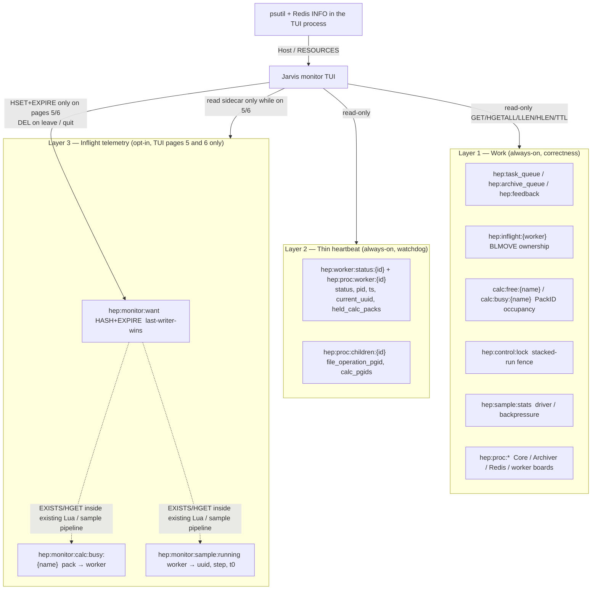
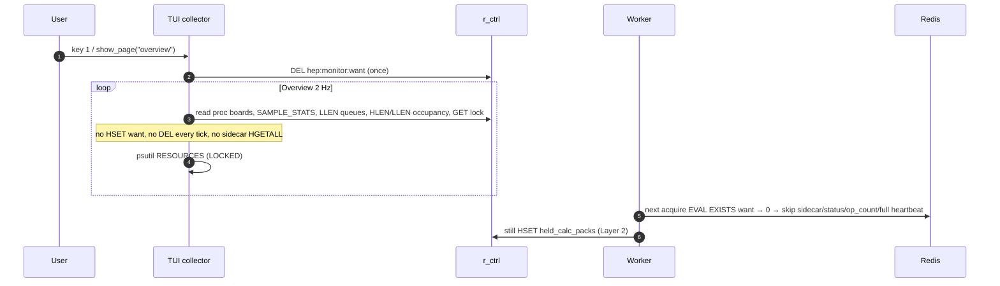

# Jarvis Monitor: event-driven inflight telemetry

| Field | Value |
| --- | --- |
| Title | Jarvis Monitor: event-driven inflight telemetry |
| Author | TBD |
| Date | 2026-09-11 |
| Status | Draft |
| Audience | Product (Part A), implementers (Part B, 台账), reviewers (Key Decisions onward) |
| Related | [`docs/monitor-tui.md`](monitor-tui.md) (accepted TUI product, 2026-09-10) |

---

## Overview

The TUI is a **surprise** attached to a live scan. When nobody is watching an inflight pane, that pane must emit **zero extra Redis traffic**. Today every calculator acquire and release in `SampleExecutor._run_calculator_step` (`jarvishep2/runtime/sample_executor.py`) calls `Worker._heartbeat("busy")`, and `_CalcPool.acquire_calc` / `release_calc` (`jarvishep2/queue/_redis_calc_pool.py`) always `HINCRBY hep:calculator:status` and `INCR hep:calculator:op_count`. That tax is paid whether a human is looking or not. It also keeps `TaskFactory._MonitorLoop` (120 Hz, op_count-gated) from staying quiet.

The fix is three layers with a single demand signal. **Work** and **thin heartbeat** stay always-on (scan correctness, watchdog, Overview). **Inflight telemetry** (`hep:monitor:*`) is written only while the TUI is on page **5 Calculators** or **6 Samples**, via last-writer-wins `HSET`+`EXPIRE` on `hep:monitor:want`. Workers observe that key *inside work events that already happen* (acquire/release Lua `EXISTS` / `HGET`, sample start/end pipeline). There is no Core listener, no worker poller, and no Redis Pub/Sub. Latency is accepted: the user watches 1–10 minutes for a temporary observation, not the full scan.

中文对照（产品口径，非正式）：监视器是个意外——不看就不写；只有第 5、6 页发出需求事件；Overview 只读 Core 已有的自诊断。

---

# Part A — Conceptual design

Audience: the product owner who locked the decisions below.

## A.1 The three layers

Redis already carries two kinds of truth the scan cannot live without. Inflight telemetry is a third kind, and it is the only one this design adds.



| Layer | What it is | Who writes | When | Who reads |
| --- | --- | --- | --- | --- |
| **Work** | Queues, BLMOVE occupancy, PackID free/busy, control lock, SAMPLE_STATS, proc boards, sample buckets, archived prefix | Core, Workers, Archiver — the scan | Every sample / acquire / lease tick | Scan driver, watchdog, TUI Overview and all pages |
| **Thin heartbeat** | `status`, `pid`, `ts`, `current_uuid`, `held_calc_packs`, children pgids | Each Worker | 5 s thread + sample start/end + **one-field `held_calc_packs` HSET on every acquire/release** (B.6.1; not the full `_heartbeat` MULTI) | Watchdog (`_Watchdog.inspect_workers`, `handle_worker_failure`), TUI Workers / Samples / Overview |
| **Inflight telemetry** | Pack→owner sidecar, sample running overlay, optional live `hep:calculator:status` | Workers, and **only** when `hep:monitor:want` says so | Inside acquire/release Lua and sample start/end | TUI pages 5 and 6 only |

`hep:inflight:{worker}` is **not** telemetry. It is BLMOVE LEFT LEFT occupancy (`_ProcBoard.pull_task_to_inflight` in `jarvishep2/queue/_redis_proc_board.py`). The TUI never `LRANGE`s it. New keys live under `hep:monitor:*`.

`calc:busy:{name}` values stay `"running"` / `"running:{mode}"` (`_claim_shared_pack`, `acquire_calc`). They are ownership labels for affinity, not worker ids. Pack→owner is a sidecar hash, and only while calc want is present.

## A.2 Which TUI pages consume which layer

Seven pages, numbered as in `jarvishep2/monitor/chrome.py` `PAGES` and `docs/monitor-tui.md` §5.

| Page | Slug | Work | Thin heartbeat | Inflight (`hep:monitor:*`) | Host OS |
| --- | --- | --- | --- | --- | --- |
| 1 Overview | `overview` | yes (queues, SAMPLE_STATS, proc boards, lock, occupancy derived from pool keys) | yes (alive/stale/busy from boards) | **no** | yes (RESOURCES: CPU / MEM / fds) |
| 2 Workers | `workers` | proc boards | yes (`current_uuid`, `held_calc_n`, children) | **no** | yes (per-pid cpu/rss) |
| 3 Factory | `factory` | proc core/archiver/redis, lock GET/TTL | no | **no** | no |
| 4 Sampler | `sampler` | queues, archived prefix, bucket meta, metadata JSON | no | **no** | no |
| 5 Calculators | `calculators` | occupancy from `LLEN`/`HLEN` of work keys | no | **yes** — pack→owner sidecar for the **selected** calculator | no |
| 6 Samples | `samples` | SAMPLE_STATS, bucket meta, archived prefix | yes (`current_uuid` rows) | **yes** — step / t0 overlay when present | no |
| 7 Host | `host` | Redis `INFO` (TUI process) | no | **no** | yes (scan process group + host aggregates) |
| Splash / picker | — | no Redis inflight | no | **no** | no |

Overview, Workers, Factory, Sampler, Host, and splash **must not** write `hep:monitor:want`. They must not 2 Hz-refresh a zeroed want key.

## A.3 Why Overview is zero-extra

Overview is the long-running, low-frequency watch. It is a **read-only visualization of Core self-diagnostics that already exist**. The scan does not grow a new writer for it.

Sources (all already on the wire, or OS-side):

- Proc boards: `hep:proc:core`, `hep:proc:archiver`, `hep:proc:redis`, `hep:proc:worker:{id}` (`publish_proc_board` / Worker `heartbeat`).
- Thin worker heartbeat fields the watchdog already requires: `ts` / `status` / `pid` / `current_uuid` / `held_calc_packs` / children pgids.
- `hep:sample:stats` — `fetch_sample_stats` is on the scan-driver path (`_ScanDriver._live_sample_counters` in `jarvishep2/runtime/_scan_driver.py`) and on backpressure. Always-on.
- `LLEN` of `hep:task_queue`, `hep:archive_queue`, `hep:feedback` (and `hep:feedback:chain:{id}` when chain ids are in metadata).
- Calculator occupancy **derived at read**: `HLEN calc:busy:{name}` plus known slot count (or `LLEN calc:free:{name}` for exclusive pools). Do **not** require a live `hep:calculator:status` cache for Overview.
- `GET` / `TTL` of `hep:control:lock` (existence + age only). Never claim it.
- Runtime-metadata JSON named by `hep:runtime:metadata_path`.
- Archived prefix `hep:archived-prefix:{scan}`.
- RESOURCES: `psutil` in the **TUI process** on the attached scan's process group + host aggregates. Not written by workers into Redis. Visual design is LOCKED (`docs/TUI/STYLES.txt`, `docs/TUI/blocks/07-resources.txt`).

No extra scan-side Redis writes. No want key. No sidecar.

## A.4 Why only pages 5 and 6 emit demand

Pack→owner and live sample step/t0 are **temporary observations**. They are useful while a human stares at Calculators or Samples for a few minutes. They are not required to drive the scan, the watchdog, or Overview.

- Page 5 needs pack→worker to fill the right pane (`docs/TUI/ref-120x36/5-calculators.txt`: `001 worker-03`). Work keys cannot provide that: `calc:busy:{name}` values are `"running"` / `"running:{mode}"`, not worker ids.
- Page 6 already lists running UUIDs from thin heartbeat `current_uuid`. The sidecar adds `step` and `t0` for the right pane. Without want, the page degrades honestly to counters + `current_uuid`.

Every other page can be honest from layers 1–2. Emitting want from Overview would re-tax the scan for a dashboard the user leaves up for hours.

## A.5 Why delay is OK

The user is not debugging a 50 ms race. They open Calculators, watch slots churn for 1–10 minutes, then leave.

- Want is visible to workers at the **next already-scheduled work event** (acquire, release, sample start, sample end).
- Pack→owner fills as PackIDs churn, or at that next event. A slot that has been held for 30 s will not sprout an owner until it is released and re-acquired (or until a concurrent acquire on another pack of the same calculator).
- Do **not** add `EXISTS hep:monitor:want` to the 5 s heartbeat pipeline just to fill the right pane faster. That would tax every Worker, every 5 s, for the entire scan, including when nobody is watching.

Accepted empty state: right pane shows occupancy counts and `hash hep:monitor:calc:busy:{name}` with no rows yet, plus a dim “waiting for next acquire”. Empty-but-honest beats a heartbeat poller.

## A.6 Why host stats are OS-side

CPU, MEM, and fds are properties of processes, not of Redis keys. The TUI already has the attached scan's process group from `list_active_scans` / `list_jarvis_processes` (`docs/monitor-tui.md` §3.1, §3.3). `psutil` on those PIDs plus host aggregates (`cpu_percent`, `virtual_memory`, `swap`, `getloadavg`) and Redis `INFO` from the **TUI** control client are approximate, real-time, and free for the scan.

Workers must not `HSET` CPU/MEM into Redis. RESOURCES is LOCKED and stays a TUI-local paint (`jarvishep2/monitor/overview.py` `render_resource_row`).

## A.7 Who listens? Nobody polls

**Question:** who is subscribed to want? Who polls it?

**Answer:** nobody. There is no dedicated Core listener, no worker poller thread, and no Redis Pub/Sub standing subscriber.

| Role | Relationship to `hep:monitor:want` |
| --- | --- |
| TUI collector | **Only producer of demand.** `HSET`+`EXPIRE` while the active page is 5 or 6. `DEL` on leave / quit. Crash → TTL. |
| Worker acquire/release Lua | `EXISTS` + `HGET ch:calc` / `ch:sample` **inside the EVAL that already mutates the pool**. Missing key → skip sidecar, skip `CALC_STATUS` `HINCRBY`, skip `op_count`, skip per-step heartbeat. |
| Worker sample start/end | A **sibling** `r_ctrl` pipeline (`EXISTS`/`HGET` want, then overlay `HSET`/`HDEL`) issued only from `process_task` start/`finally`. **Never** from `Worker._heartbeat`, `RedisQueue.heartbeat`, or `_heartbeat_loop`. Missing key → skip overlay. |
| 5 s heartbeat thread | **Does not** read want. Continues to publish thin fields the watchdog needs. **No** `EXISTS hep:monitor:want` in that pipeline (FORB-02). |
| Core | **Not** a want poller. On stopping / fuse it may piggyback `DEL` of `hep:monitor:*` onto work it is already doing (`_interrupt_for_redis_loss`, `_reset_redis_for_fresh_run`). |
| Factory `_MonitorLoop` | Untouched. TUI never starts it. Calculator `op_count` does not bump on acquire when want is off, so the 120 Hz loop stays quiet. |

When no event and no TUI on 5/6: **zero extra Redis commands and zero extra connections** from this feature.

---

# Part B — Technical design

Audience: an engineer implementing against this repo.

## B.1 Current tax (what we are removing)

Per calculator step, today:

1. `acquire_calc` / `_claim_shared_pack` pipeline (`_redis_calc_pool.py`): `HSET calc:busy:{name}`, `HINCRBY CALC_STATUS` free −1 / busy +1, `INCR hep:calculator:op_count`.
2. `SampleExecutor._run_calculator_step` immediately calls `worker._heartbeat("busy")`.
3. On the `finally` path, `force_release_calc` / `release_shared_calc` Lua does the inverse `HINCRBY` + `INCR`, then **another** `_heartbeat("busy")`.

`Worker._heartbeat` (`jarvishep2/runtime/worker.py` ~318) is a control-client MULTI of **7 commands** when children are open (`_redis_control.py` `heartbeat()`): `HSET` status, `HDEL` omitted fields, `HSET` board, `EXPIRE` board, optional children `HSET`, `EXPIRE` children, `INCR hep:worker:op_count`. That full MULTI is the tax.

The Overview canvas (`docs/TUI/ref-120x36/1-overview.txt`) is a **low-churn** example: `rate 12.4 /min`, `run 12`, `avg 3.82 s`, 48 workers, ~8 calculators. At ~8 sequential steps/sample that is on the order of **~1.6 acquire/s + ~1.6 release/s** (~3 extra full heartbeats/s, ~20 Redis commands/s), not 80/s. **Saturated** workers with short calculator steps (sub-second) can approach tens of acquires/s; that is a different load, not this figure. Quote the canvas only for the qualitative picture (48 workers, 8 named calculators). Quote the **command count of `_heartbeat`** (7) as the per-step tax this design removes.

This design **drops** the full `_heartbeat("busy")` MULTI at (2) and (3) unless `want.ch:calc` is on, and **skips** `CALC_STATUS` / `op_count` unless that same channel is on. Layer-1 ownership (`HSET calc:busy` / `HDEL`+`RPUSH` free) never gates. Layer-2 `held_calc_packs` still publishes on every acquire/release as **one** `HSET` (B.6.1) — not the 7-command MULTI.

## B.2 Key namespace

Add constants next to the existing block in `jarvishep2/queue/redis_queue.py` (lines 19–76). Quote the locked names exactly.

| Constant | Value | Client | Type | Writer | Reader |
| --- | --- | --- | --- | --- | --- |
| `MONITOR_WANT` | `hep:monitor:want` | **`r_ctrl`** | HASH + EXPIRE | TUI collector only | Workers (Lua / sample pipeline), tests |
| `MONITOR_CALC_BUSY` | `hep:monitor:calc:busy:{name}` | `r` (Lua with the pool) | HASH pack_id → worker_id | Worker acquire/release Lua, only if `ch:calc` | TUI Calculators right pane, selected name only |
| `MONITOR_SAMPLE_RUNNING` | `hep:monitor:sample:running` | `r_ctrl` (sample pipeline) | HASH worker_id → JSON | Worker sample start/end and acquire Lua if `ch:sample` | TUI Samples right pane |
| `MONITOR_WANT_TTL_SEC` | `5` | — | int | TUI sets EXPIRE every tick on 5/6 | TTL fail-closed |

**Do not add** keys under `hep:inflight:*`, `calc:busy:*` value overwrite, `hep:control:lock`, or `hep:proc:*` for this feature.

Existing names this design **must not rename or overload** (from `redis_queue.py` and `tests/test_redis_queue.py` `RedisQueueKeyNamespaceTests`):

```
hep:task_queue
calc:free:{name}          calc:busy:{name}
calc:free:{name}:mode:{mode}   calc:free:{name}:unassigned   calc:packmode:{name}
hep:results:{uuid}
hep:archive_queue         hep:archived:{scan}         hep:archived-prefix:{scan}
hep:feedback              hep:feedback:chain:{chain_id}
hep:worker:status:{id}
hep:calculator:status     hep:sample:stats            hep:{kind}:op_count
hep:sample:bucket:meta    hep:sample:bucket:state:{id}   hep:sample:bucket:ready
hep:control:lock
hep:proc:core             hep:proc:archiver           hep:proc:redis
hep:proc:worker:{id}      hep:proc:children:{id}
hep:inflight:{worker}
hep:runtime:metadata_path
```

`CONTROL_LOCK_TTL_SEC = 120`, `PROC_BOARD_TTL_SEC = 60`, `CONTROL_SOCKET_TIMEOUT_SEC = 2.0` stay as they are. Want TTL is **not** the control lock.

### B.2.1 `hep:monitor:want` fields

Last-writer-wins HASH. No `SET NX`. No mutex.

| Field | Page 5 | Page 6 | Other pages |
| --- | --- | --- | --- |
| `ch:calc` | `"1"` | `"0"` | key absent (DEL) |
| `ch:sample` | `"0"` | `"1"` | key absent |
| `ts` | unix seconds (TUI clock) | same | — |
| `pid` | TUI pid | same | — |

`EXISTS` alone is not enough: page 6 must not enable the calc sidecar. Lua always `HGET` the channel field.

Refresh: TUI collector, **only while `_page` is `calculators` or `samples`**, issues one atomic `HSET`+`EXPIRE` per tick (same 0.5 / 1 / 2 / 4 Hz budget as `docs/monitor-tui.md` §3.4, cap 4 Hz). TTL 5 s covers the slowest allowed tick (2 s at 0.5 Hz) plus `CONTROL_SOCKET_TIMEOUT_SEC` (2 s) with one second of slack.

Leave 5/6, `esc` to splash, or `q`: `DEL hep:monitor:want` once. Do not `HSET` zeros. Do not refresh an empty key from Overview's 2 Hz loop.

Crash: no `DEL`; TTL expires; workers see missing key and fail-closed.

Two TUI processes: last writer wins. Accept. Do not take `hep:control:lock`.

### B.2.2 Sidecar shapes

**`hep:monitor:calc:busy:{name}`**

- Field = PackID (`001`, …) as minted by `format_calc_pack_id`.
- Value = `str(int(worker.worker_id))` with **no padding** (`"3"`, not `"07"`). Matches `PROC_WORKER` (`hep:proc:worker:3`). `Worker.worker_id` is `int` (`worker.py` ~88). The TUI **displays** `worker-{id:02d}` (canvas `worker-03`); that formatting is view-only and is not stored.
- Written on acquire if `ch:calc`; `HDEL` that PackID on release if `ch:calc`.
- If want is **off** at release: **do not** `HDEL` the sidecar (zero extra commands). Stale fields linger until `reset_run_ephemeral_keys`, resume reconcile, or Core stopping piggyback. Size is O(packs) and accepted.
- **No EXPIRE on the sidecar.** Refreshing TTL would require the 5 s heartbeat. Correctness of the scan does not depend on this hash.

**`hep:monitor:sample:running`**

- Field = worker id.
- Value = compact JSON `{"uuid":"...","step":"SoftSUSY","t0":<unix>}` (`separators=(",", ":")`, same codec style as `encode_payload`).
- Sample start (`Worker.process_task` after `_current_sample_uuid` is set): a **sibling** method `Worker._publish_sample_overlay("start")` (B.6.2) `EXISTS`/`HGET` want on `r_ctrl` and, if `ch:sample`, `HSET` with `step=""` and `t0=now`. **Not** inside `_heartbeat`.
- Calc acquire Lua: if `ch:sample`, `HSET` overlay updating `step` to the calculator name (ARGV rewrite of the whole JSON from Python-supplied uuid/step/t0; keep Lua dumb).
- Sample end (`process_task` `finally`, uuid cleared): `_publish_sample_overlay("end")` — if `ch:sample`, `HDEL` the worker field. If want is off, skip (same linger rule).

Page 6 entered mid-sample: overlay fills at the next acquire/release or sample boundary, not from the 5 s thread. `_heartbeat_loop` never touches this key.

## B.3 Clients: `r` vs `r_ctrl`

`RedisQueue.connect` (`redis_queue.py` ~365) builds two redis-py clients to the same DB:

- `self.r` — blocking, `socket_timeout=None` (BLPOP / BLMOVE).
- `self.r_ctrl` — `CONTROL_SOCKET_TIMEOUT_SEC = 2.0`. Proc boards, heartbeats, control lock, `snapshot_raw`.

| Operation | Client | Why |
| --- | --- | --- |
| TUI want `HSET`+`EXPIRE` / `DEL` | **`r_ctrl`** | Same family as proc boards. TUI already uses the control timeout (`docs/monitor-tui.md` §3.1). |
| Acquire/release Lua (ownership + optional sidecar) | **`self.r`** (existing pool client) | Must stay atomic with `calc:busy` / free list. Same Redis DB; `EXISTS want` sees TUI writes. |
| Sample overlay `HSET`/`HDEL` | **`r_ctrl`** | Sibling pipeline from `Worker._publish_sample_overlay` at `process_task` start/`finally` only. **Never** folded into `RedisQueue.heartbeat` / `Worker._heartbeat` / `_heartbeat_loop`. |
| Thin `held_calc_packs` publish | **`r_ctrl`** | One always-on `HSET` of that field only, on acquire/release (B.6.1). Not telemetry; not behind want. |
| TUI reads (occupancy, sidecar, boards) | **`r_ctrl`** | Extend `SnapshotReader` / `snapshot_raw`. |
| Control lock | **`r_ctrl`**, unchanged | TUI never `SET NX`. Workers never use want as a lock. |

Injected single-client tests (`make_fakeredis_queue`) keep `r is r_ctrl`; behaviour is identical.

## B.4 Mixin layout

New private mixin class `_MonitorTelemetry` in `jarvishep2/queue/_redis_monitor.py`, mixed into `RedisQueue` beside `_TaskBroker, _CalcPool, _SampleBuckets, _ControlAndHeartbeat, _ProcBoard` (`redis_queue.py` ~314–315). Public import path stays `jarvishep2.redis_queue.RedisQueue`.

Five constants (all asserted in `tests/test_redis_queue.py` `RedisQueueKeyNamespaceTests.test_exact_key_strings_match_design`):

```python
class _MonitorTelemetry:
    """Private RedisQueue mixin: opt-in inflight telemetry + occupancy reads."""

    # MONITOR_WANT = "hep:monitor:want"
    # MONITOR_CALC_BUSY = "hep:monitor:calc:busy:{name}"
    # MONITOR_SAMPLE_RUNNING = "hep:monitor:sample:running"
    # MONITOR_WANT_TTL_SEC = 5
    # MONITOR_KEY_PATTERN = "hep:monitor:*"

    def monitor_calc_busy_key(self, name: str) -> str: ...

    def set_monitor_want(
        self,
        *,
        ch_calc: bool,
        ch_sample: bool,
        ttl_sec: int = MONITOR_WANT_TTL_SEC,
        pid: int | None = None,
    ) -> None:
        """Atomic HSET+EXPIRE on r_ctrl. Last-writer-wins. Never SET NX."""

    def clear_monitor_want(self) -> None:
        """DEL hep:monitor:want on r_ctrl. Idempotent."""

    def drop_monitor_keys(self) -> int:
        """SCAN match hep:monitor:* then DEL. Reset / resume / Core stopping only."""

    def fetch_calc_occupancy(
        self, names: list[str], *, slots: Mapping[str, int] | None = None
    ) -> dict[str, dict[str, int]]:
        """Return {name: {"free": int, "busy": int, "slots": int}}. No SCAN.

        busy = HLEN(calc:busy:{name}) always.
        Exclusive pools: free = LLEN(calc:free:{name}); slots defaults to free+busy
        if *slots* omits the name.
        Shared pools: LLEN(calc:free:{name}) is **0 by construction**
        (`register_shared_calc_pool` never RPUSHes that key; packs live in
        calc:free:{name}:mode:{mode} / unassigned). free = slots - busy when
        slots[name] is provided; if slots is missing, busy is still honest and
        free/slots are 0 (do not fake a total).
        """

    def fetch_monitor_calc_busy(self, name: str) -> dict[str, str]:
        """HGETALL hep:monitor:calc:busy:{name}. Missing → {}."""

    def fetch_monitor_sample_running(self) -> dict[str, dict[str, Any]]:
        """HGETALL hep:monitor:sample:running, JSON-decode values."""
```

Module-level aliases of the five constants live next to `INFLIGHT` in `redis_queue.py` so tests and Lua KEYS share one spelling. `set_monitor_want` Lua (control client), fakeredis fallback = `HSET` mapping then `EXPIRE` in a MULTI — the same EVAL-or-pipeline pattern as `_ATOMIC_RELEASE_CALC_LUA`.

## B.5 Acquire / release Lua — `EXISTS` inside the existing EVAL

Today `acquire_calc` is a Python pipeline, not Lua (`_redis_calc_pool.py` ~395–402). `release_calc` already EVALs `_ATOMIC_RELEASE_CALC_LUA`. This change **promotes acquire to Lua** so observing want is not an extra RTT, and **extends** the release scripts.

### B.5.1 Exclusive acquire (sketch)

Public `acquire_calc(...) -> str | None` is **unchanged** (tests keep `assert pack_id == "001"`). SampleExecutor does **not** call it for inflight; it calls internal `_acquire_calc(...) -> tuple[str | None, bool]` (pack, `want_calc`). Public `acquire_calc` is a thin wrapper that discards `want_calc`.

BLPOP of `calc:free:{name}` stays in Python (blocking) inside `_acquire_calc`. The post-pop claim becomes EVAL:

```lua
-- KEYS[1] calc:busy:{name}
-- KEYS[2] hep:calculator:status
-- KEYS[3] hep:calculator:op_count
-- KEYS[4] hep:monitor:want
-- KEYS[5] hep:monitor:calc:busy:{name}
-- KEYS[6] hep:monitor:sample:running
-- ARGV[1] pack_id
-- ARGV[2] free field  (name:free)
-- ARGV[3] busy field  (name:busy)
-- ARGV[4] worker_id     ("" if unknown)
-- ARGV[5] busy value    ("running")
-- ARGV[6] sample overlay JSON or ""
-- return {acquired=1, want_calc=0|1}

redis.call('HSET', KEYS[1], ARGV[1], ARGV[5])

local want_calc = 0
if redis.call('EXISTS', KEYS[4]) == 1 then
  local ch_calc = redis.call('HGET', KEYS[4], 'ch:calc')
  if ch_calc and ch_calc ~= '0' and ch_calc ~= '' then
    want_calc = 1
    if ARGV[4] ~= '' then
      redis.call('HSET', KEYS[5], ARGV[1], ARGV[4])
    end
    redis.call('HINCRBY', KEYS[2], ARGV[2], -1)
    redis.call('HINCRBY', KEYS[2], ARGV[3], 1)
    redis.call('INCR', KEYS[3])
  end
  local ch_sample = redis.call('HGET', KEYS[4], 'ch:sample')
  if ch_sample and ch_sample ~= '0' and ch_sample ~= '' and ARGV[4] ~= '' and ARGV[6] ~= '' then
    redis.call('HSET', KEYS[6], ARGV[4], ARGV[6])
  end
end
return {1, want_calc}
```

`_acquire_calc` returns that Lua `want_calc` to SampleExecutor (B.5.5). **No second EXISTS.** Public `acquire_calc` ignores it.

Ownership `HSET calc:busy` is **unconditional** and first. Sidecar / `CALC_STATUS` / `op_count` are conditional. Redis Lua is atomic: a script error rolls back ownership too. `HSET`/`HINCRBY`/`EXISTS` do not fail on missing keys; treat that as good enough. Do not add a nested pcall. If we ever need fail-open vs ownership, split scripts — not in v1.

`_discard_stale_free_token` (`_redis_calc_pool.py` ~355–363) today `HINCRBY CALC_STATUS` free −1 when junk (`ready`, UUID) is popped. That is **not** the acquire/release hot path. Gate that cache decrement on `ch:calc` the same way (one `EXISTS`/`HGET` on this rare path is allowed; it is a work-list event, not the 5 s thread). If want is off, skip the `HINCRBY` (lists remain source of truth). INF-15a asserts the hot path; this rare path must also skip the cache write when want is off.

### B.5.2 Exclusive release (extend `_ATOMIC_RELEASE_CALC_LUA`)

Current script (`_redis_calc_pool.py` 26–36): `HDEL` busy, `RPUSH` free, `HINCRBY` status, `INCR` op_count.

```lua
-- KEYS[1] calc:busy:{name}
-- KEYS[2] calc:free:{name}
-- KEYS[3] hep:calculator:status
-- KEYS[4] hep:calculator:op_count
-- KEYS[5] hep:monitor:want
-- KEYS[6] hep:monitor:calc:busy:{name}
-- ARGV[1] pack_id
-- ARGV[2] free field
-- ARGV[3] busy field
-- return {released=0|1, want_calc=0|1}

local removed = redis.call('HDEL', KEYS[1], ARGV[1])
if removed == 0 then
    return {0, 0}
end
redis.call('RPUSH', KEYS[2], ARGV[1])   -- work: always return the PackID
local want_calc = 0
if redis.call('EXISTS', KEYS[5]) == 1 then
  local ch_calc = redis.call('HGET', KEYS[5], 'ch:calc')
  if ch_calc and ch_calc ~= '0' and ch_calc ~= '' then
    want_calc = 1
    redis.call('HDEL', KEYS[6], ARGV[1])
    redis.call('HINCRBY', KEYS[3], ARGV[2], 1)
    redis.call('HINCRBY', KEYS[3], ARGV[3], -1)
    redis.call('INCR', KEYS[4])
  end
end
return {1, want_calc}
```

`_eval_atomic_release_calc` returns `tuple[bool, bool]` `(released, want_calc)`. **In the same PR as this Lua change (PR-3 / INF-04)**, public `release_calc` / `force_release_calc` **unwrap `released`**:

```python
released, _want = self._eval_atomic_release_calc(name, pack_id)
if not released:          # must NOT be `if not (released, want_calc)` — a tuple is always truthy
    raise ValueError(...)
return released           # force_release_calc: bool
```

Do **not** `bool(int(result or 0))` on a Lua list (TypeError). `_force_release_pack` (PR-4) calls `_eval_atomic_release_*` directly and returns `want_calc`; it does **not** call the public bool APIs.

### B.5.3 Shared pools

Blocking wait stays in Python on the **mode lists**, not `calc:free:{name}`: `BLPOP`/`LPOP` of `calc:free:{name}:mode:{mode}` and `calc:free:{name}:unassigned`. Public `acquire_shared_calc(...) -> tuple[str, str | None] | None` is **UNCHANGED** — `(pack_id, current_mode)` (`tests/test_calculator_modes.py` 329–342: `first == ("001", None)`, `warm == ("001", "fast")`).

Internals (SampleExecutor / claim):

- `_acquire_shared_calc(...) -> tuple[str, str | None, bool] | None` — pack, `current_mode`, `want_calc`
- `_claim_shared_pack(...) -> tuple[str, str | None, bool]` — pack, `current_mode`, `want_calc` (today this is `(pack_id, current_mode)`; **do not** replace `current_mode` with `want_calc`)

Public `acquire_shared_calc` wraps `_acquire_shared_calc` and drops `want_calc`. The post-pop claim EVAL is B.5.1 with `ARGV[5] = "running:{mode}"`.

Shared release work (affinity + packmode) stays **outside** the want branch. Sketch extending `_ATOMIC_RELEASE_SHARED_CALC_LUA` (`_redis_calc_pool.py` 38–52):

```lua
-- KEYS[1] calc:busy:{parent}
-- KEYS[2] affinity free list (mode list or unassigned)
-- KEYS[3] calc:packmode:{parent}
-- KEYS[4] hep:calculator:status
-- KEYS[5] hep:calculator:op_count
-- KEYS[6] hep:monitor:want
-- KEYS[7] hep:monitor:calc:busy:{parent}
-- ARGV[1] pack_id
-- ARGV[2] free field
-- ARGV[3] busy field
-- ARGV[4] target_mode  ('' → HDEL packmode; else HSET packmode)

local removed = redis.call('HDEL', KEYS[1], ARGV[1])
if removed == 0 then
    return {0, 0}
end
redis.call('RPUSH', KEYS[2], ARGV[1])          -- work: affinity list
if ARGV[4] == '' then
    redis.call('HDEL', KEYS[3], ARGV[1])       -- work: packmode
else
    redis.call('HSET', KEYS[3], ARGV[1], ARGV[4])
end
local want_calc = 0
if redis.call('EXISTS', KEYS[6]) == 1 then
  local ch_calc = redis.call('HGET', KEYS[6], 'ch:calc')
  if ch_calc and ch_calc ~= '0' and ch_calc ~= '' then
    want_calc = 1
    redis.call('HDEL', KEYS[7], ARGV[1])
    redis.call('HINCRBY', KEYS[4], ARGV[2], 1)
    redis.call('HINCRBY', KEYS[4], ARGV[3], -1)
    redis.call('INCR', KEYS[5])
  end
end
return {1, want_calc}
```

Want off **must still** `RPUSH` the mode-specific free list and `HSET`/`HDEL` `calc:packmode:{name}`. Copying the exclusive sketch (“RPUSH `calc:free:{name}` then want branch”) onto shared pools would skip packmode/affinity and leak modes. Sidecar key uses the **parent** name.

fakeredis without EVAL: keep the existing `"unknown command 'eval'"` pipeline fallback, and in that fallback issue `EXISTS MONITOR_WANT` (one extra command, tests only). Production Redis always takes Lua.

### B.5.4 `worker_id` plumbing

`SampleExecutor._run_calculator_step` has `worker.worker_id`, `worker._current_sample_uuid`, and `step_name`. Pass them into `_acquire_calc` / `_acquire_shared_calc` (not the public wrappers). Sidecar value is `str(int(worker.worker_id))` (no padding).

Callers that omit `worker_id` (unit tests of the pool via **public** `acquire_calc` / `acquire_shared_calc`): Lua writes ownership only; sidecar `HSET` is skipped when `ARGV[4] == ''`. Tests that only care about PackIDs stay green.

### B.5.5 Frozen acquire/release contract

Do **not** store `want_calc` on `RedisQueue` (`_last_want_calc` is a hidden cross-call global). Each Worker process owns its own `RedisQueue`, but the heartbeat thread also calls into that object — a flag would be a race.

This table is the implementer contract. Public signatures match today’s code. SampleExecutor uses the **named internals**.

| Function | Who calls | Returns |
| --- | --- | --- |
| `acquire_calc(...)` | public / pool tests | `str \| None` (pack). **Unchanged.** Wrapper: `pack, _ = self._acquire_calc(...); return pack` |
| `_acquire_calc(...)` | **SampleExecutor** (BLPOP + claim) | `tuple[str \| None, bool]` — `(pack, want_calc)` |
| `acquire_shared_calc(...)` | public / `test_calculator_modes.py` | `tuple[str, str \| None] \| None` — `(pack, current_mode)`. **UNCHANGED.** Wrapper drops `want_calc` |
| `_acquire_shared_calc(...)` | **SampleExecutor** | `tuple[str, str \| None, bool] \| None` — `(pack, current_mode, want_calc)` |
| `_claim_shared_pack(...)` | internal claim after LPOP | `tuple[str, str \| None, bool]` — `(pack, current_mode, want_calc)`. Keep `current_mode`; do not overwrite it with `want_calc` |
| `_eval_atomic_release_calc` / `_eval_atomic_release_shared_calc` | internal | `tuple[bool, bool]` — `(released, want_calc)` |
| `release_calc` / `force_release_calc` / `release_shared_calc` | public | `bool` (released?). **Unwrap `released` in PR-3** (same PR as the Lua tuple). `if not released`, never `if not (released, want)` |
| `SampleExecutor._force_release_pack` | SampleExecutor | `bool` (`want_calc`; False on failure / want off). Calls `_eval_atomic_release_*`, **not** the public bool APIs |

`_run_calculator_step` (today `sample_executor.py` 130–141) switches from public `acquire_calc` / `acquire_shared_calc` to `_acquire_calc` / `_acquire_shared_calc` and keeps `want_calc` in a **local**. `_force_release_all_held_packs` ignores the bool.

Lua `{released, want_calc}` without the public unwrap would make `release_calc`’s `if not result` (`_redis_calc_pool.py` 419–421) lie: `(False, 0)` is truthy. `bool(int(result or 0))` on a Lua list is `TypeError`. That unwrap is why PR-3 is independently shippable.

## B.6 Stop extra heartbeats — exact call sites

**Drop the full `_heartbeat("busy")` MULTI unless `want_calc`:**

| File | Line (today) | Call | Keep when |
| --- | --- | --- | --- |
| `jarvishep2/runtime/sample_executor.py` | 146 | `worker._heartbeat("busy")` after acquire | `want_calc` from `_acquire_calc` / `_acquire_shared_calc` (local) |
| `jarvishep2/runtime/sample_executor.py` | 169 | `worker._heartbeat("busy")` after `_force_release_pack` | `want_calc` returned by `_force_release_pack` (which calls `_eval_atomic_release_*`) |

**Keep always (thin heartbeat / sample boundaries):**

| File | Call | Why |
| --- | --- | --- |
| `worker.py` ~626 | `self._heartbeat("busy")` at `process_task` start | Watchdog `status=busy` + `current_uuid`; sample start |
| `worker.py` ~715 | `self._heartbeat("busy")` after inflight occupy, before `process_task` | Occupancy vs idle check (`inflight_without_busy`) |
| `worker.py` ~707, 721, 725, 727 | `_heartbeat("idle")` | Idle edges |
| `worker.py` ~801, 804 | `starting` / `idle` around `_init_runtime` | Hung-init visibility |
| `worker.py` `_heartbeat_loop` | `_heartbeat()` every `heartbeat_interval_sec` default **5.0** | Long `module.execute()` must not look stale |

When `want_calc` is on, the extra `_heartbeat("busy")` at acquire/release is allowed (opt-in display). That is **not** what keeps the watchdog correct — B.6.1 is.

Fail-open: wrap the optional heartbeat and any Python-side overlay `HSET` in `try/except Exception` that logs at warning and **does not** fail the sample. Ownership release in `_force_release_pack` already retains the pack on Redis errors; monitor errors must not take that path.

### B.6.1 Always-on thin `held_calc_packs` publish (Layer 2, not telemetry)

Dropping the full per-step MULTI would otherwise leave `hep:worker:status:{id}` `held_calc_packs` as stale as the 5 s thread. `_Watchdog` → `TaskFactory._handle_worker_failure` → `decode_heartbeat_held_packs` → `sweep_held_calc_slots` (`factory.py` ~868–909) reads **that status-hash field**. A Worker killed after acquire and before the next 5 s tick would leak a PackID until reset/resume.

On every acquire and every successful release, after the local `_held_calc_packs` update under `_hb_lock`:

```python
# RedisQueue.publish_held_calc_packs — on r_ctrl, always-on, no EXISTS want
self._ctrl().hset(
    WORKER_STATUS.format(id=str(int(worker_id))),
    "held_calc_packs",
    json.dumps(held_packs, separators=(",", ":")),
)
```

This is **one HSET**, not the 7-command `_heartbeat` MULTI (no board EXPIRE, no children, no `op_count`, no `ts`/`status` refresh). It is Layer 2 watchdog, **not** behind want, **not** `hep:monitor:*`. Acquire/release already hit Redis; this does not violate “zero extra when no monitor event.”

Proc board `held_calc_n` may lag until the 5 s thread; sweep does not read it. TUI Workers `held_calc_n` can be up to 5 s stale — accepted (Workers is not an inflight page).

Helper lives on `_ControlAndHeartbeat` (same encoding as `heartbeat()`). Fail-open: log and continue. INF-15h asserts this HSET still happens with want off. INF-15a must **allow** this one HSET on `hep:worker:status:{id}` while forbidding the full MULTI from `sample_executor`.

### B.6.2 Sample overlay is a sibling of `_heartbeat`, never inside it

`RedisQueue.heartbeat` is shared by `process_task` **and** `_heartbeat_loop` (`worker.py` ~354–363). Putting `EXISTS hep:monitor:want` inside `heartbeat()` or `Worker._heartbeat` would tax every Worker every 5 s (FORB-02, Key Decision 6).

New method, **not** called from `_heartbeat` / `_heartbeat_loop`:

```python
def _publish_sample_overlay(self, action: Literal["start", "end"]) -> None:
    """Sibling r_ctrl pipeline. EXISTS/HGET want; HSET/HDEL overlay if ch:sample.
    Called only from process_task start and finally. Fail-open."""
```

Call sites: immediately after `_heartbeat("busy")` at `process_task` ~626 (`action="start"`), and in `finally` before clearing `_current_sample_uuid` (`action="end"`). Acquire Lua may still update `step` when `ch:sample` (already inside pool EVAL; not the 5 s path).

INF-15a: `_heartbeat_loop` / `RedisQueue.heartbeat` command log contains **no** `EXISTS`/`HGET`/`HSET` on `hep:monitor:*`.

## B.7 Watchdog fields that must remain

`_Watchdog.inspect_workers` / `TaskFactory._handle_worker_failure` (`factory.py`) require:

| Field / key | Source | Used for |
| --- | --- | --- |
| `ts` / `last_heartbeat` | thin heartbeat / `hep:proc:worker:{id}` | stale_heartbeat vs `stale_sec` (default 30) |
| `status` | same | `inflight_without_busy` if `LLEN hep:inflight:{w} > 0` and status in `{idle,"",starting}` |
| `pid` | same | OS kill |
| `current_uuid` / `current_sample` | same | requeue / failure uuid (`_inflight_uuid_from_heartbeat`) |
| `held_calc_packs` | `hep:worker:status:{id}` (5 s thread **and** B.6.1 one-field HSET on every acquire/release) | `decode_heartbeat_held_packs` → `sweep_held_calc_slots` |
| children `file_operation_pgid`, `calc_pgids` | `hep:proc:children:{id}` | `kill_orphan_from_children_board` |
| `hep:inflight:{worker}` | BLMOVE occupancy | reclaim via `reclaim_inflight_task`; **not** the sidecar |

Do **not** gate any of the above on want. Do **not** move pack ownership into `hep:monitor:*`.

## B.8 Ephemeral reset and resume

`RedisQueue.reset_run_ephemeral_keys` (`redis_queue.py` ~417) already deletes queues, stats, calc pools, `hep:proc:*`, `hep:inflight:{0..N}`, worker status. **Add** `ctrl.scan_iter(match="hep:monitor:*")` to that key list.

`reconcile_resume_ephemeral` (~488) already SCANs `hep:worker:status:*`, `hep:proc:*`, `hep:inflight:*`. **Add** `hep:monitor:*`.

`_RuntimeSupervisor._reset_redis_for_fresh_run` calls `reset_run_ephemeral_keys` — no extra Core logic.

On stopping / fuse, piggyback `drop_monitor_keys()` on work Core is **already** doing. Two distinct hooks — do not treat them as one `try`:

1. `_interrupt_for_redis_loss` (`_runtime_supervisor.py` ~622–640): today publishes `scan_mode=stopping` in a first `try`, then a **second** `try` calls `redis.close()`. Order **must** be: `drop_monitor_keys()` (ignore errors) → publish stopping (existing first `try`) → `close()` (existing second `try`). Appending drop after `close()` is a no-op.
2. `_set_scan_mode("stopping")` (`_runtime_supervisor.py` ~791+): fuse overlay on `hep:proc:core`. Call `drop_monitor_keys()` here too (ignore errors), **before** any later close on the shutdown path.

Best-effort. **Not** a poller. Not an enable path.

TUI `DEL` only `hep:monitor:want`, never the sidecars (isolation: TUI cannot write other keys). Sidecar garbage is reset/resume/Core-stop's job.

## B.9 TUI collector — want lifecycle

`docs/monitor-tui.md` §8 proposes `jarvishep2/monitor/collector.py` (not yet created; pages 2–7 are still `ComingPane`). Collector is the **only** Redis talker in the TUI. Widgets render `MonitorFrame`. Extend `SnapshotReader` (`jarvishep2/dashboard.py`); do **not** call `TaskFactory.get_monitor_snapshot()` (`factory.py` ~732, in-process `_MonitorLoop` memory).

**Live attach is not `WorkspaceScreen` today.** `MonitorApp.attach_scan` (`app.py` ~54–58) pushes `WorkspaceScreen` only when `choice.simulated`; real scans get `SessionScreen` (`session.py`), a stub with no pages and no Redis. `WorkspaceScreen._tick` only drives `SimuEngine` (`workspace.py` ~93–99). INF-11 must change live attach: present `WorkspaceScreen` (or the §8 `screens/` layout) with a Redis-backed `Collector`. `SessionScreen` is deleted or becomes a thin wrapper around that workspace. `SimuEngine` ticks **must not** call `set_monitor_want` (no Redis / wrong Redis). Files: `app.py`, `session.py`, `workspace.py`, `collector.py`.

Page → channel mapping (single function, unit-tested):

```python
def want_channels_for_page(slug: str) -> tuple[bool, bool] | None:
    if slug == "calculators":
        return True, False   # ch:calc, ch:sample
    if slug == "samples":
        return False, True
    return None  # overview, workers, factory, sampler, host, splash, picker
```

Tick rules:

1. Resolve slug from `WorkspaceScreen._page` (`workspace.py` `show_page`).
2. If `want_channels_for_page` is a tuple: `set_monitor_want(ch_calc=..., ch_sample=..., ttl_sec=5, pid=os.getpid())` on the control client. This is the **sole** TUI write on the hot path.
3. If it is `None` and the previous tick had a want: `clear_monitor_want()` **once**. Remember “want is off” so Overview's 2 Hz loop does not `DEL` every tick and does not `HSET` zeros.
4. Then the read pipeline: boards, `LLEN` queues, occupancy, optional sidecar reads **only if** current page is 5 or 6.
5. On `WorkspaceScreen.action_quit_monitor`, `action_back`, app unmount: `clear_monitor_want()` in `finally`.

Read pipeline additions (control client, non-transactional, same tick):

- Overview / Calculators left table: `fetch_calc_occupancy(names, slots=...)` → `{name: {"free", "busy", "slots"}}` (B.4). Exclusive: `LLEN calc:free:{name}` + `HLEN calc:busy:{name}`. Shared: **do not** `LLEN calc:free:{name}` (always 0); `busy = HLEN`, `free = slots - busy` from metadata. **Never SCAN.** **Do not require `HGETALL hep:calculator:status`.**
- Calculators right pane: `fetch_monitor_calc_busy(selected_name)` only. Bounded by pack pool size (typically ≤ worker count). Do **not** `HGETALL calc:busy:{name}` for owners (values are not worker ids). Occupancy of the selected row still comes from LLEN/HLEN.
- Samples: worker rows from OS inventory + thin boards (`current_uuid`). Overlay from `fetch_monitor_sample_running()` when page is 6; merge by worker id. Missing overlay → show uuid/pid/status only.
- Host / RESOURCES: `psutil` + Redis `INFO` as already specified. Unchanged.

Calculator **names** and **slot counts** come from runtime-metadata JSON (accepted TUI product, `docs/monitor-tui.md` §3.4) plus `hep:runtime:metadata_path`. `write_scan_metadata` (`jarvishep2/runtime_metadata.py` ~22–31) currently writes `schema`, `scan_name`, `redis`, `control_pid` — **no** pools. INF-18 adds:

```json
"calculator_pools": { "SoftSUSY": 16, "micrOMEGAs": 8 },
"calculator_shared": { "ParentCalc": { "modes": ["fast", "full"], "n": 8 } }
```

That is a metadata extension for honest occupancy, not a new Redis writer on the acquire path.

`snapshot_raw` may keep `HGETALL CALC_STATUS` until PR-5 rewires `--once`. From PR-3 onward that hash is **knowingly stale** when want is off (no per-acquire `HINCRBY`). PR-3 ships `fetch_calc_occupancy` so tests and `--once` can switch; TUI Overview **must** use occupancy, never the live cache.

## B.10 How Calculators right pane reads the sidecar

Canvas (`docs/TUI/ref-120x36/5-calculators.txt`): left table NAME/BUSY/FREE/TOTAL/UTIL; right `pack owner` for the highlighted calculator.

```text
pack   owner
001    worker-03          # TUI formats str(int(id)) as worker-{id:02d}; Redis stores "3"
...
hash   hep:monitor:calc:busy:SoftSUSY     # was calc:busy:SoftSUSY in the canvas; amend
busy   calc:busy:SoftSUSY                 # occupancy key, values not shown as owners
free   calc:free:SoftSUSY
```

Collector frame field: `calculators: [{name, free, busy, slots, busy_packs: {pack_id: worker_id} | None}]`. `busy_packs` is populated **only for the selected/pinned name**, only on page 5, only from the sidecar. Empty dict = waiting for churn, not an error.

Do not dump every calculator's sidecar every tick.

## B.11 How Samples page degrades without want

Canvas (`docs/TUI/ref-120x36/6-samples.txt`): counters from `hep:sample:stats`; rows from workers whose `current_uuid` is non-empty (thin heartbeat / proc board). That works with want **off**.

Right pane today: uuid, worker, pid, status, hb, held_calc. `step` and `t0` come from `hep:monitor:sample:running` when present. If the user is on page 6 but workers have not yet hit a sample boundary / acquire: show the thin fields and dim “step unknown until next work event”. Never `GET hep:results:{uuid}`. Never `LRANGE hep:inflight:{w}`.

If the user is **not** on page 6, collector does not `HGETALL` the overlay key (no need). Workers do not write it.

## B.12 Isolation tests

Follow the write-guard pattern in `tests/test_dashboard_reader.py` (`test_snapshot_reader_is_read_only`) and `tests/test_monitor_snapshot.py` (`test_get_monitor_snapshot_does_not_touch_redis`, `test_snapshot_raw` must not SCAN). Wrap `set` / `hset` / `incr` / `rpush` / `lpush` / `delete` / `hincrby` / `expire` / `eval` / `blpop` / `blmove` on both `r` and `r_ctrl`.

| Test | Must be true |
| --- | --- |
| No want, acquire/release (INF-15a **PR-3**; heartbeat drop **PR-4**) | **PR-3:** no `HSET hep:monitor:*`, no `HINCRBY hep:calculator:status` on the acquire/release hot path, no `INCR hep:calculator:op_count`; ownership `HSET calc:busy` / `RPUSH calc:free` (and shared packmode/affinity) still happen. Junk-token `_discard_stale_free_token` also skips `CALC_STATUS` when want is off. **PR-4:** no extra `_heartbeat` MULTI from `sample_executor`; **one** `HSET hep:worker:status:{id} held_calc_packs` per acquire/release (B.6.1). Always: `_heartbeat_loop` / `RedisQueue.heartbeat` contain **no** `EXISTS`/`HGET` of `hep:monitor:want`; `hep:sample:stats` still moves on pull/submit; thin heartbeat still runs at sample start/end and 5 s. |
| Want only on pages 5/6 | Collector tick on `overview`/`workers`/`factory`/`sampler`/`host` issues zero writes. Tick on `calculators` writes only `hep:monitor:want` with `ch:calc=1`. Tick on `samples` writes only want with `ch:sample=1`. |
| TTL off | Set want, do not refresh, fake time / short TTL, next acquire skips sidecar. |
| Monitor write failure does not fail sample | Monkeypatch sidecar `HSET` / want Lua to raise; `process_task` still submits a result; pack is still released. |
| TUI cannot write other keys | Guard fails the run if any write key ≠ `hep:monitor:want`. `EVAL` allowed only if `KEYS[1]` is that key. |
| Never claim control lock | Guard `set(..., nx=True)` and any write to `hep:control:lock`. |
| `_MonitorLoop` stays quiet | After N acquires with want off, `get_op_count("calculator")` unchanged; `collect_latest_status` does not `HGETALL` calc status on idle ticks (existing gate in `test_collect_latest_status_gates_hgetall_on_idle_ticks`). |
| TUI never SCAN | `scan_iter` on worker/result/inflight/proc namespaces raises if collector calls it (extend `test_snapshot_raw_contains_proc_core`). |
| Factory loop not started | TUI attach path does not import/start `_MonitorLoop`. |

New test module: `tests/test_monitor_inflight.py`. Keep TUI visual tests in `tests/test_monitor_tui.py`.

## B.13 Sequence diagrams

### (1) No monitor — main scan, want absent

```mermaid
sequenceDiagram
  autonumber
  participant W as Worker
  participant R as Redis (self.r)
  participant C as r_ctrl
  participant WD as Watchdog

  Note over W,C: 5s thread — thin heartbeat only, no EXISTS want
  W->>C: HSET hep:worker:status:{id} status,pid,ts,current_uuid,held_calc_packs
  W->>C: HSET+EXPIRE hep:proc:worker:{id} / children
  WD->>C: HGETALL proc board, LLEN hep:inflight:{w}

  Note over W,R: Calculator step
  W->>R: BLPOP calc:free:{name}
  W->>R: EVAL acquire: HSET calc:busy:{name} pack running
  R-->>W: EXISTS hep:monitor:want → 0
  Note over R: skip sidecar, skip CALC_STATUS, skip op_count
  W->>C: HSET hep:worker:status:{id} held_calc_packs only (B.6.1, always-on)
  W-->>W: skip full _heartbeat("busy") MULTI
  W->>W: module.execute()
  W->>R: EVAL release: HDEL busy, RPUSH free
  R-->>W: want missing → skip sidecar/status/op_count
  W->>C: HSET held_calc_packs only
  W-->>W: skip full _heartbeat("busy") MULTI

  Note over W,C: Sample boundary still heartbeats; overlay is a sibling, skipped
  W->>C: _heartbeat("busy"|"idle") at process_task start/end (no EXISTS want)
  W->>C: _publish_sample_overlay start/end → EXISTS want → 0 → skip
```

Zero `hep:monitor:*` keys exist. `hep:calculator:op_count` does not move. `_MonitorLoop` (if Core started it for in-process snapshot) carries calculator_status forward.

### (2) Enter Calculators (page 5)

```mermaid
sequenceDiagram
  autonumber
  participant U as User
  participant T as TUI collector
  participant C as r_ctrl
  participant W as Worker
  participant R as Redis (self.r)

  U->>T: key 5 / show_page("calculators")
  loop every tick 0.5–4 Hz while on page 5
    T->>C: EVAL HSET hep:monitor:want ch:calc=1 ch:sample=0 pid ts + EXPIRE 5
    T->>C: HLEN calc:busy:{name} / LLEN calc:free:{name} (all known names)
    T->>C: HGETALL hep:monitor:calc:busy:{selected}  (right pane)
  end

  Note over W,R: Next already-scheduled acquire
  W->>R: EVAL acquire
  R-->>W: HGET ch:calc = 1 → HSET sidecar pack→worker; HINCRBY CALC_STATUS; INCR op_count
  W->>C: HSET held_calc_packs (always) + _heartbeat("busy") MULTI (opt-in, want_calc)
  T->>C: HGETALL sidecar → right pane rows fill as slots churn
```

No Core grant. No Pub/Sub. Delay until next acquire is accepted.

### (3) Leave to Overview



Stale `hep:monitor:calc:busy:{name}` may remain until reset/stop. Overview does not read it.

### (4) TUI crash → TTL

```mermaid
sequenceDiagram
  autonumber
  participant T as TUI
  participant C as Redis r_ctrl
  participant W as Worker

  T->>C: HSET+EXPIRE want TTL 5s
  T--xT: crash (no DEL)
  Note over C: want expires at T+5s
  W->>C: acquire EVAL EXISTS want
  alt still within TTL
    C-->>W: ch:calc maybe 1 (brief leftover)
  else after TTL
    C-->>W: missing → skip sidecar (fail-closed)
  end
  Note over W: scan continues; no Core involvement
```

## B.14 Factory `_MonitorLoop` is not a TUI data source

Locked in `docs/monitor-tui.md` §2 / §11. `get_monitor_snapshot()` returns an in-memory deepcopy of the 120 Hz thread. TUI attach is Redis + OS + optional runtime-metadata JSON (live `WorkspaceScreen` + `Collector`; `SessionScreen` is not the product — INF-11). Never construct a live `TaskFactory` to start `_MonitorLoop`. Calculator `op_count` staying still when want is off is what keeps that loop from `HGETALL`ing calc status every 8 ms.

## B.15 `docs/monitor-tui.md` amendments this design requires

Not implemented in this change; tracked as 台账 **INF-16** (PR-0).

- **§3.2 Allowed writes (sole exception):** `HSET`+`EXPIRE` (or one Lua EVAL) on `hep:monitor:want`, and `DEL hep:monitor:want` on detach. Tests fail the run if any other write is issued.
- **§3.2 Allowed reads:** add `HLEN` of `calc:busy:{name}`, `LLEN` of `calc:free:{name}`, `HGETALL hep:monitor:calc:busy:{name}` (selected, page 5), `HGETALL hep:monitor:sample:running` (page 6). Still forbidden: `SCAN`/`KEYS` of worker/result/inflight/proc; `LRANGE` work queues; `GET hep:results:{uuid}`; bump `hep:{kind}:op_count`.
- **§5.1 Overview Calculators:** occupancy from `HLEN`/`LLEN` (or `slots - HLEN`), not from a live `hep:calculator:status` cache.
- **§5.5 Calculators right pane:** pack→owner from `hep:monitor:calc:busy:{name}`, **not** `HGETALL calc:busy:{name}`.
- **§10 Testing:** write-guard allows the want key only.
- **Canvases:** `docs/TUI/ref-120x36/5-calculators.txt` still shows `hash hep:calculator:status` / `busy calc:busy:SoftSUSY` as the owner map — amend the hash line to `hep:monitor:calc:busy:SoftSUSY` when INF-16 lands. Same note in `_mint.py` if it still emits that string.

---

# Part C — 台账 (implementation ledger)

All rows `planned`. This change does **not** implement them. An engineer should be able to execute without re-deriving the design.

## C.1 Work items

| ID | Work item | Layer | Files | Depends on | Acceptance test | Risk if skipped | Status |
| --- | --- | --- | --- | --- | --- | --- | --- |
| INF-01 | Add five constants `MONITOR_WANT`, `MONITOR_CALC_BUSY`, `MONITOR_SAMPLE_RUNNING`, `MONITOR_WANT_TTL_SEC=5`, `MONITOR_KEY_PATTERN` on mixin `_MonitorTelemetry` | Redis mixin | `jarvishep2/queue/redis_queue.py` (mix in `_MonitorTelemetry` next to `_ProcBoard`), `jarvishep2/queue/_redis_monitor.py` (new), `tests/test_redis_queue.py` | — | `test_exact_key_strings_match_design` includes all **five** names; no collision with `INFLIGHT` / `CALC_BUSY_PACKS` | Ad-hoc key strings; TUI and Lua diverge | planned |
| INF-02 | `reset_run_ephemeral_keys` and `reconcile_resume_ephemeral` SCAN/DEL `hep:monitor:*` | Redis mixin | `jarvishep2/queue/redis_queue.py` | INF-01 | After want+sidecar exist, reset leaves zero `hep:monitor:*`; resume reconcile too | Sidecars leak across runs / stacked resume | planned |
| INF-03 | `set_monitor_want` / `clear_monitor_want` atomic HSET+EXPIRE Lua on `r_ctrl`; never SET NX | Redis mixin | `jarvishep2/queue/_redis_monitor.py` | INF-01 | MULTI/Lua sets fields+TTL; second writer overwrites; `claim_control_lock` unused; `DEL` is idempotent | Race between HSET and EXPIRE leaves immortal want | planned |
| INF-04 | Exclusive acquire Lua; add `_acquire_calc() -> (pack, want_calc)`; public `acquire_calc` stays `str \| None`; exclusive release Lua returns `{released, want_calc}`; **public `release_calc` / `force_release_calc` unwrap `released` in this same PR**; ship `fetch_calc_occupancy` + INF-15a | Redis mixin | `jarvishep2/queue/_redis_calc_pool.py`, `_redis_monitor.py` (`fetch_calc_occupancy`), `tests/test_redis_queue.py` (`test_calc_pool_cap_and_stable_pack_id_reuse`), `tests/test_worker_pool.py`, `tests/test_calculator_modes.py`, `tests/test_worker_failure.py`, `tests/test_monitor_inflight.py` (INF-15a) | INF-01 | Want off: busy hash `running`, no sidecar, no status incr, no op_count; occupancy HLEN matches pool; `if not result` on double-release still raises (`(False, 0)` must not be treated as truthy); public `acquire_calc` still `str \| None` | Extra RTT EXISTS; gating ownership; PR-3 reds pool tests **or** `if not (released, want)` lies | planned |
| INF-05 | Shared: `_claim_shared_pack` / `_acquire_shared_calc` return `(pack, current_mode, want_calc)`; public `acquire_shared_calc` stays `(pack, current_mode) \| None`; packmode + affinity **unconditional**; public `release_shared_calc` unwraps `released` in this same PR | Redis mixin | `jarvishep2/queue/_redis_calc_pool.py`, `tests/test_calculator_modes.py` (329–342: `first == ("001", None)`) | INF-04 | Want off still `RPUSH` mode/unassigned list and `HSET`/`HDEL` `calc:packmode:{name}`; `warm == ("001", "fast")` still holds; sidecar uses parent name | Dropping `current_mode` or treating Lua tuple as bool; mode leak | planned |
| INF-06 | SampleExecutor calls `_acquire_calc` / `_acquire_shared_calc` (not public wrappers); `_force_release_pack` calls `_eval_atomic_release_*` and returns `want_calc` | Worker | `jarvishep2/runtime/sample_executor.py`, `jarvishep2/queue/_redis_calc_pool.py` | INF-04, INF-05 | `_run_calculator_step` has a local `want_calc`; `_force_release_all_held_packs` ignores it; no mixin `_last_want_calc` | INF-08 has nowhere to read `want_calc`; public bool APIs hide it | planned |
| INF-07 | Pass `worker_id` / uuid / step / t0 into `_acquire_calc` / `_acquire_shared_calc` from `SampleExecutor` | Worker | `jarvishep2/runtime/sample_executor.py`, `jarvishep2/queue/_redis_calc_pool.py` | INF-04, INF-06 | Sidecar value equals `str(int(worker.worker_id))` (no padding); tests omitting worker_id via **public** `acquire_calc` still acquire | Sidecar empty on page 5 | planned |
| INF-08 | Drop full `_heartbeat("busy")` MULTI on sample_executor acquire/release unless local `want_calc` from `_acquire_calc` / `_force_release_pack`; always `publish_held_calc_packs` (one HSET) | Worker | `jarvishep2/runtime/sample_executor.py`, `jarvishep2/queue/_redis_control.py` (`publish_held_calc_packs`), `tests/test_sample_executor.py`, `tests/test_worker_failure.py` | INF-04, INF-05, INF-06 | Want off: spy shows **no** `_heartbeat` from `_run_calculator_step` but **one** status-hash `held_calc_packs` HSET per acquire/release; kill-after-acquire sweep still sees the PackID; sample start/end still full-beat | Watchdog leak window ≤5 s; or main-scan tax remains | planned |
| INF-09 | Sidecar writers live only in Lua (calc) and `_publish_sample_overlay` (not `heartbeat()`); Python try/except fail-open | Worker / Redis mixin | `_redis_calc_pool.py`, `worker.py` `_publish_sample_overlay` | INF-04, INF-07, INF-10 | Injected Redis error on sidecar does not raise out of `process_task` | Monitor bug fails physics | planned |
| INF-10 | Sample overlay is a **sibling** pipeline from `process_task` start/`finally` only; acquire Lua may update `step`; never inside `_heartbeat` / `_heartbeat_loop` / `RedisQueue.heartbeat` | Worker | `jarvishep2/runtime/worker.py` (`_publish_sample_overlay`), `_redis_calc_pool.py` | INF-03, INF-04 | Page 6 want: overlay has uuid/t0 after start; step updates on next acquire; want off: no overlay writes; 5 s thread command log has no `hep:monitor:*` | Extra EXISTS on 5 s thread (forbidden) if folded into `heartbeat()` | planned |
| INF-11 | Live attach presents `WorkspaceScreen` (or §8 `screens/`) with Redis `Collector`; `SessionScreen` deleted or thin wrapper; want HSET+EXPIRE on pages 5/6; DEL once on leave/quit; `SimuEngine` never writes want | TUI | `jarvishep2/monitor/collector.py` (new), `jarvishep2/monitor/workspace.py`, `jarvishep2/monitor/app.py`, `jarvishep2/monitor/session.py` | INF-03 | Live `attach_scan` non-simulated path has pages + collector; tick matrix INF-15b; simu ticks issue zero Redis writes | Pages 5/6 on a live scan never HSET want; simu path writes want to the wrong client | planned |
| INF-12 | Overview / left Calculators table: `fetch_calc_occupancy` → `{name: {free, busy, slots}}`; exclusive LLEN+HLEN; shared slots−HLEN (never LLEN `calc:free:{name}`) | TUI / Redis mixin | `_redis_monitor.py` (helper in PR-3), `jarvishep2/dashboard.py` `SnapshotReader` (PR-5) | INF-01, INF-04, INF-18 | Occupancy matches pool after acquire with want **off**; no HGETALL CALC_STATUS on Overview tick | Overview shows 0/0 or stale cache; shared free always 0 | planned |
| INF-13 | Calculators right pane reads `hep:monitor:calc:busy:{selected}` only; display `worker-{id:02d}` | TUI | `collector.py`, future calculators pane | INF-04, INF-11 | Selected SoftSUSY HGETALL sidecar; Redis `"3"` paints as `worker-03`; `calc:busy` not used as owner map | Wrong owners (`running` shown as worker) | planned |
| INF-14 | Samples page: rows from `current_uuid`; overlay step/t0 when present; honest degrade | TUI | `collector.py`, future samples pane | INF-10, INF-11 | Want off / missing overlay: uuid/pid/status still render; no GET results | Page 6 empty without sidecar | planned |
| INF-15 | Isolation tests (see C.1b). INF-15a ships in PR-3 with the Lua skip; INF-15b–h with TUI | tests | `tests/test_monitor_inflight.py` (new), `tests/test_redis_queue.py`, `tests/test_worker_pool.py`, `tests/test_calculator_modes.py`, `tests/test_worker_failure.py`, guards in `test_dashboard_reader.py` / `test_monitor_tui.py` | INF-04 for 15a; INF-03–INF-14 for the rest | All rows in C.1b green | Behaviour change lands without the test that prevents gating ownership | planned |
| INF-16 | Amend `docs/monitor-tui.md` §3.2, §5.1, §5.5, §10; canvas `docs/TUI/ref-120x36/5-calculators.txt` hash line; `_mint.py` if it emits `hep:calculator:status` as the owner hash | docs | `docs/monitor-tui.md`, `docs/TUI/ref-120x36/5-calculators.txt`, `docs/TUI/_mint.py` | INF-01 | Doc matches isolation contract; pack→owner is sidecar | Implementers follow stale “zero writes” / `HGETALL calc:busy` | planned |
| INF-17 | Core piggyback `drop_monitor_keys` **before** `redis.close()` on `_interrupt_for_redis_loss` and on `_set_scan_mode("stopping")` | Core | `jarvishep2/runtime/_runtime_supervisor.py` | INF-02 | Both hooks DEL `hep:monitor:*` best-effort; drop is not after `close()` | Sidecars survive Core death; or drop is a no-op on a closed client | planned |
| INF-18 | Runtime-metadata JSON: `calculator_pools: {name: slots}` and `calculator_shared: {parent: {modes, n}}` | Core / docs | `jarvishep2/runtime_metadata.py`, `_publish_runtime_metadata` | — | Attach reads names/slots from JSON; collector never `SCAN calc:*`; shared occupancy can compute `slots - busy` | Cannot derive occupancy without SCAN or stale CALC_STATUS | planned |
| INF-19 | fakeredis EVAL fallback for new Lua includes EXISTS want (tests only) | Redis mixin | `_redis_calc_pool.py`, `_redis_monitor.py` | INF-04 | Offline suite without EVAL still skip sidecar when want missing | Tests pass while production Lua wrong, or vice versa | planned |

### C.1b Isolation tests (acceptance detail for INF-15)

| ID | Assertion |
| --- | --- |
| INF-15a | Want off hot path (PR-3): no `hep:monitor:*`, no `CALC_STATUS` HINCRBY, no calculator op_count; PackID ownership still moves. Junk-token discard also skips `CALC_STATUS` when want off. `_heartbeat_loop` / `RedisQueue.heartbeat` never `EXISTS`/`HGET` want. Per-step `_heartbeat` MULTI absence + B.6.1 HSET: INF-08 / PR-4. |
| INF-15b | Want written only on pages 5/6 of a **live** WorkspaceScreen; Overview/Workers/Factory/Sampler/Host/splash/simu issue zero writes including no `DEL` every tick after the first leave |
| INF-15c | After want TTL expiry, next acquire is fail-closed (no sidecar) |
| INF-15d | Monitor write/EVAL failure does not fail a sample or leak a PackID |
| INF-15e | TUI write-guard: any write whose key is not `hep:monitor:want` fails the test run |
| INF-15f | TUI never `SET NX` / never writes `hep:control:lock` |
| INF-15g | TUI never `SCAN`/`KEYS` worker, result, inflight, or proc namespaces; never `LRANGE` work queues; never `GET hep:results:{uuid}`; never `INCR` op_count |
| INF-15h | Thin heartbeat, B.6.1 `held_calc_packs` HSET, `hep:inflight:{w}`, `SAMPLE_STATS`, `calc:busy` ownership, and shared packmode/affinity still move with want off |

## C.2 Forbidden list (do not do)

| ID | Do not | Why | What to do instead |
| --- | --- | --- | --- |
| FORB-01 | Core 1 s poll of want + worker grant cache | Invents a listener; taxes Core every tick | TUI writes want; workers observe in existing Lua |
| FORB-02 | Worker thread / 5 s pipeline `EXISTS hep:monitor:want`; any `EXISTS`/`HGET`/`HSET` of `hep:monitor:*` inside `RedisQueue.heartbeat`, `Worker._heartbeat`, or `_heartbeat_loop` | Taxes every Worker for the whole scan; B.3 “fold into heartbeat()” was the foot-gun | Observe only in acquire/release Lua and `Worker._publish_sample_overlay` (sibling of `process_task` start/`finally`) |
| FORB-03 | Redis Pub/Sub (`PUBLISH` / `SUBSCRIBE` / `PSUBSCRIBE`) | Standing subscriber = extra connection and wakeups | HASH+EXPIRE want |
| FORB-04 | `SET NX` mutex, or claiming `hep:control:lock` for the monitor | Stacked-run fence is sacred; monitor is not exclusive | Last-writer-wins HASH on `hep:monitor:want` |
| FORB-05 | Overwrite `calc:busy:{name}` values with worker ids | Breaks shared-mode `"running:{mode}"` affinity | Sidecar `hep:monitor:calc:busy:{name}` |
| FORB-06 | `LRANGE` / `LINDEX` `hep:inflight:{worker}` from the TUI | Ownership payload is work, not telemetry | Thin `current_uuid`; optional sample overlay |
| FORB-07 | Gate `SAMPLE_STATS`, thin heartbeat, B.6.1 `held_calc_packs` HSET, `hep:inflight:{w}`, PackID free/busy, or shared packmode/affinity on want | Scan/watchdog correctness | Want gates sidecar / CALC_STATUS cache / op_count / per-step **full** heartbeat only |
| FORB-08 | Start `TaskFactory._MonitorLoop` from the TUI | 120 Hz in-scan snapshot; accepted non-goal | `SnapshotReader` + `snapshot_raw` |
| FORB-09 | Import Textual (or `jarvishep2.monitor`) from Worker / Archiver / Core | Process isolation | Lazy import in `dispatch_monitor` only |
| FORB-10 | TUI `SCAN`/`KEYS`, `LRANGE` work queues, `GET` result blobs, bump op_count | Isolation contract | Known-key pipeline |
| FORB-11 | Overview 2 Hz `HSET` of a zeroed want key | Re-enables the tax for the long-running page | `DEL` once; then no want commands |
| FORB-12 | Extra `_heartbeat("busy")` on every calc acquire/release when want is off | The tax this document exists to remove | `want_calc` from EVAL |
| FORB-13 | Dedicated Core “enable inflight” RPC | Fail-closed is TTL/missing key, not Core-mediated | TUI want + worker observe |
| FORB-14 | Put CPU/MEM/fds in Redis | Host metrics are OS-side; RESOURCES is LOCKED | `psutil` in the TUI process |
| FORB-15 | Wire `Collector.set_monitor_want` into `SimuEngine` / simulated `WorkspaceScreen._tick` | Simu has no (or the wrong) Redis | Live attach uses Redis-backed Collector; simu stays local |

---

# Key Decisions

Locked product decisions, with the rationale used in this document. Do not re-litigate in implementation PRs.

| # | Decision | Rationale |
| --- | --- | --- |
| 1 | Monitor is a surprise; unseen parts emit no extra Redis traffic | Overview stays up for hours; inflight is a 1–10 min observation. Default path must match “no TUI”. |
| 2 | Only pages 5 Calculators and 6 Samples enable inflight channels | Only those panes need pack→owner or live step/t0. Other pages are honest from work + thin heartbeat + OS. |
| 3 | Event-driven, not polled. No Core listener, no worker poller, no Pub/Sub | A standing subscriber is a new connection and a wakeup. `EXISTS` inside existing acquire Lua is O(1) and same RTT. |
| 4 | TUI is the only producer of demand: `HSET`+`EXPIRE` `hep:monitor:want` on pages 5/6; `DEL` on leave; TTL on crash | Crash-safe without Core. Last-writer-wins avoids a lock. |
| 5 | Overview must not 2 Hz-refresh a zeroed want key | A zeroed HASH still exists; workers would `HGET` fields. `DEL` once, then silence. |
| 6 | Workers observe want in acquire/release Lua and sample start/end only. Sample overlay is a **sibling** of `_heartbeat`, never inside `RedisQueue.heartbeat` / `_heartbeat_loop` | Those events already happen. Do not add EXISTS to the 5 s heartbeat just to fill the right pane faster. |
| 7 | Latency is accepted | Users watch minutes; slots churn; empty-but-honest right pane is OK. |
| 8 | Overview is read-only visualization of existing Core self-diagnostics | Zero extra scan-side writes. Occupancy derived from work keys. |
| 9 | Host/RESOURCES metrics are external (`psutil`, Redis `INFO` from TUI) | Not worker-written. RESOURCES visual is LOCKED. |
| 10 | `hep:inflight:{worker}` stays BLMOVE occupancy; telemetry is `hep:monitor:*`; do not overwrite `calc:busy` values | Confusing ownership with display breaks affinity and watchdog reclaim. |
| 11 | No locks. Want is HASH+EXPIRE on `r_ctrl`. Lua only for HSET+EXPIRE atomicity or EXISTS-inside-acquire. Fail-closed telemetry, fail-open scan | Control lock is the stacked-run fence (`SET NX EX` 120 s). Monitor must not touch it. |
| 12 | Always-on vs opt-in split (work + thin heartbeat + B.6.1 `held_calc_packs` HSET vs sidecar / CALC_STATUS cache / calculator op_count / per-step **full** heartbeat) | Watchdog and driver must not depend on a TUI being attached. PackID sweep cannot wait 5 s. |
| 13 | Drop extra `_heartbeat("busy")` MULTI on every calc acquire/release unless `want.ch:calc`. Replace it with one always-on `HSET` of `held_calc_packs` only | The MULTI is the expensive path (~7 commands). One HSET preserves sweep without re-taxing the board. |
| 14 | Factory `_MonitorLoop` is not a TUI data source; op_count must not bump on acquire when want is off | 120 Hz loop stays quiet; TUI never starts it. |
| 15 | TUI Redis writes: only want HSET+EXPIRE and DEL want. Tests fail the run otherwise | Sole exception to `docs/monitor-tui.md` §3.2. |
| 16 | Core is not a want poller; may piggyback DEL on stopping/fuse | Fail-closed by missing key, not Core-mediated enable. |
| 17 | Document language is English; Redis key names and page names exact | Matches codebase and `docs/monitor-tui.md`. |

---

# API / Interface Changes

## RedisQueue (additive)

```python
# jarvishep2/queue/_redis_monitor.py  (new mixin)

MONITOR_WANT = "hep:monitor:want"
MONITOR_CALC_BUSY = "hep:monitor:calc:busy:{name}"
MONITOR_SAMPLE_RUNNING = "hep:monitor:sample:running"
MONITOR_WANT_TTL_SEC = 5
MONITOR_KEY_PATTERN = "hep:monitor:*"   # fifth constant

class _MonitorTelemetry:
    def set_monitor_want(self, *, ch_calc: bool, ch_sample: bool,
                         ttl_sec: int = MONITOR_WANT_TTL_SEC, pid: int | None = None) -> None: ...
    def clear_monitor_want(self) -> None: ...
    def drop_monitor_keys(self) -> int: ...
    def fetch_calc_occupancy(self, names: list[str], *, slots: Mapping[str, int] | None = None
                             ) -> dict[str, dict[str, int]]:
        """{name: {"free": int, "busy": int, "slots": int}}"""
    def fetch_monitor_calc_busy(self, name: str) -> dict[str, str]: ...
    def fetch_monitor_sample_running(self) -> dict[str, dict[str, Any]]: ...
```

`RedisQueue` inherits `_MonitorTelemetry`. `__all__` in `redis_queue.py` exports all **five** constants.

## `_ControlAndHeartbeat.publish_held_calc_packs`

```python
def publish_held_calc_packs(self, worker_id: str, held_packs: Mapping[str, str]) -> None:
    """Always-on Layer 2: one HSET hep:worker:status:{id} held_calc_packs.
    Not telemetry. No EXISTS want. Fail-open."""
```

## `_CalcPool.acquire_calc` / `acquire_shared_calc` / `release_*`

Additive kwargs only. **Public return types do not change** (frozen; B.5.5):

```python
def acquire_calc(self, name: str, timeout: int = 30, *,
                 worker_id: str | None = None,
                 sample_uuid: str = "",
                 step_name: str = "",
                 t0: str = "") -> str | None: ...

def acquire_shared_calc(self, name: str, mode: str, *, modes: Sequence[str],
                        timeout: int = 30, affinity_wait_sec: float = 3.0,
                        worker_id: str | None = None, sample_uuid: str = "",
                        step_name: str = "", t0: str = "",
                        ) -> tuple[str, str | None] | None: ...  # pack, current_mode UNCHANGED

def release_calc(self, name: str, pack_id: str) -> None: ...     # raises if not released
def force_release_calc(self, name: str, pack_id: str) -> bool: ...
def release_shared_calc(self, name: str, pack_id: str, mode: str | None) -> bool: ...
```

Named internals (SampleExecutor; must exist from PR-3 so PR-4 does not invent them):

```python
def _acquire_calc(...) -> tuple[str | None, bool]: ...
# pack, want_calc  — BLPOP + claim

def _acquire_shared_calc(...) -> tuple[str, str | None, bool] | None: ...
# pack, current_mode, want_calc

def _claim_shared_pack(...) -> tuple[str, str | None, bool]: ...
# pack, current_mode, want_calc  — NOT (pack, want_calc)

def _eval_atomic_release_calc(...) -> tuple[bool, bool]: ...
def _eval_atomic_release_shared_calc(...) -> tuple[bool, bool]: ...
# released, want_calc — public wrappers unwrap `released` in PR-3
```

`SampleExecutor._run_calculator_step` calls `_acquire_calc` / `_acquire_shared_calc`. `_force_release_pack` calls `_eval_atomic_release_*` (returns `want_calc`), not public `force_release_calc`. Do **not** use `_last_want_calc`.

## TUI collector

```python
# jarvishep2/monitor/collector.py  (new; widgets do not import RedisQueue)

def want_channels_for_page(slug: str) -> tuple[bool, bool] | None: ...

class Collector:
    def tick(self, *, page: str) -> MonitorFrame: ...
    def detach(self) -> None:  # DEL want
        ...
```

`SnapshotReader.read` gains optional `page` / occupancy names; it still issues **no** writes. Want writes live in `Collector`, which is the documented exception, wrapped by the write-guard.

Live `MonitorApp.attach_scan` must push the workspace+collector for **non-simulated** scans (`app.py`). `SessionScreen` is not the attach target.

## Worker overlay

```python
def _publish_sample_overlay(self, action: Literal["start", "end"]) -> None: ...
```

Not a method on `RedisQueue.heartbeat`. Not called from `_heartbeat_loop`.

## Not changed

- `claim_control_lock` / `refresh_control_lock` / `release_control_lock`
- `pull_task_to_inflight` / `ack_inflight_task`
- `heartbeat()` field list required by watchdog
- `TaskFactory.get_monitor_snapshot` / `_MonitorLoop.start`
- Textual widgets (they keep rendering frames)

---

# Data Model Changes

No HDF5 / DATABASE schema change. Redis only.

### New keys

```
hep:monitor:want                      HASH   EXPIRE 5s
  ch:calc    "0"|"1"
  ch:sample  "0"|"1"
  ts         unix
  pid        TUI pid

hep:monitor:calc:busy:{name}          HASH   no TTL
  {pack_id}  →  {worker_id}

hep:monitor:sample:running            HASH   no TTL
  {worker_id} →  {"uuid":"...","step":"...","t0":...}
```

### Keys whose **write rate** changes (schema unchanged)

| Key | Want off | Want `ch:calc` on |
| --- | --- | --- |
| `calc:busy:{name}` | still `HSET`/`HDEL` `running` / `running:{mode}` | same |
| `hep:calculator:status` | **no** per-acquire `HINCRBY` (stale after register) | live `HINCRBY` |
| `hep:calculator:op_count` | **no** `INCR` on acquire/release | `INCR` |
| `hep:worker:status:{id}` | 5 s + sample edges + **one-field** `held_calc_packs` HSET on every acquire/release (B.6.1) | plus optional per-step full `_heartbeat` MULTI |

### Migration

- Fresh run: `reset_run_ephemeral_keys` deletes `hep:monitor:*` (INF-02).
- Resume: `reconcile_resume_ephemeral` deletes `hep:monitor:*` then reseeds `SAMPLE_STATS` from DATABASE as today.
- Rolling code: old workers ignore want (no EXISTS in old Lua) → no sidecar, TUI right pane stays empty-but-honest. New workers + old TUI: want never written → same as want off. Safe to ship mixin before TUI want (default-off).

No Redis ACL. Convention + tests.

---

# Alternatives Considered

## (i) Core 1 s poll + worker grant cache

Core's supervise tick (`_SUPERVISE_TICK_SEC = 1.0` in `_runtime_supervisor.py`) would `GET`/`HGETALL` want and `HSET` a grant key; workers would cache the grant.

**Rejected.** Invents the listener this design forbids. Core becomes a collaborator in display. A 1 s grant lag is not better than “next acquire”, and the poll runs for the whole scan even when the TUI is on Overview. Fail-closed would still need TTL. Extra writes on the control plane.

## (ii) Redis Pub/Sub

TUI `PUBLISH hep:monitor:want`, workers `SUBSCRIBE` at process start.

**Rejected.** A standing subscriber is an extra connection and a thread wake for every Worker for the entire scan — the opposite of “when no event: zero extra commands/connections”. Missed messages need a snapshot key anyway (so you still want a HASH). Pub/Sub is not durable across the 5 s the TUI is allowed to be slow.

## (iii) TUI writes grant directly vs want observed in Lua

TUI could `HSET hep:monitor:grant:{worker}` for each OS-inventory worker id (48 HSETs per tick).

**Rejected.** TUI would need the worker id list on every want refresh (OK) but would write O(workers) keys at 4 Hz, and would still race acquire. Observing one HASH inside the Lua that already mutates the pool is one `EXISTS`+`HGET`, same RTT as today's claim, O(1) regardless of worker count. TUI isolation stays “one key”.

## (iv) `EXISTS` on the 5 s heartbeat for faster owner fill

The heartbeat thread would see want and `HSET` sidecar for currently held packs (`_held_calc_packs`) so the Calculators right pane fills without waiting for churn.

**Rejected (locked).** It adds a Redis read to every Worker every 5 s for the life of the scan, including when nobody is watching (the thread cannot know want is off without the EXISTS). The product explicitly accepts delay. Held packs are already on the thin heartbeat for the watchdog; the TUI Workers page can show `held_calc_n` without pack→owner. Calculators pack→owner waits for acquire/release.

## Other alternatives (brief)

- **Always-on `hep:calculator:status` + Overview HGETALL:** current code. Rejected for Overview because it is a write tax on every acquire; derive-at-read `HLEN` is enough for bars.
- **TUI `HGETALL calc:busy:{name}` as owner map:** rejected; values are not worker ids (`docs/monitor-tui.md` §5.5 must be amended).
- **ACL to enforce TUI read-only:** rejected; isolation is client convention plus tests (`docs/monitor-tui.md` §3.2). Want is the documented write exception.

---

# Security & Privacy

| Topic | Handling |
| --- | --- |
| Control lock | Untouched. TUI never `SET NX` `hep:control:lock`. Want is not a lease. Stacked-run fence (`claim_control_lock` in `_runtime_supervisor.py`) stays the only exclusive writer for Core. |
| Lock-free monitor | Last-writer-wins HASH. Two TUIs on different pages fight; accepted. No mutex, no Redlock. |
| Auth / ACL | None claimed. Same Redis DB as the scan (often managed `redis-server` on localhost). Isolation is tests wrapping the client. |
| Data in keys | Worker ids, PackIDs, sample UUIDs, step names, timestamps. No coordinates, no observables, no result blobs, no host CPU series. Same sensitivity as `hep:proc:worker:{id}` `current_uuid`. |
| TUI process | Observer. No signals, no `Jarvis kill`, no log tail. `psutil` restricted to the attached scan's process group (`docs/monitor-tui.md` §3.3). |
| Fail-closed telemetry | Missing/expired want → no sidecar. Stale sidecar is display garbage, not ownership. |
| Fail-open scan | Sidecar/want/optional heartbeat exceptions never fail `process_task` or skip PackID release. |

---

# Observability

| Signal | Where | Notes |
| --- | --- | --- |
| Want present | TUI header already has page + Hz; optional dim badge `inflight:calc` / `inflight:sample` on pages 5/6 | Do not write a Redis metric for this |
| Sidecar write failure | `get_jarvis_logger("worker")` warning, existing style (`calculator slot release failed…`) | Rate-limit if needed; never error the sample |
| Want Lua failure on TUI | Collector keeps last good frame + stale badge (`docs/monitor-tui.md` §3.4) | Do not retry in a tight loop |
| Calculator op_count | Stays a factory-loop gate; TUI may display it on Factory if already in `snapshot_raw` but must not bump it | Quiet when want off is the success metric |
| Redis `INFO` ops/sec | Host page, 0.5 Hz, TUI process | Existing; expect a drop vs today's per-step heartbeat, a small bump while page 5/6 is open |
| Tests as monitors | INF-15 write-guard | CI fails the run on contract breach |

No new Grafana board. No Core log line every tick.

---

# Rollout Plan

Order matches the stage table and the PR plan (not “TUI want then Lua”). Each step is idle-safe if the next is not shipped:

**constants → Lua default-off (tax gone, INF-15a in the same PR) → occupancy readers → TUI want → sidecar panes.**

Rollback after PR-3 = stop writing want (quit TUI / revert collector). Workers fail-closed on a missing key.

| Stage | What ships | Behaviour if later stages missing | Rollback |
| --- | --- | --- | --- |
| 0 | This document + `docs/monitor-tui.md` amendment (INF-16 / PR-0) | No runtime change | Delete docs |
| 1 | Key constants, `drop_monitor_keys` in reset/resume | No writers yet | Revert mixin |
| 2 | Acquire/release Lua EXISTS branch; skip status/op_count/sidecar when want missing; `fetch_calc_occupancy`; INF-15a; flip pool tests that asserted always-on CALC_STATUS/op_count | Calculator cache/op_count tax gone. `--once` / `_MonitorLoop` `calculator_status` is **knowingly stale** until stage 3 occupancy is wired into SnapshotReader. Per-step `_heartbeat` MULTI still present until PR-4 (watchdog still fresh). Right pane still empty. | Revert Lua; restore old pipeline (not preferred) |
| 3 | Occupancy in SnapshotReader / `--once`; TUI collector want lifecycle on **live** WorkspaceScreen | Overview honest; pages 5/6 write want but sidecar empty until stage 4 | Stop opening pages 5/6; or `clear_monitor_want` |
| 4 | Sidecar writers + Calculators/Samples reads | Full feature | **Rollback = stop writing want** (quit TUI or gate collector). Workers fail-closed on missing key. No Core flag required |

Feature flag: none required. Default-off is missing `hep:monitor:want`. Do not add a task-YAML switch that workers poll.

Staged rollout to users: ship stage 2 with a release that drops the **cache/op_count** tax (`CALC_STATUS` `HINCRBY` and `hep:calculator:op_count`); the **7-command `_heartbeat` MULTI** drops in PR-4 together with `publish_held_calc_packs`. Ship TUI pages 5/6 later.

---

# Risks

| Risk | Severity | Mitigation |
| --- | --- | --- |
| Implementer adds EXISTS to the 5 s heartbeat “just to fill owners” or folds overlay into `heartbeat()` | **High** (re-taxes the scan) | FORB-02; INF-15a must not see EXISTS from `_heartbeat_loop` / `RedisQueue.heartbeat`; overlay is `_publish_sample_overlay` |
| Overview tick refreshes want | **High** | INF-11 / INF-15b; `want_channels_for_page("overview") is None` |
| Live attach stays on `SessionScreen` so pages 5/6 never write want | **High** | INF-11 lists `app.py` / `session.py`; live path must present WorkspaceScreen + Collector |
| Dropping the full per-step MULTI without B.6.1 | **High** (PackID leak until 5 s tick / reset) | Always-on one-field `held_calc_packs` HSET; INF-08 / INF-15h; `test_worker_failure` kill-after-acquire |
| Lua bundles sidecar with ownership and a script error rolls back the PackID claim | **Medium** | Keep Lua to HSET/HDEL/EXISTS/HINCRBY/INCR only; fakeredis fallback tested; fail-open is for **Python** overlay/heartbeat |
| Shared-pool occupancy via `LLEN calc:free:{name}` reads 0 | **Medium** | INF-12 uses `HLEN busy` and metadata `slots`; INF-18; helper contract documents exclusive-only LLEN |
| Shared release copies exclusive Lua and skips packmode/affinity when want off | **High** (mode leak) | B.5.3 sketch; INF-05 acceptance |
| Stale sidecar after leave/crash | **Low** | Accepted; reset/resume/Core-stop DEL; TUI does not read sidecar off page 5 |
| Two TUIs last-writer-wins (page 5 vs 6) | **Low** | Document; no lock |
| `acquire_calc` signature churn breaks tests | **Medium** | Additive kwargs; public returns unchanged; INF-07 |
| CALC_STATUS stale for `_MonitorLoop` / `--once` from PR-3 until occupancy is wired | **Low** (known) | PR-3 ships `fetch_calc_occupancy` + flips pool tests; PR-5 rewires SnapshotReader / `--once`; factory loop is not the product |
| `drop_monitor_keys` after `redis.close()` | **Medium** | INF-17 order: drop → publish stopping → close |
| Monitor exception fails a sample | **High** | INF-09 / INF-15d; never raise through `process_task` |
| Confusing `hep:inflight:{w}` with sidecar | **High** (data loss if TUI LRANGE/ack) | FORB-06; isolation tests |

---

# Open Questions

None. The product decisions in **Key Decisions** are locked. Implementation contracts that used to be open are now specified:

- Frozen B.5.5: public `acquire_calc` stays `str | None`; public `acquire_shared_calc` stays `(pack, current_mode) | None`; SampleExecutor calls `_acquire_calc` / `_acquire_shared_calc`; `_claim_shared_pack` is a 3-tuple keeping `current_mode`; public release wrappers unwrap `released` in PR-3. No mixin `_last_want_calc`.
- Sample overlay is one JSON value per worker id, written by `_publish_sample_overlay`, never by `heartbeat()`.

Do not reopen Core pollers, Pub/Sub, heartbeat EXISTS, control-lock reuse, or Overview want.

---

# References

- [`docs/monitor-tui.md`](monitor-tui.md) — accepted TUI product (2026-09-10). Isolation §3, pages §5, collector layout §8, testing §10.
- [`docs/TUI/STYLES.txt`](TUI/STYLES.txt) — RESOURCES block LOCKED; tab strip LOCKED.
- [`docs/TUI/blocks/07-resources.txt`](TUI/blocks/07-resources.txt), [`docs/TUI/blocks/LAYOUT.txt`](TUI/blocks/LAYOUT.txt), [`docs/TUI/blocks/04-calculators.txt`](TUI/blocks/04-calculators.txt).
- [`docs/TUI/ref-120x36/5-calculators.txt`](TUI/ref-120x36/5-calculators.txt), [`docs/TUI/ref-120x36/6-samples.txt`](TUI/ref-120x36/6-samples.txt), [`docs/TUI/ref-120x36/1-overview.txt`](TUI/ref-120x36/1-overview.txt).
- `jarvishep2/queue/redis_queue.py` — key namespace, dual client `r` / `r_ctrl`, `snapshot_raw`, `reset_run_ephemeral_keys`, `reconcile_resume_ephemeral`.
- `jarvishep2/queue/_redis_control.py` — heartbeat MULTI, control lock `SET NX EX`, `_worker_board_fields` (never copies ownership blobs).
- `jarvishep2/queue/_redis_proc_board.py` — proc boards HASH+EXPIRE; `hep:inflight:{worker}` BLMOVE occupancy Lua.
- `jarvishep2/queue/_redis_calc_pool.py` — acquire/release; `CALC_STATUS` HINCRBY + calculator `op_count` on every acquire/release (today).
- `jarvishep2/queue/_redis_task_broker.py` — `SAMPLE_STATS` on pull/submit (always-on).
- `jarvishep2/runtime/worker.py` — 5 s `_heartbeat_loop`; `_heartbeat` on sample start/end; control-lock watch.
- `jarvishep2/runtime/sample_executor.py` — extra `_heartbeat("busy")` on every calc acquire and release (expensive path).
- `jarvishep2/runtime/factory.py` — `_MonitorLoop` 120 Hz op_count-gated; `_Watchdog` needs ts/status/held_calc_packs/children.
- `jarvishep2/runtime/_runtime_supervisor.py` — 1 s supervise tick; lease overlay on `hep:proc:core`; `_reset_redis_for_fresh_run`.
- `jarvishep2/dashboard.py` — `SnapshotReader` / `MonitorView`; TUI extends this.
- `jarvishep2/monitor/` — TUI skeleton; Overview RESOURCES already locked (`overview.py` `render_resource_row`).
- `jarvishep2/calculator_pools.py` — `resolve_calculator_pools` / `register_calculator_pools`.
- `jarvishep2/runtime_metadata.py` — `hep:runtime:metadata_path` JSON.
- `tests/test_dashboard_reader.py`, `tests/test_monitor_snapshot.py`, `tests/test_redis_queue.py` — write-guard and key-namespace patterns.

---

# PR Plan

Independently reviewable PRs. Do not mix Lua behaviour with TUI chrome. Each PR must keep want-missing = today's correctness (or cheaper).

| PR | Title | Files | Depends | Description |
| --- | --- | --- | --- | --- |
| PR-0 | docs: event-driven inflight telemetry | `docs/monitor-inflight.md` (this file), `docs/monitor-tui.md` (§3.2 / §5.1 / §5.5 / §10), `docs/TUI/ref-120x36/5-calculators.txt` | — | Design + isolation-contract amendment (INF-16). No runtime Python. |
| PR-1 | redis: `hep:monitor:*` constants and ephemeral cleanup | `jarvishep2/queue/redis_queue.py`, `jarvishep2/queue/_redis_monitor.py`, `tests/test_redis_queue.py` | PR-0 | Five constants, `_MonitorTelemetry` mixin, `drop_monitor_keys`, reset/resume SCAN. No acquire change. |
| PR-2 | redis: want HSET+EXPIRE / DEL API on `r_ctrl` | `_redis_monitor.py`, tests | PR-1 | `set_monitor_want` / `clear_monitor_want` Lua; last-writer-wins; no SET NX; never touches `hep:control:lock`. |
| PR-3 | redis: acquire/release Lua EXISTS branch (default-off cheaper) + occupancy helper + INF-15a + **public unwrap of Lua `{released, want_calc}`** | `_redis_calc_pool.py` (`_acquire_calc`, `_acquire_shared_calc`, `_claim_shared_pack` 3-tuple, public release unwrap), `_redis_monitor.py` (`fetch_calc_occupancy`), `tests/test_redis_queue.py` (`test_calc_pool_cap_and_stable_pack_id_reuse`), `tests/test_worker_pool.py`, `tests/test_calculator_modes.py` (shared return still `(pack, current_mode)`), `tests/test_worker_failure.py` (CALC_STATUS/op_count assertions), `tests/test_monitor_inflight.py` (INF-15a cache/op_count/ownership only) | PR-1 | Ownership / packmode / affinity always; skip CALC_STATUS, op_count, sidecar when want missing. Public `release_*` unwrap `released` so `if not result` still works. Flip tests that asserted always-on cache/op_count. `--once` CALC_STATUS knowingly stale until PR-5. **Independently shippable** without TUI. Per-step `_heartbeat` MULTI still present (watchdog still fresh); that tax drops in PR-4. |
| PR-4 | worker: SampleExecutor calls `_acquire_calc` / `_acquire_shared_calc` / `_eval` internals; drop per-step full MULTI unless local `want_calc`; always `publish_held_calc_packs`; overlay sibling | `sample_executor.py`, `_redis_control.py` (`publish_held_calc_packs`), `worker.py` (`_publish_sample_overlay`), `tests/test_sample_executor.py`, `tests/test_worker_failure.py` (kill-after-acquire sweep) | PR-3 | INF-06+INF-08. Call sites 146 / 169: no full `_heartbeat` unless local `want_calc`. One HSET `held_calc_packs` always. Overlay never inside `heartbeat()`. Fail-open. |
| PR-5 | tui/reader: occupancy in SnapshotReader / `--once`; sidecar read helpers; metadata pools | `dashboard.py`, `runtime_metadata.py` (INF-18 fields), tests | PR-3 | Wire `fetch_calc_occupancy` into `--once` / MonitorView; `fetch_monitor_calc_busy` / `fetch_monitor_sample_running`. |
| PR-6 | tui: live WorkspaceScreen + collector want lifecycle | `jarvishep2/monitor/collector.py`, `workspace.py`, `app.py`, `session.py`, `tests/test_monitor_inflight.py`, `tests/test_monitor_tui.py` | PR-2, PR-5 | Non-simulated attach presents workspace+collector. Pages 5/6 only; DEL once on leave; SimuEngine never writes want; write-guard. |
| PR-7 | tui: Calculators sidecar pane + Samples overlay | future calculators/samples panes, collector frame fields | PR-4, PR-6 | Right pane pack→owner (`worker-{id:02d}`); Samples degrade without overlay. |
| PR-8 | core: piggyback `drop_monitor_keys` on stopping/fuse | `_runtime_supervisor.py` (`_interrupt_for_redis_loss`, `_set_scan_mode`), tests | PR-1 | `drop_monitor_keys` **before** `close()`. Best-effort; not a poller. |
| PR-9 | tests: remaining isolation matrix INF-15b–h as a gate | `tests/test_monitor_inflight.py` | PR-4, PR-6 | TUI cannot write other keys; want only on 5/6; control lock unclaimed. INF-15a already green from PR-3. |

Rollback at any stage after PR-3: stop writing want (quit TUI / revert PR-6). Workers remain fail-closed. Reverting PR-3 reintroduces the acquire tax and should be avoided once INF-15a exists.

---

*End of draft. Implementation is out of scope for this document.*
